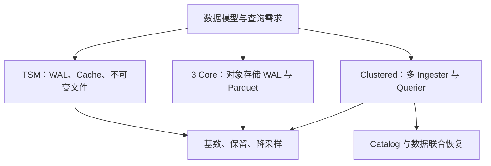

# InfluxDB 体系：产品、引擎与数据生命周期

本领域最需要先纠正的是版本混用：v1/v2 TSM、InfluxDB 3 Core、Clustered 不能共享一张固定部署图。以下图是阅读路线。

从 [[InfluxDB-数据模型]] 理解 measurement、tags、fields 与时间戳，再用 [[InfluxDB-指标设计与基数管理]] 定义实际维度组合。基数相乘只是上界，不能把有关联的维度当作完全独立。

[[InfluxDB-TSM存储引擎]] 与 [[InfluxDB-3-列存引擎]] 都涉及不可变文件及后台整理。Parquet 不意味着只写一次、没有 compaction；统计剪枝也不意味着所有查询不再需要索引或元信息。

[[InfluxDB-写入与查询路径]] 区分成功应答、内存可查询与文件持久化；[[InfluxDB-多副本与高可用]] 区分本地 WAL、多 Ingester 和对象存储的故障边界；[[InfluxDB-Catalog元数据]] 解释 Clustered 的独立元数据服务及其恢复要求。最近数据尚未变成 Parquet 时，Querier 仍可能访问 Ingester。

## 设计推论

开放列式格式有利于生态互操作，但读取所有对象文件不能代替系统 Catalog 的有效文件视图。高基数能力改善不等于零成本；冷数据扫描、短窗口最新查询和高并发写入应分别评价。

选型先固定产品与版本，再记录实际 series 口径、数据分布、保留策略、窗口、并发、冷热缓存、故障恢复和总成本。旧稿固定十倍压缩成本收益、自动三 AZ 与统一 100 天保留不是跨产品保证。
