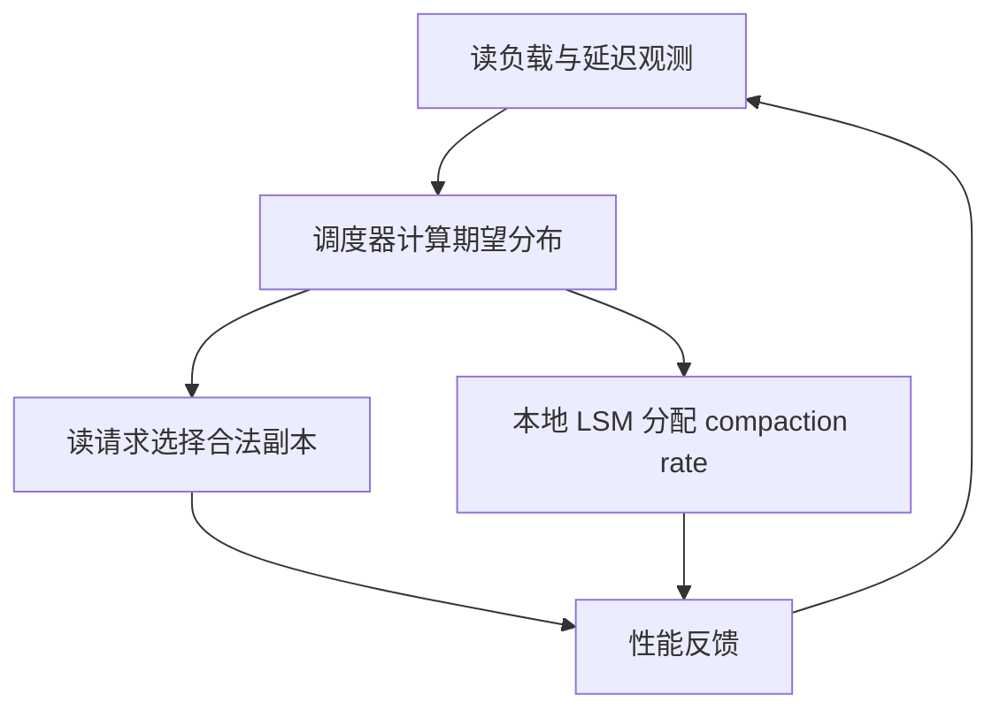

# LSM 近期进展：调度、卸载和存储接口

本次原文核对发现，旧笔记以“Silo 分布式 Compaction”命名的内容不对应所附论文。实际 PDF 是 FAST 2026 的 HATS。旧 WAF 调度、任务迁移协议及 62% / 57% 结果已撤回；保留旧路径仅为兼容链接，显示名称改为 HATS。

## HATS 在协调什么

压实干扰使不同副本的读取代价随时间变化；只均匀分发读请求无法消除延迟差异，一直推迟压实又会累积读放大。HATS 将合法副本间的读路由与各副本本地 compaction 预算放进同一反馈过程。

Raft 在这项设计中选出 scheduler，不替代 Cassandra 的用户数据复制协议。数据也不会随每次读调度迁移。因此它不能被画成远端 compaction 服务。

## 实驗支持哪些结论

论文以 Cassandra 5.0 为基础，默认 10 个四核/16GiB/SATA SSD 节点、10Gbps 网络、R=3、读响应数 1、写响应数 3，使用 YCSB、100M 记录及多轮运行。read-dominant 负载中，作者报告相对 C3/DEPART 的 P99 与吞吐改善；具体数值和图表位置见 [[知识库/sources/papers/LSM-Scheduling/精读分析]]。这些结果不是通用 SLO 达标率，也没有验证所有强一致读取配置或千节点规模。

## 与其他路线比较

| 路线 | 调整的对象 | 应验证的额外代价 |
|---|---|---|
| [[Silo-分布式LSM-Compaction调度|HATS 读与压实协同]] | 路由与本地预算 | 状态过期、调度震荡、写密集负载 |
| [[CaaS-LSM-Compaction即服务]] | 压实计算的位置 | 网络、任务一致性、失败清理 |
| [[Hailstorm-存算分离LSM数据库]] | 计算、存储池与卸载 | 原文实验仍待独立精读 |
| [[Fluss-KV存储-RocksDB]] | 流日志与 PK 状态接口 | 快照和日志的恢复边界 |

下一步实证问题是：同一硬件与一致性目标下，调度与卸载是否可组合、何时竞争同一网络预算，而不是仅比较不同论文摘要中的最大倍数。基础成本模型见 [[LSM-Tree-存储引擎体系综述]]。
