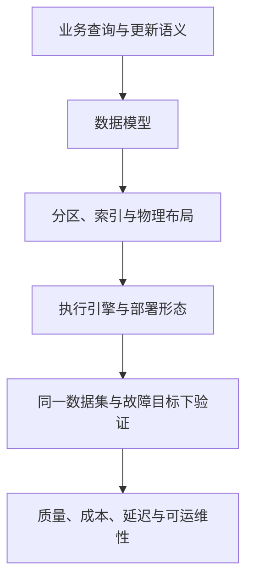

# OLAP 与时序数据库：按工作负载阅读知识库

OLAP 与 TSDB 都可使用列式编码、批量执行和分区剪枝，但需要优化的问题不同。系统选型不能由“实时”“湖仓”或某个引擎名称直接决定。

| 工作负载问题 | 优先阅读 | 测量重点 |
|---|---|---|
| 明细分析、多表 Join、主键 CDC | [[Apache-Doris-OLAP-数据库体系综述]] | Join 分布、更新可见性、并发与合并压力 |
| 指标写入、时间窗口、保留与降采样 | [[InfluxDB-时序数据库体系综述]] | 实际基数、最新数据可见性、窗口扫描与恢复 |
| 流式状态与历史湖表结合 | [[Fluss-流处理平台架构综述]] | Log/KV/Lake 三种进度和提交边界 |
| 存储底层读写成本 | [[LSM-Tree-存储引擎体系综述]] | 放大、缓存、后台债务和尾延迟 |

读写确认、查询可见、备份可恢复是三种不同边界；列式文件、向量化执行、水平扩容也是三个不同维度。不要把 CockroachDB 的向量化等同于物理列存，或把 InfluxDB Clustered 的部署图套到 Core。

本综述是导航与比较框架，不提供未经统一测试的产品排名。各领域卡片中的版本、原文证据与待核验项优先于旧周报中的趋势判断。
