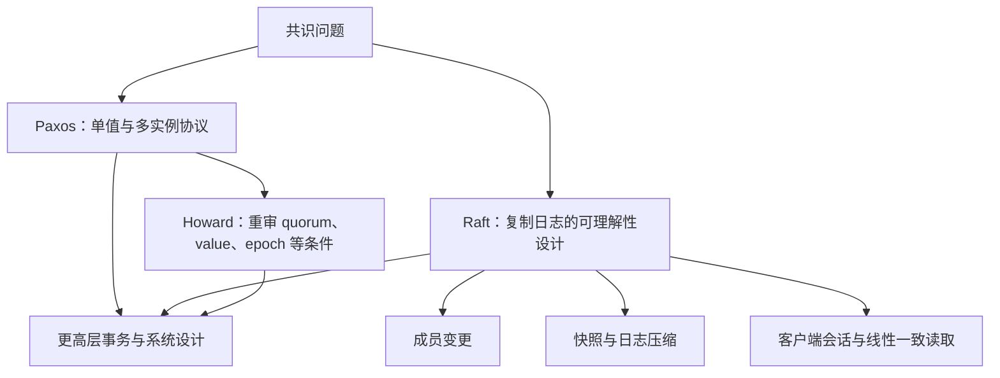

# 共识协议体系：安全条件、工程组件与使用边界

本综述连接 Ongaro 2014 博士论文、Howard 2019 博士论文及相关系统卡片。先区分单值共识、复制日志、跨分片事务和分布式快照，避免把所有“一致性”问题都写成 Raft。

图是问题与阅读关系，不是证明 Raft 是 Paxos 子集，也不把 Howard 的广义框架与 Lamport 的 Generalized Paxos 当作同一术语。

## Raft 的阅读主线

| 卡片 | 博士论文位置 | 关键检查 |
|---|---|---|
| [[Raft-共识算法协议核心]] | Ch.3 | 当前 term 条目的多数提交与旧 term 间接提交 |
| [[Raft-集群成员变更]] | Ch.4 | joint 阶段分别满足新旧多数，按本地最新配置规则生效 |
| [[Raft-日志压缩]] | Ch.5 | 快照边界 index/term 决定能否保留后缀 |
| [[Raft-客户端交互]] | Ch.6 | 读屏障、应用进度、并发请求去重与会话生命周期 |
| [[Paxos-理论到实践的鸿沟]] | Ch.2 等背景 | 协议核心不等于完整工程系统 |

多数票只解决相应阶段的证明条件。成员变化不能要求“所有节点都确认”，也不能承诺故障或分区期间始终可用。快照 RPC 的 offset 是分块传输位置，不自动构成增量快照算法。lease read 需要时间和领导权条件，不能因刚收到心跳就省略线性一致性验证。

Raft 论文的 43 人理解性研究、选举测量与 LogCabin 原型是三类证据。理解测试支持特定教学设置下的结果，不能推导所有生产实现更快或永远更少缺陷；性能评估也不等价于对所有 Multi-Paxos 实现的统一比较。

## Howard 框架的自由度有条件

Revision A 关注跨阶段 quorum 交集；Revision B 把条件细化到 epoch，但新 phase-1 必须考虑**所有较早 epoch**，不是仅前一个。Value selection 和 epoch 共享进一步改变恢复需要的信息，不能单凭稳定路径多数派就推断恢复也始终只需多数。

例如原文 Table 7.1 中 N=5、k=3 的共享 epoch 配置，恢复需要的回答可在 3–5 之间。唯一 epoch 与共享 epoch 的 phase-completion 条件也不同。细节与证明位置见 [[共识算法族系-从Paxos到广义解]]、[[Paxos-Quorum-Intersection-Revised]]、[[Paxos-Value-Selection-Revised]]、[[Paxos-Epochs-Revised]]。

## 放回系统层看

CockroachDB 的 range 复制与 leader lease 服务于低延迟合法读取；[[Rosé-异步复制协议设计]] 处理分区主备复制的共同恢复边界；[[Event-Horizon-非对称依赖]] 研究按操作语义协调的混合执行。三者不是同一个共识协议的参数替换。

[[Chandy-Lamport-分布式快照算法]] 捕获一致切面，不负责为并发写决定唯一日志顺序。其所得状态可能是与原执行等价的合法执行中的状态，而非原执行里真实同时出现过的一瞬间。

设计评审应分别写出安全不变量、故障模型、持久化点、恢复信息与活性前提，再选择算法。关联：[[分布式数据系统一致性体系]]、[[分布式数据系统事务与一致性新进展-2026综述]]。
