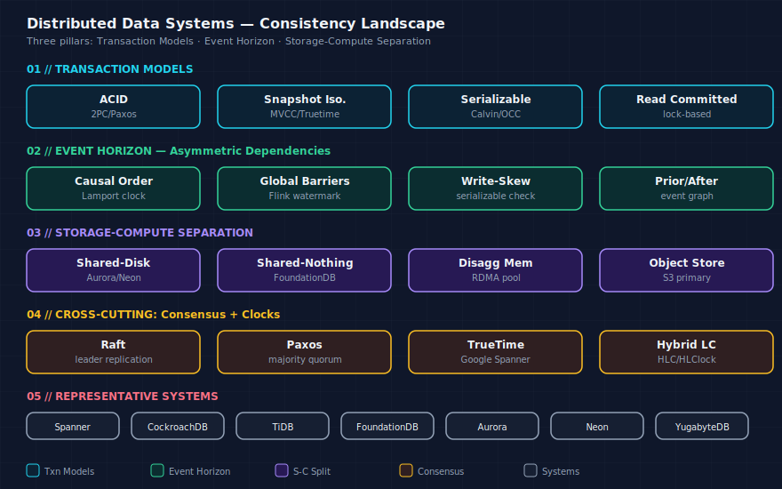

# 分布式数据系统一致性体系

> 从 事务模型、Event Horizon、存储计算分离 三条主线出发，构建分布式数据系统的全景一致性视图。注意：这页是元层次的 synthesis——它对桥接所有子集群的 **[[事务模型深度调研]]** 再进行一次提炼。




## 1. 领域定义

"一致性"在分布式数据系统中至少有三层含义：

| 层面 | 问题 | 代表技术 |
|------|------|---------|
| **事务一致性（Transaction）** | 多操作原子性、隔离性 | [[事务模型深度调研\|ACID / MVCC / 2PC / TCC / SAGA]] |
| **副本一致性（Replication）** | 多副本间的数据同步 | Paxos / Raft / 因果广播 |
| **会话一致性（Session）** | 客户端观察到什么 | [[Event-Horizon-非对称依赖\|半线性化 (SL)]] / ReadYourWrites |

这三层相互依赖、层层叠加。

## 2. 概念关系图

<svg viewBox="0 0 800 420" xmlns="http://www.w3.org/2000/svg" font-family="sans-serif" font-size="13px">
  <defs>
    <marker id="arrow-c1" markerWidth="8" markerHeight="6" refX="8" refY="3" orient="auto"><path d="M0,0 L8,3 L0,6 Z" fill="currentColor"/></marker>
  </defs>
  <!-- Top -->
  <rect x="230" y="10" width="340" height="40" rx="6" fill="transparent" stroke="currentColor" stroke-width="1.5"/>
  <text x="400" y="32" text-anchor="middle" dominant-baseline="middle" fill="currentColor" font-weight="bold">分布式数据系统 — 一致性全景</text>
  
  <line x1="400" y1="50" x2="400" y2="75" stroke="currentColor" stroke-width="1.5" marker-end="url(#arrow-c1)"/>
  
  <line x1="130" y1="75" x2="670" y2="75" stroke="currentColor" stroke-width="1.5"/>
  <line x1="130" y1="75" x2="130" y2="95" stroke="currentColor" stroke-width="1.5" marker-end="url(#arrow-c1)"/>
  <line x1="400" y1="75" x2="400" y2="95" stroke="currentColor" stroke-width="1.5" marker-end="url(#arrow-c1)"/>
  <line x1="670" y1="75" x2="670" y2="95" stroke="currentColor" stroke-width="1.5" marker-end="url(#arrow-c1)"/>
  
  <!-- Three boxes -->
  <rect x="40" y="95" width="180" height="100" rx="4" fill="transparent" stroke="currentColor" stroke-width="1.5"/>
  <text x="130" y="117" text-anchor="middle" dominant-baseline="middle" fill="currentColor" font-weight="bold">事务层</text>
  <text x="130" y="137" text-anchor="middle" dominant-baseline="middle" fill="currentColor" font-size="12px">ACID → 分布式</text>
  <text x="130" y="155" text-anchor="middle" dominant-baseline="middle" fill="currentColor" font-size="12px">2PC/3PC/TCC/SAGA</text>
  <text x="130" y="173" text-anchor="middle" dominant-baseline="middle" fill="currentColor" font-size="12px">Percolator/Spanner/Calvin</text>
  
  <rect x="310" y="95" width="180" height="100" rx="4" fill="transparent" stroke="currentColor" stroke-width="1.5"/>
  <text x="400" y="117" text-anchor="middle" dominant-baseline="middle" fill="currentColor" font-weight="bold">副本层</text>
  <text x="400" y="137" text-anchor="middle" dominant-baseline="middle" fill="currentColor" font-size="12px">Paxos → Raft</text>
  <text x="400" y="155" text-anchor="middle" dominant-baseline="middle" fill="currentColor" font-size="12px">→ 主从复制的</text>
  <text x="400" y="173" text-anchor="middle" dominant-baseline="middle" fill="currentColor" font-size="12px">一致性保证</text>
  
  <rect x="580" y="95" width="180" height="100" rx="4" fill="transparent" stroke="currentColor" stroke-width="1.5"/>
  <text x="670" y="117" text-anchor="middle" dominant-baseline="middle" fill="currentColor" font-weight="bold">会话层</text>
  <text x="670" y="137" text-anchor="middle" dominant-baseline="middle" fill="currentColor" font-size="12px">Linearizability →</text>
  <text x="670" y="155" text-anchor="middle" dominant-baseline="middle" fill="currentColor" font-size="12px">Semi-Linearizability</text>
  <text x="670" y="173" text-anchor="middle" dominant-baseline="middle" fill="currentColor" font-size="12px">(Event Horizon)</text>
  
  <!-- Merge -->
  <line x1="130" y1="195" x2="130" y2="240" stroke="currentColor" stroke-width="1.5"/>
  <line x1="670" y1="195" x2="670" y2="240" stroke="currentColor" stroke-width="1.5"/>
  <line x1="130" y1="240" x2="670" y2="240" stroke="currentColor" stroke-width="1.5"/>
  <line x1="400" y1="240" x2="400" y2="265" stroke="currentColor" stroke-width="1.5" marker-end="url(#arrow-c1)"/>
  
  <!-- Horizontal split for bottom -->
  <line x1="200" y1="265" x2="600" y2="265" stroke="currentColor" stroke-width="1.5"/>
  <line x1="200" y1="265" x2="200" y2="290" stroke="currentColor" stroke-width="1.5" marker-end="url(#arrow-c1)"/>
  <line x1="600" y1="265" x2="600" y2="290" stroke="currentColor" stroke-width="1.5" marker-end="url(#arrow-c1)"/>
  
  <!-- Bottom two boxes -->
  <rect x="40" y="290" width="320" height="90" rx="4" fill="transparent" stroke="currentColor" stroke-width="1.5"/>
  <text x="200" y="312" text-anchor="middle" dominant-baseline="middle" fill="currentColor" font-weight="bold">存储计算分离 + Log-as-DB</text>
  <text x="200" y="332" text-anchor="middle" dominant-baseline="middle" fill="currentColor" font-size="12px">Tail Latency 根因</text>
  <text x="200" y="350" text-anchor="middle" dominant-baseline="middle" fill="currentColor" font-size="12px">RaaS 回放消除</text>
  <text x="200" y="368" text-anchor="middle" dominant-baseline="middle" fill="currentColor" font-size="12px">日志链差异 + CPU 争抢</text>
  
  <rect x="440" y="290" width="320" height="90" rx="4" fill="transparent" stroke="currentColor" stroke-width="1.5"/>
  <text x="600" y="312" text-anchor="middle" dominant-baseline="middle" fill="currentColor" font-weight="bold">具体系统实现</text>
  <text x="600" y="332" text-anchor="middle" dominant-baseline="middle" fill="currentColor" font-size="12px">├── Doris 2PC + 副本</text>
  <text x="600" y="350" text-anchor="middle" dominant-baseline="middle" fill="currentColor" font-size="12px">├── InfluxDB Raft + 反熵</text>
  <text x="600" y="368" text-anchor="middle" dominant-baseline="middle" fill="currentColor" font-size="12px">└── Spanner TrueTime</text>
</svg>

## 3. 三条演进主线

### 3.1 事务模型：从单机 ACID 到全球分布式

[[事务模型深度调研]] 勾勒了一条清晰路径：

```
单机 ACID (锁/MVCC)
  → 跨机 2PC (阻塞式共识)
    → 3PC / TCC (减少阻塞)
      → Percolator / Spanner (大规模乐观 + 全球时钟)
        → Calvin (确定性执行绕开 2PC)
```

核心洞察：**协调代价决定了事务模型的实际可行性**。从 2PC 到 Calvin 的演进，每一步都在削减协调成本。

### 3.2 Event Horizon：重新定义"需要多强的协调"

[[Event-Horizon-非对称依赖]] 提出了一个颠覆性观点：**不是所有操作都需要全序**。SL（半线性化）把操作分为三级：

| 层级 | 符号 | 协调代价 | 适用场景 |
|------|------|:---------:|----------|
| strictly ordered | `OP1 → OP2` | 最高 | 拍卖结算、余额扣减 |
| eventually ordered | `OP1 ⇝ OP2` | 低 | 出价可见性保证 |
| commutative | `OP1 ∥ OP2` | 零 | 日志追加、指标采集 |

与传统二分法（强/弱操作）相比，SL 的贡献在于识别了"非对称依赖"——**close_auction 需要看到 new_bid，但 new_bid 不需要等待 close_auction**。这对二分法模型的"对称冲突假设"构成了根本性批评。

### 3.3 存储计算分离：新架构引入的一致性新问题

[[存储计算分离数据库的-Tail-Latency]] + [[Log-as-the-Database-模式]] 揭示了一个悖论：**存算分离带来的弹性优势，以不可预测的读延迟为代价**。

根因：日志链在不同 page server 上的回放进度天然不均衡。

[[RaaS-Replay-as-a-Service]] 的解决方案：后台异步回放 + 读请求触发按需回放，本质上是在存储层把"严格线性化"放松为"按需串行化"——与 Event Horizon 的思路异曲同工。

## 4. 跨页核心洞察

1. **协调代价是分布式一致性的统一度量**：无论是事务层的 2PC、副本层的 Raft、会话层的 SL——它们都在回答同一个问题：这个操作需要多少轮跨机通信？

2. **"不需要全序"是 2024-2026 年最大的趋势**：
   - Event Horizon：弱操作微秒级，只需因果广播
   - RaaS：后台回放不阻塞前台读
   - InfluxDB：默认最终一致，强一致按需开启
   - Doris：Compaction 不阻塞查询

3. **每个系统最终都要回答同一个问题**：在一致性（正确性）、延迟（性能）、可用性（容错）之间——你的工作负载到底需要哪个？这个问题没有通用答案，但有一套结构化思考框架。

## 5. 系统实现对比

| 系统 | 事务层 | 副本层 | 会话层 | 创新点 |
|------|--------|--------|--------|--------|
| Spanner | TrueTime + 2PC | Paxos | Linearizability | 全球时钟 |
| TiDB | Percolator 变体 | Raft | Snapshot / RC | 去中心化 2PC |
| Doris | 2PC 导入 | Tablet 多副本 | 强一致读取 | MPP + OLAP |
| InfluxDB | 无跨行事务 | Raft + 反熵 | 可调一致性 | 时序优先 |
| Aurora / RaaS | 单写 + 日志分发 | Quorum 读 | 读延迟毛刺 | Log-as-DB 回放 |

## 6. 对外桥接

- [[synthesis/LSM-Tree-存储引擎体系综述]]：事务系统的底层存储，写放大直接关联事务吞吐
- [[synthesis/OLAP与TSDB全景综述]]：OLAP/TSDB 系统各自对一致性有不同的需求强度

## 7. 待探索方向

- [ ] 真正的"弱一致性事务"是什么？（SAGA 是补偿不是弱一致，SL 是对强操作的一致性模型）
- [ ] CRDT + SL 是否可能结合——CRDT 处理数据类型冲突，SL 处理操作依赖图
- [ ] BFT（Byzantine 容错）在实际数据库系统中的可行性——Event Horizon §7 提及但未实现
- [ ] AI Agent 场景下的长事务模型——Agent 调用的跨系统事务可能持续数分钟到数小时
