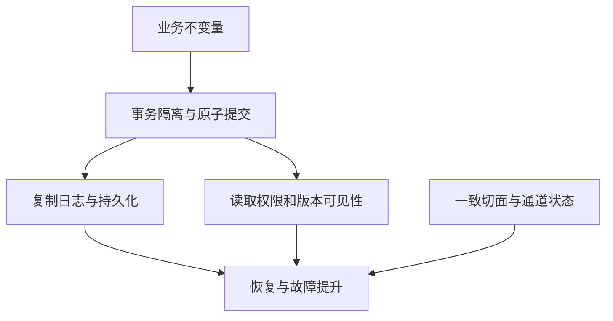

# 分布式数据系统：一致性需要分层说明

“强一致”不足以描述一个完整系统。事务隔离约束并发事务，复制协议约束副本历史，读接口约束能看到哪个版本；快照算法与异步灾备又有不同目标。

```mermaid
flowchart TD
  B[业务不变量] --> T[事务隔离与原子提交]
  T --> R[复制日志与持久化]
  T --> Q[读取权限和版本可见性]
  R --> F[恢复与故障提升]
  Q --> F
  S[一致切面与通道状态] --> F
```

| 问题 | 知识入口 | 不能混淆的结论 |
|---|---|---|
| 同一复制组决定日志顺序 | [[共识协议体系综述]] | Raft 多数提交不自动实现跨 shard 原子性 |
| 跨分片更新一起提交 | [[事务模型深度调研]] | 2PC 不是隔离级别，也不是共识的替代品 |
| 副本可否本地读 | [[CockroachDB-Leader-Lease-整体设计]] | 心跳正常不等于读到合法最新状态 |
| 分区异步备份 | [[Rosé-异步复制协议设计]] | 有界积压不等于停机时仍有有界 RPO 时间 |
| 混合协调强度 | [[Event-Horizon-非对称依赖]] | 弱操作可能撤回/重排，不是任意操作都可交换 |
| 分布式状态快照 | [[Chandy-Lamport-分布式快照算法]] | 一致切面不必是原执行真实同时出现过的状态 |

Event Horizon 依据具体操作间依赖做协调，强操作必须获得足够的弱操作水位与内容，不是看到本地 bag 就能提交。普通 consumer offset 覆盖更新也不能未经语义证明就当作可交换操作。

存算分离进一步拆开日志持久化、页面回放和查询可见性。[[RaaS-Replay-as-a-Service]] 处理回放竞争；[[Doris-元数据与一致性复制]] 需要区分 COMMITTED 与 VISIBLE；[[InfluxDB-写入与查询路径]] 则区分内存可查询和 Parquet 已持久化。它们没有统一的“只要日志落盘就任意节点可读”结论。

工程审查应画出成功响应前后的持久化点，列出可接受故障及恢复不变量，再测试网络分区、超时重试、重配置和延迟副本。设计推论与已发表实验分别记录，不能从架构相似直接推断相同保证。
