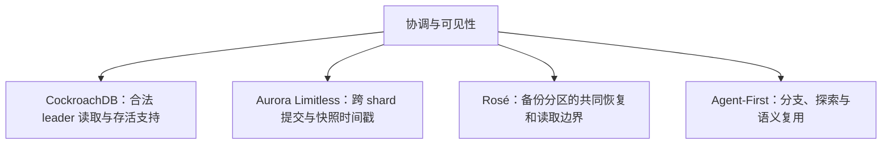
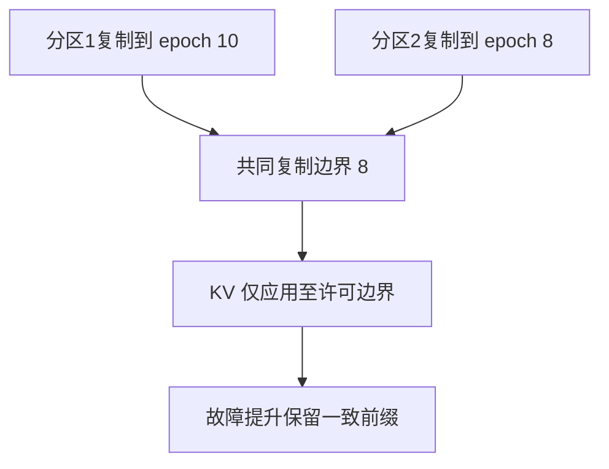

# 分布式事务与复制：2026 论文的不同问题边界

CockroachDB Leader Leases、Aurora Limitless、Rosé 和 Agent-First Data 研究的对象并不相同。将它们放在同一图里，是为了比较协调发生在哪里，而不是把某个方案看成另一方案的升级版本。

## CockroachDB：复制日志之上的读取权限

其 range 复制使用 Raft。Leader lease 和 liveness 支持允许在满足条件时减少读路径协调；不能写成 Multi-Paxos，也不能把没有检测到故障当作天然拥有有效 lease。[[CockroachDB-Leader-Lease-整体设计]]、[[CockroachDB-Liveness-Fabric-故障检测层]]、[[CockroachDB-Leader-Fortification]] 分别解释职责、支持关系和失效处理。

## Aurora Limitless：时间戳不替代提交协议

Router 与 shard 通过时间戳快照提供 RR/SI 与 RC 语义；多 shard 更新采用 lead-shard 参与的两阶段提交。HLC 处理读时间戳推进，commit wait 约束实时顺序，二者都不应被概括成“避免所有 2PC”。单 shard 与只读优化有自己的适用条件。

尊重实时顺序的 SI 仍可能存在 write skew，不能称为串行化。Router 没有专用 standby 也不代表没有持久元数据。实验里的 NOPM、NEWORD 平均延迟、扩容吞吐和 P99 是不同指标；原文个别百分比与表值不一致时，应列出重算过程，见 [[知识库/sources/papers/Aurora-Limitless/精读分析]]。

## Rosé：共同水位与受控应用

备份分区各自复制 epoch，整体可用边界受到较慢分区约束。Coordinated Apply 不让已复制但超出共同许可边界的尾部先进入 KV，从而降低提升备库时清理超界版本的成本。

队列长度限制在途积压，不能保证完全停机分区在有限墙钟时间内追上。若统一 primary epoch 为 E，各 backup 到 e_i，则共同前缀落后量是 `E-min(e_i)=max(E-e_i)`；论文中相反的 min-lag 写法存在疑点，已在精读显式标注，而非当作已证结论沿用。

## Agent-First：把假设与已验证结果分开

分支事务、语义缓存和推测执行针对探索型工作流，不代表可以放松支付、外发消息等真实副作用的事务要求。原文的案例、微基准与愿景应分别阅读。[[知识库/sources/papers/Agent-First-Data/精读分析]] 记录实验设置和表格，不能把语义复用直接当成任意任务等价性证明。

## 共同的评审框架

对每项方案回答：谁有权写、什么时刻应答、读到哪个快照、崩溃后保留哪段历史、最慢分区是否阻塞整体、哪些外部副作用无法撤销。评价时固定故障模型与一致性目标，再比较吞吐、尾延迟和恢复时间。关联 [[事务模型深度调研]]、[[分布式数据系统一致性体系]]。
