> **作者**: Stark (CTO, CHANG_AI_TEAM)
> **日期**: 2026-06-14
> **版本**: v1.1（2026-10-05 来源核验修订）
> **范围**: 经典协议按原论文解释；产品行为按文中标出的官方文档核对。本文是主题调研，不替代各论文的完整精读；示例用于说明机制，未在生产数据库运行。
> **摘要**: 涵盖事务基础概念（ACID、隔离级别）、单机并发控制（2PL、MVCC）、分布式事务协议（2PC/3PC/TCC/SAGA）、现代事务架构（Percolator/Spanner/Calvin）以及主流数据库（MySQL/PostgreSQL/TiDB/CockroachDB）实现的全面技术调研。

---

## 1. 事务基础概念

### 1.1 ACID 特性

事务（Transaction）是应用定义的一组逻辑操作；ACID 描述其原子性、一致性、隔离性和持久性要求。

| 特性 | 全称 | 含义 | 实现机制与边界 |
|------|------|------|----------|
| **A** | Atomicity（原子性） | 提交全部数据库效果，或撤销未提交效果 | 回滚、恢复和原子提交协议；数据库外的副作用需单独处理 |
| **C** | Consistency（一致性） | 事务保持规定的完整性约束与业务不变量 | 数据库约束、正确的事务逻辑及足够的隔离共同保障 |
| **I** | Isolation（隔离性） | 限制并发事务间允许的影响 | 锁、MVCC、验证；具体保证取决于隔离级别 |
| **D** | Durability（持久性） | 已确认提交的效果在承诺的故障模型下可恢复 | 持久日志、刷盘与复制策略；异步提交可弱化承诺 |

**C 不是 A、I、D 自动推出的结果。** 即使事务完全串行且持久，应用只扣款不入账仍会破坏“转账前后总额不变”。数据库只能自动检查已声明且支持的约束，业务逻辑还需表达跨行或跨服务的不变量。ACID 的 C 也不等同于 CAP 的线性一致性。

```text
事务伪代码（不是可直接执行的 Python）：
BEGIN
  验证扣款与入账的业务条件
  debit(account_a, 100)
  credit(account_b, 100)
COMMIT
若提交前明确失败：ROLLBACK
若提交应答丢失：按业务请求 ID 查询最终状态，避免盲目重做转账
```

### 1.2 隔离级别与并发问题

SQL 标准定义了四种隔离级别，用于在并发控制开销与数据正确性之间做权衡：

| 隔离级别 | 脏读 (Dirty Read) | 不可重复读 (Non-Repeatable Read) | 幻读 (Phantom Read) |
|----------|:-----------------:|:-------------------------------:|:-------------------:|
| **Read Uncommitted** | ✅ 可能 | ✅ 可能 | ✅ 可能 |
| **Read Committed** | ❌ 禁止 | ✅ 可能 | ✅ 可能 |
| **Repeatable Read** | ❌ 禁止 | ❌ 禁止 | ✅ 标准允许；实现可提供更强保证 |
| **Serializable** | ❌ 禁止 | ❌ 禁止 | ❌ 禁止 |

这张表仅列标准禁止的三类现象，不能覆盖全部隔离语义。PostgreSQL 的 Repeatable Read 使用快照隔离，不出现上述幻读，但仍允许写偏斜等序列化异常；MySQL InnoDB 则要区分快照一致性读和使用 next-key/gap locks 的锁定读。Serializable 的定义是提交结果等价于某种串行执行，不只是“没有幻读”。参见 [PostgreSQL 18 §13.2](https://www.postgresql.org/docs/18/transaction-iso.html) 和 [MySQL 8.4 §17.7.2.1](https://dev.mysql.com/doc/refman/8.4/en/innodb-transaction-isolation-levels.html)。

**三种典型并发问题**（下列为并发历史示意）：

```
-- 脏读：事务 A 读到事务 B 未提交的数据
Time  T1: UPDATE accounts SET balance=500 WHERE id=1  -- 未提交
      T2: SELECT balance FROM accounts WHERE id=1      -- 读到 500
      T1: ROLLBACK                                     -- 实际回滚了

-- 不可重复读：同一事务内两次读到的值不同（其他事务 UPDATE 导致）
Time  T1: SELECT balance FROM accounts WHERE id=1      -- 读到 100
      T2: UPDATE accounts SET balance=200 WHERE id=1; COMMIT
      T1: SELECT balance FROM accounts WHERE id=1      -- 读到 200

-- 幻读：同一事务内两次查询的行数不同（其他事务 INSERT/DELETE 导致）
Time  T1: SELECT * FROM accounts WHERE balance > 100   -- 返回 5 行
      T2: INSERT INTO accounts VALUES (6, 150); COMMIT
      T1: SELECT * FROM accounts WHERE balance > 100   -- 返回 6 行
```

---

## 2. 单机事务与并发控制

### 2.1 两阶段锁（2PL: Two-Phase Locking）

2PL 是经典的基于锁的并发控制协议。核心规则：

1. **Growing Phase（增长阶段）**: 只能获取锁，不能释放锁
2. **Shrinking Phase（收缩阶段）**: 只能释放锁，不能获取锁


图：严格 2PL 的写锁生命周期示例。普通 2PL 约束锁获取/释放顺序；严格性再约束排他锁的释放时机。

**锁类型与兼容矩阵**：

|  | S (共享锁) | X (排他锁) |
|--|:---------:|:---------:|
| **S** | ✅ 兼容 | ❌ 冲突 |
| **X** | ❌ 冲突 | ❌ 冲突 |

**Strict 2PL**（严格两阶段锁）额外要求：排他锁持有到事务提交或中止回滚完成。2PL 在对访问对象及必要谓词正确加锁的前提下保证冲突可串行化；严格持有写锁还避免其他事务读取或覆盖未提交数据，从而简化恢复。

**核心缺点**：
- **死锁风险**: 事务间互相等待对方持有的锁
- **读写互斥**: 读操作也需要获取共享锁，与写操作冲突
- **长事务阻塞**: 长事务会延长与其所持锁冲突的事务的等待

### 2.2 MVCC（Multi-Version Concurrency Control）

MVCC 保存多个数据版本，读操作根据快照选择可见版本。普通快照读通常可以避开写锁，但锁定读、写写冲突、DDL 等仍可能等待或死锁；不能把 MVCC 等同于“完全无锁”。

**核心思想**：
- 写入产生新版本或保留可恢复旧值的 undo 记录。
- 读取使用快照可见性规则，而不是只比较“版本事务号是否小于自己的事务号”。
- 已无合法快照需要的旧版本由 GC、Purge 或 VACUUM 回收。

| PostgreSQL 示例版本 | 创建事务 xmin | 更新/删除事务 xmax | 值 |
|---|---|---|---|
| v1 | Tx1 | Tx3 | 100 |
| v2 | Tx3 | Tx5 | 200 |
| v3 | Tx5 | 无删除事务 | 300 |

表中假定均为普通更新。实际 `xmax` 也可能表示行锁或 MultiXact，需结合元组标志位解释。

**可见性示例**：Tx3 尚活跃时，事务 R 获取快照，随后 Tx3 提交。R 的后续固定快照读仍应看到 v1，而非 v2；只检查 `xmin < R.xid && 已提交` 会得出错误结果。正确抽象是：创建事务在该快照可见，且没有在该快照可见的删除/更新；本事务自己的修改另按命令顺序处理。这里不展开 PostgreSQL 的完整存储层判定算法。

**快照隔离（SI）**让事务使用固定快照，并检测并发写同一对象等冲突；快照建立时点由系统定义，未必是 `BEGIN` 的墙钟时刻。它仍允许写偏斜：两个值班医生各看到另一人在岗，再分别把自己设为离岗；写集合不相交，可能都提交。解决此类约束需要可串行化隔离，或针对不变量设计锁/校验。

MVCC 可降低普通读写间的阻塞，但付出版本存储与回收成本。长快照可能延迟旧版本回收；不同系统也可能选择让过旧快照失败。证据：[PostgreSQL 18 事务隔离](https://www.postgresql.org/docs/18/transaction-iso.html) 与 [VACUUM](https://www.postgresql.org/docs/18/routine-vacuuming.html)。

### 2.3 WAL（Write-Ahead Logging）预写日志

WAL 的关键顺序是：**包含某次修改的数据页刷到持久存储之前，相应日志必须先持久化**。内存缓冲页可以在日志真正落盘前修改；同步提交另要求所需提交日志持久化后才向客户端确认成功。

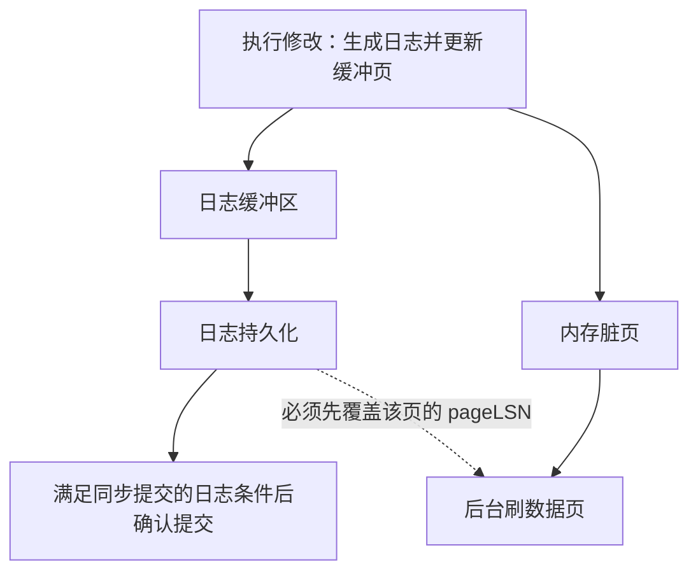

图：两个持久化约束，而非“每修改一次内存都先 fsync”。实际系统还可使用 group commit 合并刷盘。

| 日志类型 | 用途 | 记录内容的抽象 |
|----------|------|----------|
| Redo/WAL | 重做尚未持久写入数据页的变更 | 足以重建修改的信息，可采用物理、逻辑或两者结合的记录 |
| Undo | 撤销未提交操作；部分系统也用于历史版本读取 | 旧值或逆向操作信息；不要求与 redo 存储在同一记录 |

上述机制不代表所有数据库都具有相同的 redo/undo 格式。证据：[PostgreSQL 18 §28.3 WAL](https://www.postgresql.org/docs/18/wal-intro.html)。

### 2.4 ARIES 崩溃恢复算法

ARIES（Algorithm for Recovery and Isolation Exploiting Semantics）是经典 WAL 恢复方法。此处解释原始 ARIES；具体数据库可能采用不同恢复设计，不能据此把 InnoDB 等系统视为原算法的逐步实现。

**三个核心原则**：

1. **WAL (Write-Ahead Logging)**: 先写日志再写数据
2. **Repeating History During Redo**: 恢复时重放所有操作（包括未提交事务的）
3. **Logging Changes During Undo**: 回滚未提交事务时也要记日志

**恢复三步走**：

```
Phase 1: Analysis（分析阶段）—— 从上一个 Checkpoint 开始扫描日志
  → 确定哪些事务已提交，哪些未提交
  → 构建脏页表（Dirty Page Table）和活跃事务表

Phase 2: Redo（重做阶段）—— 从最早的脏页 LSN 开始
  → 扫描相关日志，按脏页表、recLSN 与 pageLSN 判断是否需要重做
  → 包括已提交和未提交的事务

Phase 3: Undo（回滚阶段）—— 沿未完成事务的日志链反向处理
  → 回滚应中止的 loser 事务；不擅自回滚等待全局决定的 Prepared 分支
  → 对每个 Undo 操作也记录 CLR (Compensation Log Record)
```

**LSN (Log Sequence Number)** 是 ARIES 的心脏：
- 每个日志记录有全局递增的 LSN
- 每个数据页记录最后一次修改它的 LSN（pageLSN）
- Redo 判断还依赖脏页表和 recLSN；通过这些筛选后，只有日志修改尚未反映在 pageLSN 中才需要重放。

证据：[ARIES 原论文](https://www.cs.cmu.edu/~15849g/readings/mohan92.pdf) §3 的算法概览与 §6.1–6.3 的恢复过程；其历史重演包含需要恢复的未提交更新，之后通过 Undo 和 CLR 撤销应中止的事务。涉及 2PC 的 in-doubt 状态需保留并恢复其决定，不属于可自行中止的 loser 事务。

---

## 3. 分布式事务协议

当数据分布在多个节点上，单机事务机制不再够用，需要分布式事务协议。

### 3.1 2PC（Two-Phase Commit，两阶段提交）

2PC 是**原子提交**协议：所有参与者对同一事务达成一致的提交或中止结果。它不单独提供可串行化隔离，也不等同于副本共识；并发控制与复制需要各自的机制。

1. Prepare：参与者把足以恢复 Prepared 状态的日志持久化，承诺有能力提交后才回复 Yes。
2. 决策：全部 Yes 才能选择 Commit；在作出提交决定前，No 或无法完成 Prepare 可导致 Abort。协调者必须按协议持久保存决策，再通知参与者。
3. 完成：参与者记录并执行决定、释放资源；丢失的消息可重传。已经投 Yes 的参与者不能仅凭本地超时自行中止，因为协调者可能已决定提交。

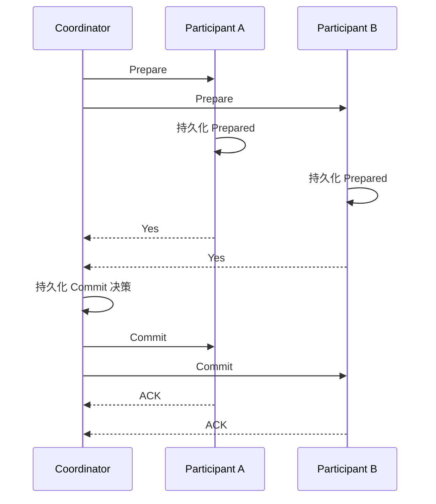

图：成功路径。协调者决策不可达时，尚未得知结果的 Prepared 分支可能阻塞；这不意味着整个数据库所有事务都阻塞。正确恢复日志维持一致决策，不能把“协调者恢复后脑裂”描述成协议的必然性质。

**XA 接口**用于外部事务管理器协调资源管理器。MySQL 提供 XA SQL；PostgreSQL 提供 `PREPARE TRANSACTION` 等两阶段提交命令，集成方式不同。[MySQL XA](https://dev.mysql.com/doc/refman/8.4/en/xa.html)、[PostgreSQL PREPARE TRANSACTION](https://www.postgresql.org/docs/18/sql-prepare-transaction.html)。

```sql
-- 演示不同资源管理器上的两个分支；不是同一连接顺序执行的完整协调器。
-- 连接 A / 资源管理器 A：相同 gtrid，branch qualifier 为 b1
XA START 'tx_001', 'b1', 1;
UPDATE accounts SET balance = balance - 100 WHERE id = 1;
XA END 'tx_001', 'b1', 1;
XA PREPARE 'tx_001', 'b1', 1;

-- 连接 B / 资源管理器 B：branch qualifier 为 b2
XA START 'tx_001', 'b2', 1;
UPDATE accounts SET balance = balance + 100 WHERE id = 2;
XA END 'tx_001', 'b2', 1;
XA PREPARE 'tx_001', 'b2', 1;

-- 协调器仅在两者成功 Prepared 且持久记录全局 Commit 后，分别发给 A、B：
XA COMMIT 'tx_001', 'b1', 1;
XA COMMIT 'tx_001', 'b2', 1;
```

示例省略约束检查、重连、`XA RECOVER`、失败决策与日志恢复；标识语法依据 [MySQL 8.4 XA statements](https://dev.mysql.com/doc/refman/8.4/en/xa-statements.html)。同一数据库内可完成的转账通常直接使用本地事务。

2PC 的开销来自协调轮次、持久化和 Prepared 资源占用。复制协调状态可改善容错，但网络分区下的推进仍取决于恢复与多数派条件。理论依据：[Gray 与 Lamport, Consensus on Transaction Commit](https://www.microsoft.com/en-us/research/wp-content/uploads/2016/02/tr-2003-96.pdf) §2–4。

### 3.2 3PC（Three-Phase Commit，三阶段提交）

3PC 在投票与最终决定之间引入预提交状态，用额外通信减少部分故障场景下的不确定性。


图为阶段抽象，省略各状态的终止协议。**不能把“进入 PreCommit 后超时就自动提交”当作一般实现规则**：非阻塞结论依赖同步性和故障假设，在任意网络分区下独立决定可能破坏原子性。超时只说明消息未及时到达，不能证明对端没有提交。

在异步系统里，安全性与一定时间内终止是不同要求；FLP 不是“协调者一故障就无法恢复”的结论。经典 2PC、非阻塞提交与 Paxos Commit 的条件比较见 [Gray 与 Lamport §2–4](https://www.microsoft.com/en-us/research/wp-content/uploads/2016/02/tr-2003-96.pdf)。

### 3.3 TCC（Try-Confirm-Cancel）

TCC 把业务操作设计成资源预留、确认、取消三个接口。一次 Try 可以用短本地事务持久保存预留，随后释放数据库锁；**业务资源仍被预留**，不能被其他请求重复使用。

| 阶段 | 库存预占示例 | 必需的状态约束 |
|---|---|---|
| Try | 校验可售库存，按请求 ID 创建预留并减少可售量 | 预留与分支状态在同一本地事务原子更新 |
| Confirm | 把已预留库存转为已售 | 重复调用不重复扣减；已取消分支不能再确认 |
| Cancel | 释放预留 | 重复调用不重复释放；Try 未到达时也记录取消状态 |

```text
TCC 协调伪代码（省略持久调度、重试及故障恢复）：
持久登记事务与全部分支
调用各分支 Try
若全部预留成功：持久记录 Confirm 决策，持续驱动各分支 Confirm
否则：持久记录 Cancel 决策，持续驱动各分支 Cancel
状态未知时先查询/重试，不把网络超时等同于 Try 没有执行
```

| 维度 | 数据库 2PC | TCC |
|------|------|-----|
| 协调对象 | 资源管理器的 Prepared 分支 | 应用定义的资源预留与业务状态 |
| 隔离基础 | 数据库并发控制，Prepared 期间可能持锁 | 每阶段的本地事务，加跨阶段业务预留规则 |
| 故障恢复 | 决策日志与未决分支恢复 | 持久状态机、重试、幂等、空回滚和防悬挂 |
| 正确性边界 | 原子提交仍需另配隔离机制 | 不自动提供跨服务瞬时可见性或可串行化 |

TCC 可用于可预留资源，但其性能、可用性与一致性取决于接口设计和故障处理。确认中的不同分支可能暂时处于不同状态；业务若要求原子可见，必须再设计读取/发布规则。不能仅因使用了 TCC 就宣称资金或库存全局强一致。[Seata TCC fence 机制](https://seata.apache.org/blog/seata-tcc-fence/)展示了幂等、空回滚与悬挂的具体处理。

### 3.4 SAGA 模式

SAGA（Saga）是处理长事务（Long-Lived Transaction, LLT）的模式，把一个大事务拆分为一系列有序的本地事务。

**两种协调方式**：

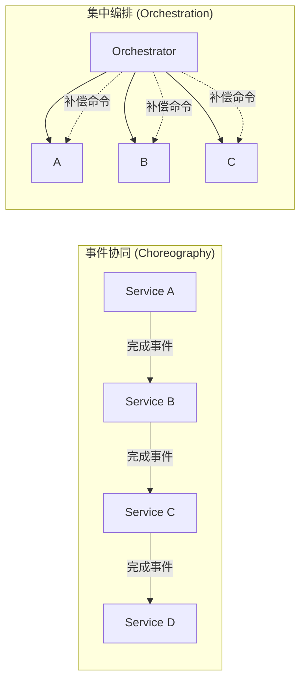

**补偿机制核心**：
```
正常完成: T1 → T2 → T3 → ... → Tn
部分完成后中止: T1 → ... → Tj → Cj → ... → C2 → C1
每个需要补偿的 Ti 有对应的 Ci，未完成的本地事务先按本地机制回滚

例如订单流程:
  T1: 创建订单      C1: 取消订单
  T2: 扣减库存      C2: 恢复库存
  T3: 扣款          C3: 退款
  T4: 更新积分      C4: 扣减积分
```

```text
Saga 编排伪代码（不表示可直接部署的协调器）：
为每一步持久记录请求 ID、执行状态与补偿参数
驱动当前本地事务，按请求 ID 查询或重试未知结果
成功则持久记录进度并执行下一步
确认失败后，对已经完成的步骤按业务依赖逆序发起补偿
补偿失败则持久排队重试或进入人工处理状态
```

补偿是新的业务事务，不是时间倒流：退款不能撤回已经发送的通知，也不能保证其他事务未观察到中间状态。协调者崩溃后必须能恢复执行进度；只把成功步骤放在内存数组中不足以实现 Saga。动作应可幂等重试，无法补偿的步骤需要业务上的前置检查或兜底。

Saga 的原始定义与恢复讨论见 [Garcia-Molina 与 Salem, SAGAS（1987），§1、§4–6](https://www.cs.cornell.edu/andru/cs711/2002fa/reading/sagas.pdf)。上方事件协同/集中编排图是现代工程组织方式的说明，不是原论文配图。

**SAGA vs TCC**：

| 维度 | SAGA | TCC |
|------|------|-----|
| 常见用途 | 可补偿的多步长流程 | 可预留资源的确认/取消流程；时长无协议固定界限 |
| 资源占用 | 本地事务可能持锁，步骤间通常不长期持数据库锁 | 跨阶段保留业务资源，各阶段仍可能使用本地锁 |
| 实现模式 | 事件协同或集中编排 | Try-Confirm-Cancel 三元组 |
| 隔离性 | 中间结果可能可见，需业务语义处理 | 预留可防止资源被重复使用，不能自动推出全局隔离 |

### 3.5 事务消息与 Transactional Outbox

两种方案都用于衔接本地事务与异步消息，但协议不同。**RocketMQ 事务消息**先保存消费者不可见的半消息，再由生产者提交本地事务并告知 Broker 结果；未知结果通过回查业务的持久状态解决。回查不是重新执行业务事务。

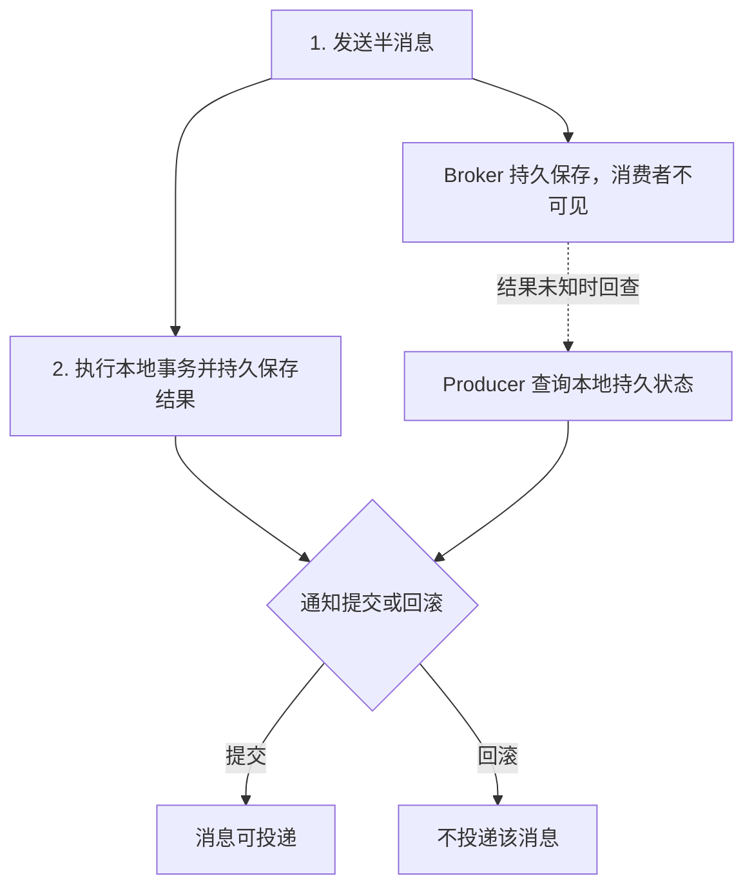

图：RocketMQ 事务消息的简化恢复路径。生产者必须能可靠查询本地结果；该机制不包办消费者数据库事务，也不自动提供端到端 exactly-once。[RocketMQ 5.0 官方说明](https://rocketmq.apache.org/docs/featureBehavior/04transactionmessage/)。

**Transactional Outbox** 则把业务变更与待发送事件写入同一个本地数据库事务，之后由 relay/CDC 发布。

```sql
-- SQL 结构示意：省略实际字段、约束和 relay 的并发抢占逻辑。
BEGIN;
INSERT INTO orders (...) VALUES (...);
INSERT INTO outbox (event_id, topic, payload, status) VALUES (...);
COMMIT;
```

若 relay 发送后、标记已发送前崩溃，恢复时可能重复发送，因此消费者仍需按 `event_id` 去重，并把去重记录与业务变更放进同一个本地事务。投递失败会造成延迟；死信、重放与顺序要求要单独设计。它保证本地业务与发布意图原子写入，不保证所有下游同时可见。

---

## 4. 现代分布式事务架构

### 4.1 Percolator（MVCC + 乐观冲突检查 + 2PC）

Percolator（OSDI 2010）在 Bigtable 的单行事务之上提供跨行事务与快照隔离。客户端协调提交，TSO 分配时间戳；“客户端协调”不意味着没有共享时间戳服务。

| 每个数据单元的列 | 作用 |
|---|---|
| data | 按 `start_ts` 保存待提交/历史值 |
| lock | 按 `start_ts` 保存锁，并指向选定的 primary |
| write | 按 `commit_ts` 保存指向 data 的 `start_ts` |

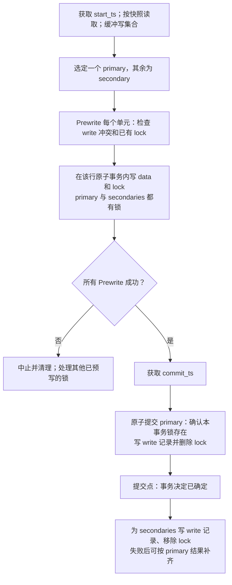

图：原论文 §2.1、Figure 6（PDF 第 5 页）的提交过程。secondary 的锁与 write 记录分别承担未决保护和提交可见性；提交收尾写入 write 记录，同时移除 lock。

**读路径的抽象伪代码**：

```text
read(key, read_ts):
  若存在 start_ts <= read_ts 的 lock：
    检查其 primary 与事务存活/恢复状态
    已提交：按 primary 的 commit_ts 补写 secondary write 记录并清锁
    仍活跃或结果未知：等待/重试，不能直接回滚
    已安全判定中止：清理未提交数据与锁
    然后重新读取
  选取 commit_ts <= read_ts 的最新 write 记录
  按其中的 start_ts 读取 data 版本；不存在则返回未找到
```

这是概念抽象，原协议的单行原子检查与失败清理不能省略。仅凭“没有查到已提交”不能推断 Abort；已提交 primary 不可被回滚。

**自拟示例**：事务 `start_ts=10` 更新 A、B，选 A 为 primary，`commit_ts=20`。A 已提交而 B 仍有锁时，时间戳 25 的读可查 A 的决定并补齐 B；时间戳 15 的快照应看到此次提交前的版本。锁负责阻止读者把“尚未补齐”误当“未提交”，而不是所有读都一律返回新值。

证据：[Percolator 原论文 §2.1、Figures 3–6](https://www.usenix.org/legacy/event/osdi10/tech/full_papers/Peng.pdf)。该设计提供 SI，不能自动防止写偏斜。TiKV 后来的悲观锁、Async Commit 和 1PC 是不同扩展，见 §5.3。

### 4.2 Spanner / TrueTime（时间不确定性与外部一致性）

Spanner 2012 论文描述了全球分布式数据库如何提供外部一致事务。这里不作“全球首个”排序断言。**外部一致性**要求串行顺序尊重已完成事务与后来事务之间的真实时间先后。

TrueTime 暴露时间区间，而非假装本地时钟精确：`TT.now()` 返回 `[earliest, latest]`；`TT.after(t)` 判断 t 已确定过去，`TT.before(t)` 判断 t 尚确定未到。正确性依赖区间确实包住真实时间，不确定度并非恒定 1–7 ms 的产品承诺。

**2012 论文读写提交路径的要点**：

1. 参与者执行并发控制；跨 Paxos group 事务由各组 leader 参与 2PC。
2. 协调者选择提交时间戳 s，满足所有 prepare 时间戳、协调者的时间边界及 leader 时间戳单调性约束。
3. 通过 Paxos 记录决定，并在允许提交效果可见/通知完成前满足 `TT.after(s)`，即 `TT.now().earliest > s`；等待可与复制通信重叠。
4. 参与者记录决定、按相同时间戳应用并释放锁。持久决定、复制和隔离都不可由“原子钟硬件”替代。

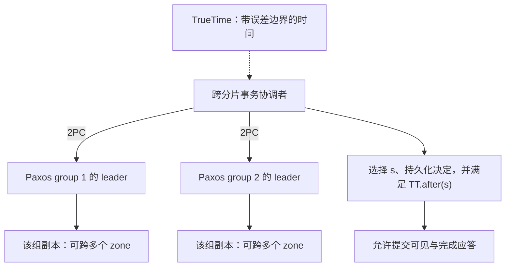

图：**group 是复制/事务参与单位，zone 是部署故障域**，不能把一个 zone 画成一个 Paxos group。来源：[Spanner §3、§4.1.2、§4.2.1，PDF 第 5–8 页](https://www.usenix.org/system/files/conference/osdi12/osdi12-final-16.pdf)。

| 维度 | Spanner 论文机制 | CockroachDB 机制 |
|------|---------------|-------------|
| 时间基础 | TrueTime 的有界时间区间 | HLC 与受控时钟偏差假设 |
| 避免时间歧义 | 提交时间戳约束与 commit wait | 不确定读可能推动时间戳、验证已读集合或重试 |
| 配套机制 | 复制、锁、2PC、safe time | Raft、事务记录、write intents、锁和读刷新 |

上表比较机制，不把 CockroachDB 的不确定读重试说成“内置 commit wait”；global tables 等专门读写路径还有额外规则。[CockroachDB 时钟说明](https://www.cockroachlabs.com/blog/clock-management-cockroachdb/)。

**当前产品边界（2026-10-05 核对）**：Spanner 默认 Serializable，另支持 Repeatable Read（SI）；不能把外部一致可串行化保证无条件套到 SI 的多事务执行。只读快照与读写事务也需区分。见 [Spanner 隔离级别](https://docs.cloud.google.com/spanner/docs/isolation-levels) 与 [外部一致性说明](https://docs.cloud.google.com/spanner/docs/true-time-external-consistency)。

### 4.3 Calvin（确定性事务调度）

Calvin（SIGMOD 2012）把事务输入的排序与复制移到持锁执行之前，再以确定性锁调度和执行恢复计划，减少执行结束时的分布式提交协调。它不是仅给事务一个序号就“自动原子提交”。

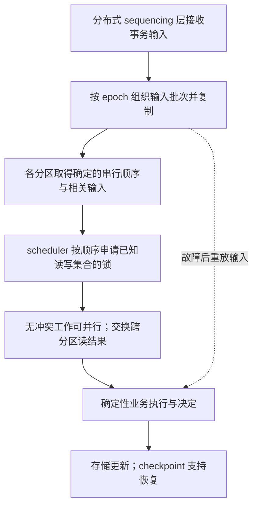

图：原论文 §3.1–3.2 的抽象。Sequencer 是分布式组件，不是所有请求必经的单台机器。确定性执行仍需要跨分区通信，输入复制也有协议与延迟成本。

**省去执行后 2PC 的条件**：输入顺序和恢复信息已可靠确定；调度、所需输入和业务决定具有确定性。节点故障通过恢复重放完成预定工作，而非因为超时在部分分区任意中止；业务逻辑导致的中止必须能够确定性重现。

**限制与折中**：需要在加锁前知道读写集合。§3.2.1 给出 OLLP：先用 reconnaissance 查询预测集合，再在正式执行时校验；预测失效需要重试，因此并非“所有动态依赖都不支持”，也不能视为任意交互 SQL 的直接替代。批处理、排序、跨分区依赖和热点决定实际延迟/吞吐，本文没有新增基准测试。

证据：[Calvin 原论文 §2、§3.1–3.2.1，PDF 第 3–6 页](https://cs.yale.edu/homes/thomson/publications/calvin-sigmod12.pdf)。

---

## 5. 核心系统实现对比

### 5.1 MySQL InnoDB

**架构概览**：

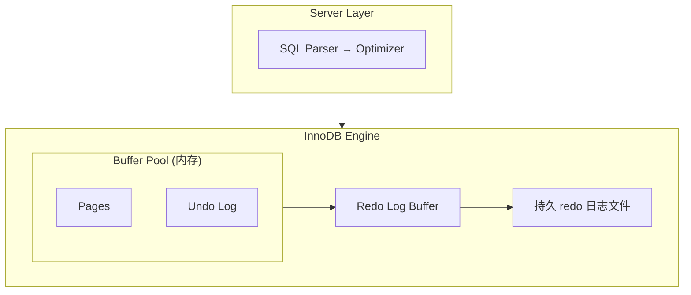

**MVCC 实现核心**：

InnoDB 通过 **Undo Log（回滚段）** 实现 MVCC：

```
每行数据隐藏列:
  DB_TRX_ID  : 最后一次修改该行的事务 ID (6 bytes)
  DB_ROLL_PTR: Undo Log 指针，指向回滚段记录 (7 bytes)
  DB_ROW_ID  : 当没有可选作聚簇索引的主键/合适唯一非空索引时使用隐藏行 ID

ReadView（读视图）判断可见性（正常读视图的概念抽象，不是完整源码）:
  m_ids[]     : 创建 ReadView 时活跃事务列表
  min_trx_id  : 活跃事务中的最小 ID
  max_trx_id  : 下一个将分配的事务 ID
  creator_trx_id: 创建该 ReadView 的事务 ID

可见性规则:
  if (trx_id == creator_trx_id) → 可见（自己的修改）
  if (trx_id < min_trx_id)      → 可见（已提交）
  if (trx_id >= max_trx_id)     → 不可见（未来事务）
  if (trx_id in m_ids[])        → 不可见（活跃未提交）
  else                          → 可见（已提交）
```

**隔离级别实现差异**（MySQL 8.4）：

| 隔离级别 | 普通一致性读 | 锁定读与写入 |
|----------|-------------------|----------|
| Read Uncommitted | 可读未提交版本 | 写操作仍需并发控制 |
| Read Committed | 每次一致性读建立新快照 | 通常使用记录锁；外键/重复键检查等有例外 |
| Repeatable Read（默认） | 第一次一致性读建立并复用快照；显式一致快照启动另有规则 | 对索引范围可使用 next-key/gap locks；不是所有查询都加 gap lock |
| Serializable | 关闭 autocommit 时普通 SELECT 转为共享锁定读 | autocommit 的单语句只读事务可用非锁定读 |

快照读与当前锁定读不能混为一个固定视图。证据：[MySQL 8.4 隔离级别](https://dev.mysql.com/doc/refman/8.4/en/innodb-transaction-isolation-levels.html)。

**Redo 提交策略**（`innodb_flush_log_at_trx_commit`）：

| 值 | 策略 | 故障边界 |
|:--:|------|------|
| 0 | 后台周期性写日志并刷盘 | 进程崩溃也可能丢失尚在日志缓冲区的提交 |
| 1 | 提交时写日志并完成持久化，可 group commit | 依赖 OS/存储如实实现持久化；不是所有故障下绝不丢失 |
| 2 | 提交时写 OS 缓存，后台周期性刷盘 | OS 崩溃/断电可能丢失未持久化的提交 |

0/2 的默认后台周期不能作为精确“最多丢 1 秒”的保证，调度和配置会改变窗口。二进制日志的持久性还涉及 `sync_binlog`，吞吐高低需实测。证据：[MySQL 8.4 参数说明](https://dev.mysql.com/doc/refman/8.4/en/innodb-parameters.html#sysvar_innodb_flush_log_at_trx_commit)。

### 5.2 PostgreSQL

PostgreSQL 的普通堆表更新保留旧元组，通过 XID、事务状态和快照决定可见性；不能把“没有 InnoDB 式 undo 版本链”等同于无需日志或回滚机制。

| 元组字段 | 含义 |
|---|---|
| xmin | 创建版本的事务 ID |
| xmax | 更新/删除事务或锁信息，需结合标志位解释 |
| ctid | 元组位置；更新链可能指向后继版本 |
| infomask | 可见性与锁等标志 |

默认 Read Committed；Repeatable Read 实现 SI；Serializable 使用 SSI 检测可能形成序列化异常的依赖。SSI 的谓词锁主要用于依赖跟踪，不能与传统阻塞范围锁等同；应用需能重试整个序列化失败事务。[PostgreSQL 18 §13.2](https://www.postgresql.org/docs/18/transaction-iso.html)。

**XID 回卷与冻结**：正常 XID 使用 32 位空间循环，比较相对先后要考虑约半个空间的有效范围（约 2³¹），不能画成 `0 → 2³¹−1` 的回卷。

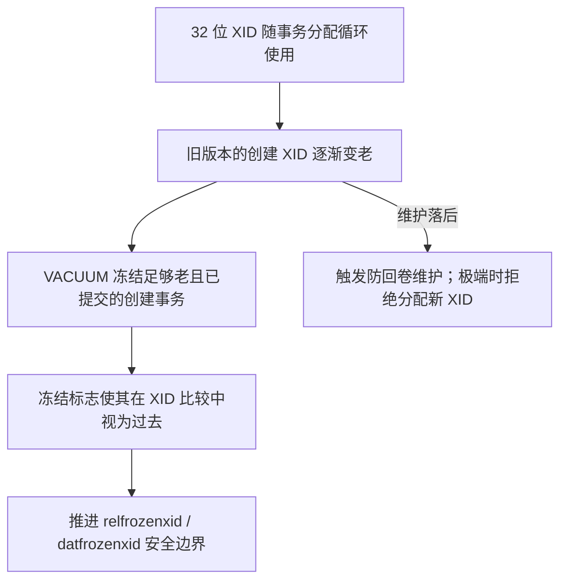

图：防回卷机制，非 XID 数轴。PostgreSQL 9.4 起通常设置冻结标志并保留原 `xmin`，不再统一把字段改成 2。冻结只解决创建事务过旧问题，后续删除等可见性规则仍有效。防回卷触发阈值由参数和年龄决定，不是固定“20 亿进入只读模式”；应监测冻结进度并保证 autovacuum 能完成。证据：[PostgreSQL 18 §24.1.5](https://www.postgresql.org/docs/18/routine-vacuuming.html#VACUUM-FOR-WRAPAROUND)。

### 5.3 TiDB / TiKV

**分工图**：SQL/客户端协调跨 Region 事务；TiKV 执行事务状态操作，各 Region 用 Raft 复制底层写入。Raft 本身不决定多个 Region 的全局原子提交。

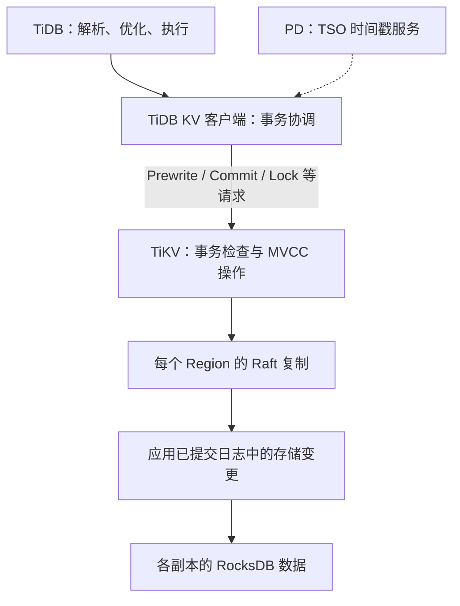

图为写入职责示意，省略读路径、调度与并发控制内部细节。跨 Region 的客户端协调建立在各 Region 的复制服务之上。

| 设计点 | 机制与边界 |
|--------|------|
| 事务模式 | 保留乐观与悲观模式；从 v3.0.8 起新建集群默认悲观，升级旧集群需核对配置 |
| 隔离级别 | 默认 Repeatable Read，以 SI 为基础；Read Committed 仅在悲观模式生效，当前读和 MySQL gap-lock 行为有差异 |
| 时间戳 | PD TSO；批量与缓存优化不能改写为无时间戳依赖，也无固定“每节点 40 万 QPS”结论 |
| Async Commit | 所有预写成功并确定合法 commit_ts 后可提前返回，将提交收尾异步化；锁中携带恢复所需信息 |
| 1PC | 写入可在单个 Region 内原子完成且满足条件时走一个阶段，可包含多个 key；条件不满足会回退 |
| MVCC GC | 按安全点回收旧版本，需考虑事务/备份/CDC 等保留需求及版本行为 |

**Async Commit 与 1PC 是独立优化。** 前者并不等于“单行事务免除 TSO”，后者也不意味着整个事务生命周期没有取时间戳。证据：[事务隔离](https://docs.pingcap.com/tidb/stable/transaction-isolation-levels/)、[悲观模式](https://docs.pingcap.com/tidb/stable/pessimistic-transaction/)、官方开发指南 [Async Commit](https://pingcap.github.io/tidb-dev-guide/understand-tidb/async-commit.html) 与 [1PC](https://pingcap.github.io/tidb-dev-guide/understand-tidb/1pc.html)。产品页按 2026-10-05 核对，部署时应使用对应版本文档。

### 5.4 CockroachDB

CockroachDB 将 MVCC、write intents、事务记录、锁表、时间戳缓存/读刷新与 Raft 组合起来实现事务。Write intent 是暂定值与事务锁信息的持久表示，不能称为“无锁”；Serializable 也不等同于 PostgreSQL 的 SSI 实现。

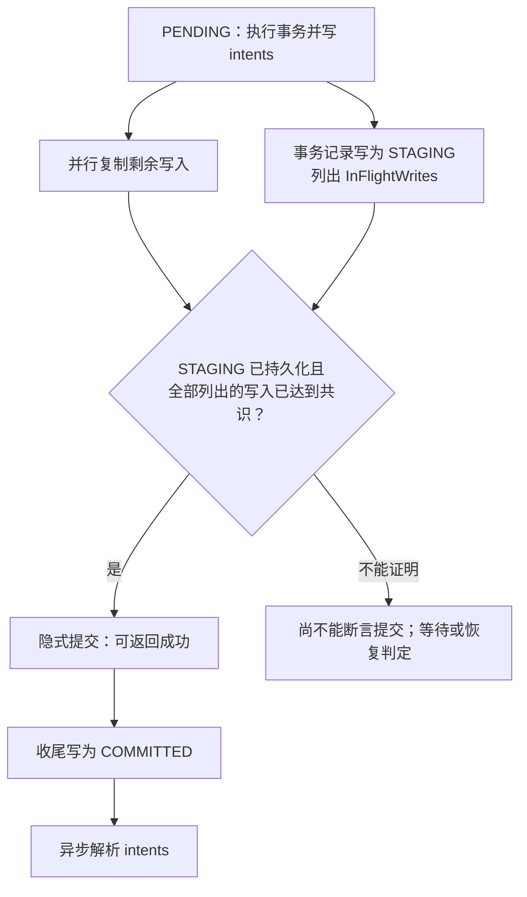

图：Parallel Commit 成功路径。`STAGING` 本身不足以提交，必须与已复制的 in-flight writes 一起构成证据。协调者故障时恢复流程检查这些写入；正常仍有心跳时，冲突事务通常等待收尾。读者不会任意把另一事务从 PENDING 推到 STAGING。[事务层官方文档，Parallel Commits](https://www.cockroachlabs.com/docs/stable/architecture/transaction-layer)。

**时钟不确定性**主要在读取新版本时体现，不是“commit_ts 落在窗口就等待后提交”：

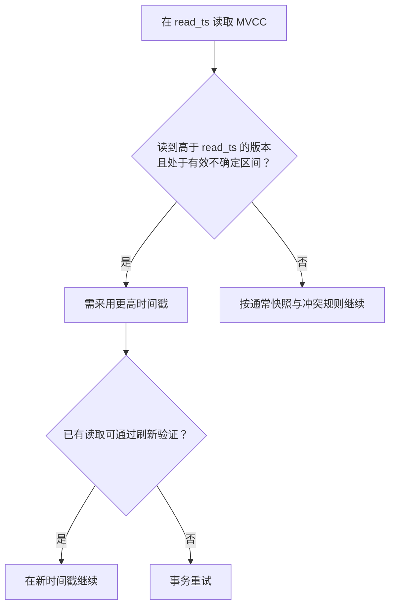

图为 Serializable 常规路径的简化；有效窗口会受到观测时间等信息缩小。global tables、锁定读和其他优化有不同等待行为，不能推出“CockroachDB 从不等待”。证据：[官方 consistency model](https://www.cockroachlabs.com/blog/consistency-model/) 和 [clock management](https://www.cockroachlabs.com/blog/clock-management-cockroachdb/)。

按核对时的稳定版文档，默认 Serializable，另支持 Read Committed。较低隔离可减少某些冲突重试，但允许更多并发异常；不是所有业务都能直接降级。

### 5.5 系统综合对比

机制层次不同，不能把 2PC、MVCC、共识、时钟服务作为互斥选项。以下为 2026-10-05 核对的文档口径，MySQL 固定 8.4、PostgreSQL 固定 18；云产品和 stable 文档后续会变化。

| 维度 | MySQL InnoDB | PostgreSQL | TiDB/TiKV | CockroachDB | Spanner |
|------|------|------|------|------|------|
| 主要事务范围 | 本地实例；XA 可供外部协调 | 本地实例；prepared transactions 可供外部协调 | 原生跨 Region 事务 | 原生跨 Range 事务 | 原生跨 split/group 事务 |
| 默认隔离 | RR | RC | RR / SI 基础 | Serializable | Serializable |
| 其他隔离 | RU、RC、Serializable | RR / SI、Serializable / SSI；RU 映射 RC | 悲观模式支持 RC | RC | Repeatable Read / SI |
| 版本与冲突控制 | Undo + 锁/next-key lock | 堆版本 + 锁；SSI 依赖检测 | MVCC + 乐观/悲观事务 | MVCC + intents/锁表、时间戳与读刷新 | MVCC + 锁或验证，取决于隔离/并发模式 |
| 跨分片提交 | 外部协调时可用 XA 2PC | 外部管理器使用两阶段提交接口 | Percolator 衍生；Async Commit / 1PC 快路径 | Parallel Commit 等路径 | 跨组 2PC；组内复制 |
| 分布式复制与时间 | 取决于部署方案 | 取决于部署方案 | Region Raft + PD TSO | Range Raft + HLC | Paxos + TrueTime |

证据分别见 §5.1–5.4 的官方文档及 [Spanner 隔离级别](https://docs.cloud.google.com/spanner/docs/isolation-levels)。CAP 分类需要明确网络分区与部署模型；支持内部 2PC 不等于提供外部 XA 接口。底层分布式文件系统也不能与本地存储引擎直接并列比较。

---

## 6. 选型与实践建议

### 6.1 事务模型选择决策树

先确定必须维护的不变量、读者可看到的中间状态及失败后的处理方式，再选择协议与产品。下图是本文的工程判断，不是对某一产品的性能结论。

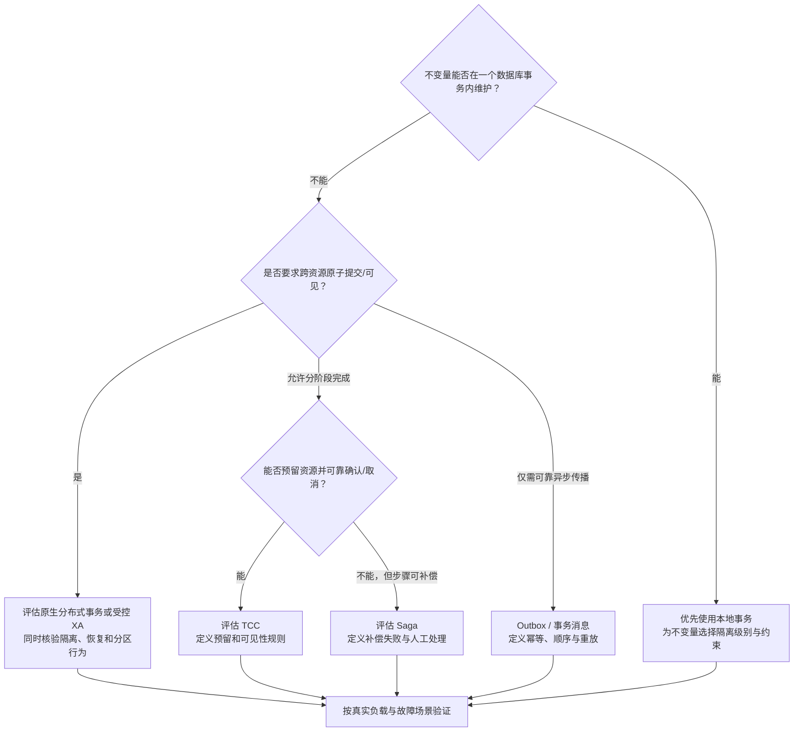

图：决策关注语义与恢复条件。跨服务流程即使使用数据库事务，也要处理支付网关、通知等数据库外效果；可补偿或最终完成不能替代业务要求的强隔离。

### 6.2 隔离级别与性能：如何建立可复核结论

**隔离级别没有跨系统通用的固定性能比例。** 没有版本、配置、负载和可追溯报告的相对吞吐百分比不能用于选型；sysbench/YCSB 名称本身不是实验来源。

| 对比时必须固定/记录的条件 | 需要观察的结果 |
|---|---|
| 产品版本、硬件、数据量、缓存命中、复制因子与部署延迟 | 已成功完成的逻辑事务吞吐，而非含失败尝试的请求量 |
| 读写比、键分布、热点比例、事务长度和跨分片比例 | P50/P95/P99 延迟，包含客户端重试和退避 |
| 隔离级别、并发模式、锁定读、持久化与复制配置 | 锁等待、重试/中止原因、CPU/IO/网络开销 |
| 并发度、预热、测量时长、随机种子、多次重复 | 结果分布与稳定性，避免只报最佳一轮 |
| 业务不变量与故障注入方案 | 是否出现写偏斜、重复效果、未知提交未恢复等正确性问题 |

PostgreSQL SSI 的依赖跟踪可能增加开销，也可能在特定负载下优于阻塞锁；CockroachDB 的 Serializable 实现不能直接填入“PostgreSQL SSI”一列。这里提供的是实验设计建议，未实际运行或生成新的性能数字。

### 6.3 分布式事务最佳实践

#### 6.3.1 先确定事务边界

把需要共同维护的不变量尽可能放在明确的所有权边界内，可减少协调。但不能仅为避免 2PC 就把原子性要求悄悄改成最终一致。

- 可由单个数据库事务完成：优先使用已有本地能力。
- 跨分片且需要统一事务语义：核验原生分布式数据库的隔离与容错条件。
- 跨不同资源管理器：XA 是可评估的机制，成本取决于锁持有、协调器恢复与负载，不能一概称为“性能灾难”。
- 允许异步传播或业务补偿：再评估 Outbox、事务消息、TCC 或 Saga，并写明中间状态和失败终局。

#### 6.3.2 事务超时与回滚范围

```sql
-- MySQL 8.4，会话级锁等待超时示例（单位：秒）
SET SESSION innodb_lock_wait_timeout = 5;

-- PostgreSQL，会话级示例；阈值需按真实负载设定
SET statement_timeout = '10s';
SET idle_in_transaction_session_timeout = '30s';
```

MySQL 默认锁等待超时通常只回滚当前语句，不保证整个事务都已回滚。`innodb_rollback_on_timeout` 是全局、非动态启动选项，**不能使用旧稿的 `SET SESSION ... = ON`**。死锁受害者和锁等待超时的处理也要区分。客户端收到错误后应依据事务状态明确回滚或重试完整业务单位。[MySQL 8.4 参数说明](https://dev.mysql.com/doc/refman/8.4/en/innodb-parameters.html#sysvar_innodb_rollback_on_timeout)。

PostgreSQL 显式事务中的语句错误通常使事务处于失败状态，需要 `ROLLBACK`（或适用的保存点回退）后才能继续；`idle_in_transaction_session_timeout` 会终止过久空闲的事务会话。超时、连接断开和提交响应丢失不能统一解释成“数据库一定没提交”。[PostgreSQL 客户端连接默认参数](https://www.postgresql.org/docs/18/runtime-config-client.html)。

#### 6.3.3 Percolator 系统的冲突优化

- **定位热点后调整键设计**：递增键可能集中冲击右端 Region，但不是全部历史数据和所有写入永远在同一 Region。打散方案会影响范围扫描与索引；TiDB 的 `SHARD_ROW_ID_BITS` 针对隐藏 row ID，不是任意聚簇主键的万能开关。
- **控制事务大小**：拆成独立批次可缩短占用，但会改变原子性。应先确认允许部分完成，并提供检查点、幂等与恢复策略。
- **选择并发模式**：热点场景可比较悲观锁的等待与乐观模式的重试成本，默认值不能代替负载测试。
- **监控 GC 与保留窗口**：长事务、备份/CDC 的安全点和配置共同影响旧版本保留；不能盲目缩短 GC life time 来“解决”长事务。

```sql
-- TiDB 会话配置示例，需与业务隔离要求一起验证
SET SESSION tidb_txn_mode = 'pessimistic';
```

TiDB 从 v6.1.0 起计算 GC safe point 时纳入活跃事务 startTS，超过 `tidb_gc_max_wait_time` 后可强制推进；更旧版本的说明不能直接套用。参见 [GC configuration](https://docs.pingcap.com/tidb/stable/garbage-collection-configuration/) 的版本变更部分。以上是调优方向，没有保证 UUID、批处理或悲观模式一定更快。

#### 6.3.4 TCC：幂等、空回滚与防悬挂

“先查记录是否存在，再扣余额，最后插记录”存在并发竞态和中间崩溃窗口。必须把分支状态与资源变更纳入**同一本地原子事务**，用唯一键和锁/条件更新约束状态转换。

```text
状态机伪代码（每次调用内部执行一个本地事务）：
键 = (global_tx_id, branch_id)，有唯一约束
Try:
  若为 RESERVED：返回已有结果
  若为 CANCELLED：拒绝迟到的 Try，防止悬挂
  若为 CONFIRMED：按协议返回已有终态，不重新预留
  若不存在：原子地校验资源、预留资源、写 RESERVED
Confirm:
  RESERVED -> 原子兑现预留并写 CONFIRMED
  CONFIRMED -> 幂等成功
  CANCELLED 或不存在 -> 不直接扣资源，按协议报错/恢复
Cancel:
  RESERVED -> 原子释放预留并写 CANCELLED
  CANCELLED -> 幂等成功
  不存在 -> 写 CANCELLED 墓碑，阻止迟到 Try
  CONFIRMED -> 不反向取消已确认效果，交给终态校验处理
```

以上还不是完整实现：需处理协调者持久决策、请求重试、墓碑保留时间、唯一冲突以及跨资源的可见性。Seata 的 fence 设计提供了实现例子，见 [幂等、悬挂和空回滚](https://seata.apache.org/blog/seata-tcc-fence/)。

#### 6.3.5 时钟相关注意事项

| 系统 | 正确性/可用性依赖 | 应关注的条件 |
|------|----------|------|
| TiDB | TSO 的单调性和服务可用性 | PD 仲裁与故障切换、取时间戳延迟，不只是节点数量 |
| CockroachDB | HLC、时钟偏差边界及事务协议 | 时钟同步与偏差告警；调大 max-offset 会扩大不确定性成本，不是无代价“更保守” |
| Spanner | TrueTime 误差区间可靠，协议遵守时间约束 | 时钟来源/服务健康与不确定性变化，commit wait 和复制条件 |
| 传统 2PC | 安全性不依赖同步物理时钟 | 超时用于故障怀疑与恢复触发，不能授权 Prepared 分支擅自改变决定 |

依据为 §3.1、§4.2、§5.4 已列原论文与官方文档；不要把时间戳分配、物理时钟同步与提交共识当成同一件事。

#### 6.3.6 分布式事务监控告警指标

```
关键指标:
  □ 事务延迟 (P50 / P99 / P999)
  □ 事务中止率及原因（冲突、超时、资源失败分开统计）
  □ 事务重试次数
  □ 正在执行的活跃事务数
  □ 锁等待队列长度
  □ TSO 分配延迟（TiDB）
  □ GC 安全点与保留原因（长事务/备份/CDC 等，按版本核对）
  □ MVCC 版本数（版本膨胀）
```

---

## 附录 A: 术语对照表

| 缩写 | 全称 | 中文 |
|------|------|------|
| ACID | Atomicity, Consistency, Isolation, Durability | 原子性、一致性、隔离性、持久性 |
| MVCC | Multi-Version Concurrency Control | 多版本并发控制 |
| 2PL | Two-Phase Locking | 两阶段锁定 |
| WAL | Write-Ahead Logging | 预写日志 |
| ARIES | Algorithm for Recovery and Isolation Exploiting Semantics | 恢复与隔离利用语义算法 |
| LSN | Log Sequence Number | 日志序列号 |
| 2PC | Two-Phase Commit | 两阶段提交 |
| 3PC | Three-Phase Commit | 三阶段提交 |
| TCC | Try-Confirm-Cancel | 尝试-确认-取消 |
| SAGA | Saga Pattern | 长事务补偿模式 |
| XA | eXtended Architecture | X/Open 分布式事务标准 |
| TSO | Timestamp Oracle | 时间戳分配器 |
| HLC | Hybrid Logical Clock | 混合逻辑时钟 |
| SSI | Serializable Snapshot Isolation | 可串行化快照隔离 |
| SI | Snapshot Isolation | 快照隔离 |
| CLR | Compensation Log Record | 补偿日志记录 |

## 附录 B: 参考文献与核验范围

以下为实际核对的原论文或官方材料。产品文档查阅日期为 **2026-10-05**，`stable` 与云产品页面可能随版本更新。正文自拟示例与工程建议不冒充论文实验结果。

1. [Percolator，Peng 与 Dabek，OSDI 2010](https://www.usenix.org/legacy/event/osdi10/tech/full_papers/Peng.pdf)：§2.1，Figures 3–6；SI、元数据、提交点和锁恢复。
2. [Spanner，Corbett 等，OSDI 2012](https://www.usenix.org/system/files/conference/osdi12/osdi12-final-16.pdf)：§3、§4.1.2、§4.2.1；TrueTime、时间戳约束与提交等待。
3. [Calvin，Thomson 等，SIGMOD 2012](https://cs.yale.edu/homes/thomson/publications/calvin-sigmod12.pdf)：§2、§3.1–3.2.1；确定性输入、调度与动态集合预测。
4. [ARIES，Mohan 等，ACM TODS 1992](https://www.cs.cmu.edu/~15849g/readings/mohan92.pdf)：WAL、历史重演、CLR 和恢复阶段。
5. [Consensus on Transaction Commit，Gray 与 Lamport](https://www.microsoft.com/en-us/research/wp-content/uploads/2016/02/tr-2003-96.pdf)：§2–4；原子提交、2PC 与共识的关系。
6. [SAGAS，Garcia-Molina 与 Salem，1987](https://www.cs.cornell.edu/andru/cs711/2002fa/reading/sagas.pdf)：§1、§4–6，补偿事务与恢复模型。
7. [PostgreSQL 18 事务隔离](https://www.postgresql.org/docs/18/transaction-iso.html)、[VACUUM](https://www.postgresql.org/docs/18/routine-vacuuming.html)、[WAL](https://www.postgresql.org/docs/18/wal-intro.html)：快照/SSI、回卷冻结和日志持久化。
8. [MySQL 8.4 隔离级别](https://dev.mysql.com/doc/refman/8.4/en/innodb-transaction-isolation-levels.html)、[InnoDB 参数](https://dev.mysql.com/doc/refman/8.4/en/innodb-parameters.html)、[XA statements](https://dev.mysql.com/doc/refman/8.4/en/xa-statements.html)：锁、刷盘/超时配置与分支标识。
9. [TiDB 隔离级别](https://docs.pingcap.com/tidb/stable/transaction-isolation-levels/)、[悲观模式](https://docs.pingcap.com/tidb/stable/pessimistic-transaction/)、[Async Commit](https://pingcap.github.io/tidb-dev-guide/understand-tidb/async-commit.html)、[1PC](https://pingcap.github.io/tidb-dev-guide/understand-tidb/1pc.html)：隔离、默认模式和不同快路径。
10. [CockroachDB Transaction Layer](https://www.cockroachlabs.com/docs/stable/architecture/transaction-layer)、[Consistency Model](https://www.cockroachlabs.com/blog/consistency-model/)、[Clock Management](https://www.cockroachlabs.com/blog/clock-management-cockroachdb/)：Parallel Commit、锁、读刷新及不确定性。
11. [Spanner 隔离级别](https://docs.cloud.google.com/spanner/docs/isolation-levels)、[TrueTime 与外部一致性](https://docs.cloud.google.com/spanner/docs/true-time-external-consistency)：当前产品的 Serializable / Repeatable Read 边界。
12. [Seata TCC fence](https://seata.apache.org/blog/seata-tcc-fence/)、[RocketMQ 事务消息](https://rocketmq.apache.org/docs/featureBehavior/04transactionmessage/)：业务状态机、回查与投递范围。

**未完成的验证**：未运行数据库负载、故障注入或可执行代码测试；本文不提供性能排名。SQL/协议片段已检查概念与文档语法，但不是包含恢复路径的生产实现。产品最终选型应固定部署版本及业务不变量后验证。
