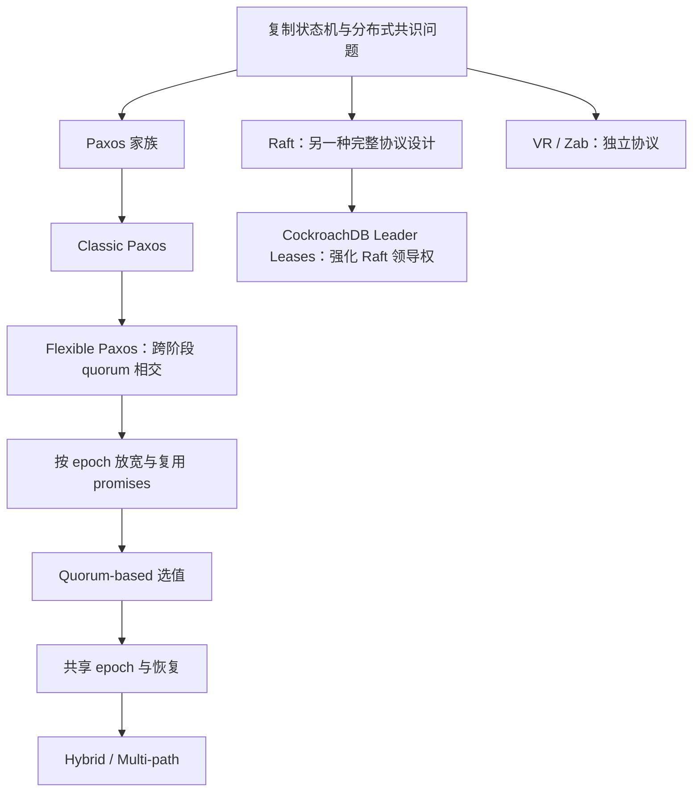

# 共识算法族系：从 Paxos 到可选择的安全条件

> 本卡按 Howard *Distributed Consensus Revised*（UCAM-CL-TR-935，2019）梳理理论关系，并用 Ongaro 2014 博士论文澄清 Raft 的位置。不是产品替代路线图。[Howard 官方原文](https://www.cl.cam.ac.uk/techreports/UCAM-CL-TR-935.pdf)。

## 关系图

从 Classic 向下的箭头表示逐步修改条件，需要同时保留相应安全前提；不是“Raft 是 Paxos 的某个泛化层”或“CockroachDB 用 Multi-Paxos”。

## 四个可优化维度

| 维度 | 原文位置 | 放宽了什么 | 仍须保留什么 |
|---|---|---|---|
| Quorum | Ch.4，pp.75–90 | 同阶段不必相交；e 的准备只关联所有 f<e 的接受 quorum | 对所有可能历史决定的跨阶段覆盖 |
| Promise | Ch.5，pp.91–96 | 复用合法历史提案携带的安全证据 | 仍覆盖已知 f 与当前 e 之间的 epoch |
| Value selection | Ch.6，pp.97–111 | 逐 quorum 排除不可能决定，而非机械取最高 epoch | 未知不能当空；可能决定值必须继承 |
| Epoch | Ch.7，pp.113–139 | 可动态分配、与值关联、或允许共享 | acceptor 同 epoch 不改值，以及更强冲突恢复条件 |

## 工程启示和不能推出的结论

稳定路径与恢复路径可以有不同 quorum 成本。N=5 的共享 epoch 方案中，k=3 的 phase 2 可能对应最坏 5 个 phase-1 回答，而 k=4 对应最多 3 个（Table 7.1）。因此“更小写 quorum”和“任意故障下更可用”不是同一结论。

论文证据以算法、执行例及证明为主，没有直接证明一个新数据库在真实 WAN、尾延迟或故障恢复上胜过 Raft。迁移到 Multi-Raft 系统还需要把成员变更、持久化、lease 和日志槽位组合起来重新检查。

Raft 的价值侧重可理解的协议分解和工程语义；Howard 的价值侧重区分充分条件与必要条件。二者关注点不同，不能把“经典 quorum 过强”写成“Raft 过时”或“所有 Paxos 实现问题已有一招解决”。

## 深入阅读路线

先读 [[Paxos-Quorum-Intersection-Revised]]，再读 [[Paxos-Value-Selection-Revised]]、[[Paxos-Epochs-Revised]]；逐章出处、示例和限制见 [[知识库/sources/papers/Distributed-Consensus-Revised/精读分析]]。工程对照为 [[Raft-共识算法协议核心]] 与 [[CockroachDB-Leader-Lease-整体设计]]。
