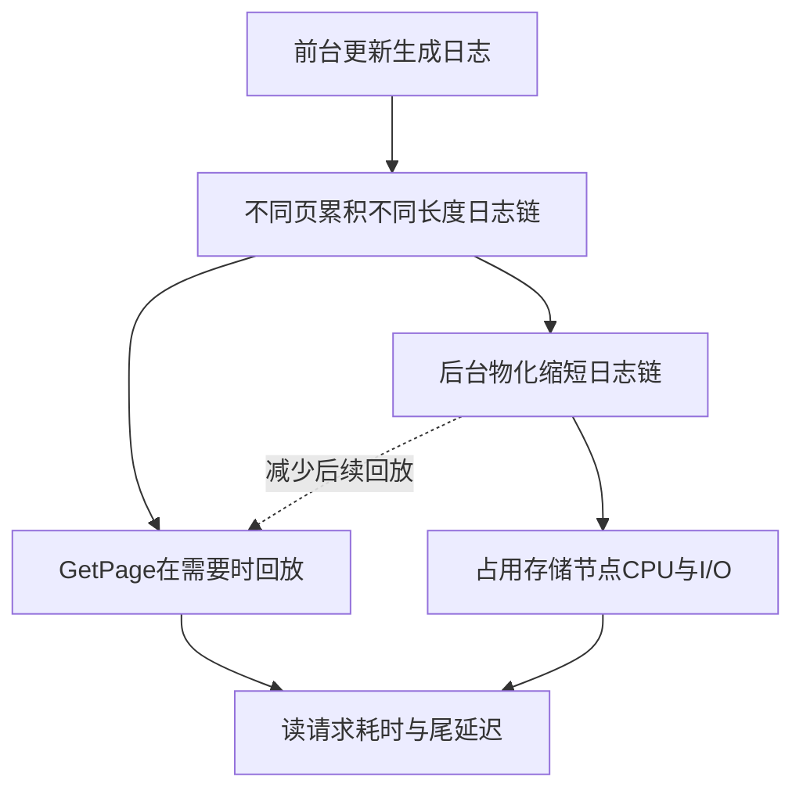

# 存储计算分离数据库的尾延迟：日志链与后台竞争

## 观察对象与问题边界

RaaS论文研究的是采用log-as-the-database、由存储侧回放日志物化页的OLTP系统。它没有证明所有存算分离架构必然有相同瓶颈，也没有证明尾延迟只有一个原因。P95/P99补充平均值，反映少数慢请求对用户操作的影响。

§1/图1（PDF第2页）在Aurora PostgreSQL16.6、db.r6g.large（2vCPU/16GB）和10GB SysBench、20分钟测试中观测：

| 指标 | 值 |
|---|---:|
| 平均 | 33.2ms |
| 中位 | 26.7ms |
| P95 | 69.3ms |
| P99 | 153.1ms |

P99约为中位5.7倍。Aurora是闭源系统，这一组观测不能直接证明内部回放是其唯一根因；作者随后用OpenAurora插桩分析。

## 两条因果路径（§3，PDF6–9页，图3–5）

第一条路径是单页回放工作量。OpenAurora的24GB SysBench实验，120秒update-only预热后采集10秒，使用16线程：延迟86.5ms的请求平均回放272条日志，145ms平均380条，低于50ms的请求少于25条。它显示该设置中强相关，不能把日志数当作跨机器通用延迟公式。

第二条路径是后台和前台竞争。作者取两个10秒窗口，用perf分类CPU份额：无后台回放时GetPage占90.6%，后台执行时降为49.4%，而后台占43.0%。这是CPU份额分布，不是简单说前台“损失了同样比例的吞吐”。日志回放有长远收益，暂停它又会增加未来单页回放，二者需要共同处理。

## 为什么卸载可能有效

如果别的实例空闲，把计算密集的后台回放交给RSA，可减少原节点竞争，同时缩短积压日志链。元数据检查留在原节点，必要时本地执行，资源不足才卸载；数据经S3交换，原引擎保留前台读写和事务持久性职责。见[[RaaS-Replay-as-a-Service]]。

教学例：同样读取LSN150，页A从LSN149回放少量变更，页B从LSN100开始回放较长链。后台提前物化B会缩短后续读取工作，但若恰在前台峰值抢占B所在存储节点全部CPU，也可能让其他页变慢。需要测工作量与资源时序，不能只调线程数。

## 评估与适用条件

§7主实验与上述根因实验不同：8个OpenAurora实例，每实例86GB、32线程，计算8核/32GB、log与storage各4核/16GB，10Gbps。预热10分钟后跑3轮5分钟负载、间隔10分钟，两个四实例组错开8分钟。相较不开RaaS，吞吐1351→2376TPS，P95 68.28→40.9ms、P99 106.75→62.19ms。错峰空闲资源是重要条件。

§7后续变体显示：在作者的设置中，仅在原节点并行回放反使P99增加38.3%，提高本地频率P99仅改善约3%；这不是所有机器上的普适结论。全集群持续繁忙时，共置RSA没有额外空闲算力，专用RSA可另行提供资源，需算成本。论文没有一个足够普遍的实验支持“纯扩CPU永远无效”。

## 工程启示与仍待核验

**推论**：先定位CPU、存储、网络、锁等待和回放链分布，确认tail来源；记录offload的传输、排队、回放、安装成本以及相邻租户的P99。Kafka日志压缩等后台任务可借鉴资源隔离思路，但不是数据库页回放，需独立验证业务语义。

RaaS原文§5.5与§7.6对RSA失败后的重试发起者描述不同：设计段为通知storage重试，实验段为coordinator重新派发。此差异保留为源码核验项，不构造统一协议。[[知识库/sources/papers/RaaS/精读分析|精读分析]]给出对应页码及实验。
