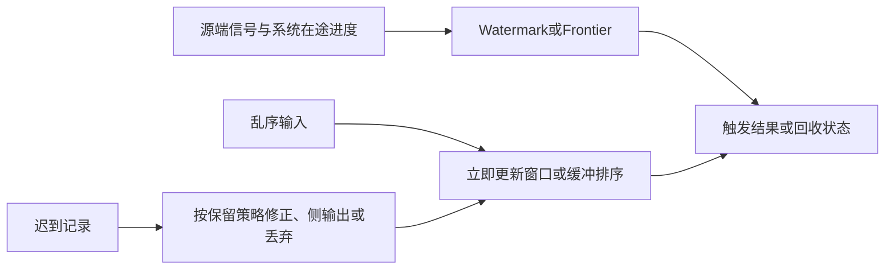

# 流处理乱序数据管理

## 定义

**乱序数据管理**（Out-of-Order Data Management）是流处理系统处理事件不按时间戳顺序到达，并仍产生正确结果的能力。论文明确指出：乱序是流处理的**常态而非异常**——这一认识是 2nd Gen 超越 1st Gen 的关键转折。

> 术语统一：论文用 *disorder* 和 *out-of-order* 指代同一概念——流元组到达顺序与事件时间顺序的错位。早期文献各自用不同词（out-of-order arrival, disorder, unordered stream），论文对这些术语进行了对照。

## 乱序的三种根因（§3.1）

| 类别 | 根因 | 机制 |
|------|------|------|
| **外部-网络** | 不同路由路径延迟差异 | 网络不可靠性、带宽、负载变化导致部分元组路由时间拉长 |
| **外部-多源** | 多数据源汇聚 | 不同传感器/服务时钟偏差和处理速度差异，极难协调 |
| **内部-算子** | Join / Windowing / Union / 优先级重排 | Join 按关联属性重分区打乱顺序；Union 混洗两个不同步的流；按非排序属性做窗口或优先化处理重排流 |

## 两种架构策略（§3.3）

| 策略 | 原理 | 代表系统 | 代价 |
|------|------|---------|------|
| **In-Order Processing** | 缓冲区接收元组 → 按时间戳排序 → 按序转发给算子处理 | STREAM, Aurora/Borealis, Gigascope, TelegraphCQ | 引入等待延迟；需为排序分配内存和 CPU；超界元组需按系统的丢弃或修正策略处理 |
| **Out-of-Order Processing** | 元组不经排序直接处理；由算子或全局协调器产生进度信息（Watermark），建立延迟上界 | Flink, Beam/Dataflow, Millwheel, Naiad | 实现复杂度高；需保存状态直到延迟上界以支持迟到数据修正 |

> **关键区别**：In-Order 系统通过**修正流的顺序**来管理乱序；Out-of-Order 系统通过**追踪处理的进度**来管理乱序。前者改数据，后者改判断。

## 进度追踪 vs 延迟上界

论文（§3.2）给出了**处理进度**的精确定义：

> 设属性 A 对流中的元组排序。当所有未处理元组中 A 的最小值随时间增大时，流的处理在推进。这个 A 的最小值本身就是进度的度量。

**延迟上界**（lateness bound）是进度追踪的对偶概念：是否接受迟到记录还取决于系统的进度契约、状态保留与修正策略，不能一律视为丢弃。

所有机制都在这两个维度操作：

## 五种进度追踪机制（§3.5.1）

### 1. Slack — 最简单的固定等待

- **定义**：等待固定数量的"元组数"或"时间单位"来接收迟到数据
- **通信方式**：用户配置（查询规格的一部分）
- **示例**：slack=1 → 窗口边界到达后，额外等待 1 个元组才触发计算
- **缺点**：不考虑实际延迟特征；迟到元组如果超出 slack 范围，即使刚到也被丢弃

### 2. Heartbeat — 源端信号

- **定义**：输入源向系统发送的信号，携带时间戳 T，声明此后所有元组的时间戳 ≥ T
- **通信方式**：从输入源到 Input Manager 的外部信号
- **生成方式**：可由源端主动生成，或由系统根据网络延迟上界、应用时钟偏差等推算
- **关键限制**：只反映**源的生成进度**，不反映系统内部的**处理进度**

### 3. Low-Watermark (LWM) — 系统内进度

- **定义**：流中某个属性 A 在特定子集内的**最小值**。它反映系统内最老未处理工作，等价于"最大已确认完成"的补。
- **通信方式**：通过 **Punctuation**（嵌入流的元数据元组）在数据流图中传播
- **核心推广**：LWM 可定义在任意属性上（不仅是时间戳，还可以是序列号等）
- **与 Heartbeat 的关键区别**：
  - Heartbeat 反映**源端生成进度**，LWM 反映**系统内处理进度**
  - Heartbeat 是外部信号，LWM 通过 Punctuation 在数据流图内传播
  - LWM 将"最老值即进度"的概念推广到任意 proceeding attribute

### 4. Punctuation — 通用信息载体

- **定义**：嵌入数据流中的特殊元组，携带一组"模式"来标注元组的某个属性在未来不再出现
- **角色**：**不是进度追踪机制本身**，而是进度信息（LWM / 时间偏差 / Slack）的**通信通道**
- **多功能性**：除了乱序管理，还用于状态管理、监控、流控

### 5. Pointstamps & Frontiers (Naiad) — 二维进度追踪

- **定义**：每个元组附带的 `(timestamp, location)` 对，定位在数据流图的顶点/边上
- **Frontier**：所有未被处理元组中，不存在其他未处理元组"可导致"它们的元组的集合 → 这些就是当前最老的待处理工作
- **Precursor Count**：有多少活跃 Pointstamp 可以导致此 Pointstamp
- **核心优势**：天然支持**循环/迭代计算**中的进度追踪——这是它显式支持的重要场景；其他机制也可扩展用于循环查询
- **代价**：实现复杂度高；每个元组带 Pointstamp，通信开销大

### 五种机制对比

| 维度 | Slack | Heartbeat | Low-Watermark | Punctuation | Pointstamp |
|------|-------|-----------|--------------|-------------|------------|
| 本质 | 延迟上界 | 进度信号 | 进度信号 | 通信载体 | 进度信号 |
| 进度追踪 | ❌ 只等固定量 | ✓ 源端进度 | ✓ 系统内进度 | ❌ 载体 | ✓ 含位置维度 |
| 嵌入流中 | ❌ 用户配置 | ❌ 外部信号 | ✓ (通过Punctuation) | ✓ 自己即流元组 | ✓ 每个元组附带 |
| 延迟上界单位 | 元组数/时间 | 时间戳 | 时间戳/序列号 | N/A | 多维时间戳 |
| 循环查询 | 单独不足 | 需额外协议 | 需额外协议 | 可用推测/验证扩展 | 显式支持偏序进度 |
| 代表系统 | Aurora | STREAMS | Flink/Millwheel | Aurora/Naiad | Naiad |

## 循环查询的进度追踪（§3.5.2）

这是进度追踪中最难的问题。循环查询总有二元算子（如 Join），其中一个输入通道依赖于输出 → 死锁：
- 二元算子等待两条输入通道都收到 Punctuation 才继续 → 但其中一条通道依赖自己的输出 → 永远不会收到

**Chandramouli et al. 方案**：
1. 专用检测算子从经过的事件时间戳推导**推测性 Punctuation**
2. 该 Punctuation 流经循环时，算子验证其猜测
3. 推测被验证后，转为正式 Punctuation 携带进度信息
4. 前提：查询必须是强收敛的

**Naiad 方案**：
- 用 Pointstamp 的多维时间戳天然建模循环（迭代计数器 + 输入批次）
- 限制：发送事件需遵守拓扑与逻辑时间的偏序约束，不能将所有发送概括为时间戳严格增大 → 强加偏序关系 → 保证进度
- 进度追踪在数据流外（external to the dataflow），按节点而非边做通知传递

## 三种修正处理策略（§3.5.3）

当迟到数据到达时，已发布的早期结果需要修正：

| 策略 | 原理 | 代表系统 | 适用场景 |
|------|------|---------|----------|
| **Store & Revise** | 缓冲所有数据，迟到数据到达时增量修正计算 | CEDR, StreamInsight, Dataflow | 通用；与 Out-of-Order 架构天然匹配 |
| **Replay & Revise** | 回放受影响的数据子集，重算并传播修订消息 | Borealis (Dynamic Revision), 推测性处理 | 状态算子较少时高效；需维护历史日志 |
| **Partition & Consolidate** | 按延迟级别分区独立处理，最后合并结果 | Truviso (Order-Independent Processing), Trill (Impatience Sort) | 不同消费者可订阅不同延迟级别 |

### Dataflow Model 的修正体系

- **Trigger**：决定何时物化窗口结果——Watermark 触发 / 处理时间触发 / 计数触发 / 复合触发 / 用户自定义
- **Refinement**：三种策略
  - **Accumulating**：新结果覆盖旧结果
  - **Discarding**：新结果独立存在
  - **Accumulating & Retracting**：收回旧结果 + 发布新结果（最完整，见 StreamInsight 的补偿机制）

## 1st vs 2nd Gen 对比（§3.6）

| | 1st Gen (DSMS) | 2nd Gen (Dataflow) |
|---|---|---|
| **架构选择** | 仅 In-Order | 主流 Out-of-Order |
| **核心机制** | Buffer + Sort → Slack/Heartbeat | Watermark + Trigger → Revision |
| **进度追踪** | 仅源端进度（Heartbeat） | 系统内进度（LWM）+ 源端进度 |
| **信息传播** | 外部信号 | Punctuation 嵌入流 |
| **循环查询** | 不支持 | Naiad 支持（Pointstamp+Frontier） |
| **迟到处理** | 直接丢弃（超出 Buffer） | 修正处理（如 Dataflow Trigger/Refinement） |

## 开放问题（§3.7）

1. **哪种架构更好？** Out-of-Order 实现复杂、修正处理状态大；In-Order 资源消耗大、超界丢数据。没有定论
2. **多时间域**：多源流可能需支持多个独立 Event Time 域，但当前系统不支持
3. **多源 Watermark 对齐**：不同源延迟特征差异大，导致 Watermark 不对齐，进度追踪困难

---

*参考论文: Fragkoulis et al., "A Survey on the Evolution of Stream Processing Systems", arXiv:2008.00842v2, 2023*

## 核验与具体例子

依据综述§3（PDF pp.5–11），本页是机制分类，未运行系统benchmark。窗口先输出10，收到迟到金额3后是否输出13、只输出增量3或撤回旧10，取决于trigger与refinement；详见[[Dataflow-Model]]。Watermark既可能有源端严格保证，也可能是启发式估计；frontier在偏序下可能包含多个不可比较点，不能简化成所有数据流都共享一个标量时钟。
