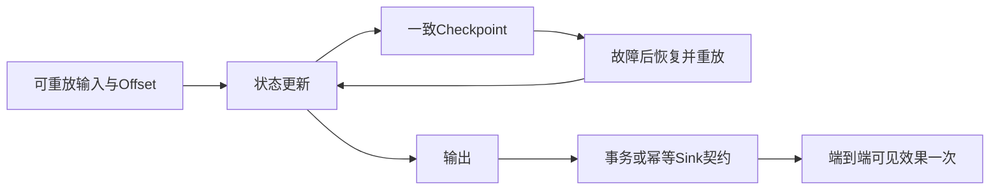

# 流处理容错模型

## 定义

**容错**（Fault Tolerance）是流处理系统在算子/节点故障后继续运行、输出预期结果的能力。论文有一个核心洞察：

> Exactly-Once on State ≠ 端到端 Exactly-Once。在系统内恢复状态一致性是可行的，但一旦输出已发布给外部系统，可能重复，除非额外协议协调外部效果——这是**Output Commit Problem**。

## 为什么流处理容错尤其困难（§5）

1. **无限流**：无法"从头重来"——已经处理过的流段可能已永久消失
2. **有状态**：算子状态是持久计算结果，丢失意味着丢失所有历史信息
3. **分布式**：多台物理机器，故障是常见事件而非异常
4. **非确定性**：处理时间窗口、多源 Join 天然非确定性，恢复状态可能发散

## 处理语义四级分类（§5.1）

| 语义 | 保证 | 重复输出？ | 系统内状态一致？ | 实用状态 |
|------|------|-----------|----------------|---------|
| **At-Most-Once** | 不保证送达 | N/A（可能丢数据） | ❌ | 可接受丢失时仍可能使用 |
| **At-Least-Once** | 保证送达 | ✓ 可能重复 | ❌ | Storm 默认 |
| **Exactly-Once on State** | 系统内状态一致 | ✓ 可能重复（不会撤销外部已输出） | ✓ | Flink/Beam/Spark 主流 |
| **Exactly-Once on Output** | 输出也无重复 | ❌ | ✓ | 极少数系统实现 |

### Exactly-Once on Output — Output Commit Problem

即使系统内状态恢复到一致性快照，已发送给外部消费者的输出无法撤回。解决方案：
- **幂等 Sink**：接收方能安全容忍重复（如 Upsert 到 key-value store）
- **事务 Sink**：两阶段提交到支持事务的外部系统（Kafka 事务 / DB 事务）
- **Millwheel 方案**：每条输出与状态变更原子提交到 BigTable（Idempotent + Atomic Checkpoint）

### 非确定性计算的容错

综述讨论的 **Clonos**[118] 支持对非确定性计算恢复；这里不声称它是所有历史与当前系统中唯一方案：
- 保存非确定性计算的"决定因子"（determinants）到持久存储
- 恢复时用决定因子精确重现相同状态 → 实现*因果一致性*
- 但尚未形成通用框架

## 容错四维度分析框架（Table 4）

论文对 18 个系统沿四个维度做了完整对比：

### 1. Processing Semantics — 处理语义
见上表四级分类

### 2. Replication — 复制策略

| 策略 | 原理 | 资源开销 | 恢复延迟 | 代表系统 |
|------|------|---------|---------|---------|
| **Active Replication** | 主备同时执行相同计算；主故障后备直接接管 | 通常需额外执行副本 | 仍有检测与切换延迟 | Borealis, Streamscope |
| **Passive Replication** | 算子定期将 Checkpoint 发给 Standby；Standby 从快照恢复 | 快照、存储及备用资源 | 从快照恢复的时间 | Flink, Samza |
| **None (Replay)** | 从上游消息队列回放输入流重算状态 | 需要可重放日志及恢复计算 | 取决于重放长度与速率 | Storm (Acker机制), Streamscope option |

### 3. Recovery Data — 恢复数据源

| 数据类型 | 作用 | 系统示例 |
|----------|------|---------|
| **State Snapshots** | 从分布式一致性快照恢复算子状态 | Flink, Samza, Spark, Naiad |
| **Output Buffers** | 重放未确认的输出 | Trident, S-Store |
| **State Metadata / Changelog** | 状态变更日志，用于增量恢复 | Samza (changelog), TimeStream (state dependencies) |
| **Input Log Offsets** | Kafka/Pulsar 偏移量，用于回放源数据 | 几乎所有现代系统 |

### 4. Storage Medium — 存储介质

| 类型 | 说明 | 代表 |
|------|------|------|
| **Local Resilient Store** | 本地持久数据；能否抵御整机故障需额外副本/远端快照 | Flink |
| **Remote Resilient Store** | HDFS/S3/GCS 远端快照 | Spark, Beam |
| **In-Memory** | 主内存空间（故障即丢，仅用于 Active Replication 方案） | Borealis |

> 注意：论文中对 Output Buffers 也区分了内存缓冲（不计入 In-Memory 类别，因为不是主要存储方案）和持久化缓冲。

## 系统容错策略速览（Table 4 节选）

| 系统 | 处理语义 | 复制 | 恢复数据 | 存储介质 |
|------|---------|------|---------|---------|
| **Aurora** | At-Least-Once | Active | State | In-Memory |
| **Borealis** | At-Least-Once | Active | State | Local |
| **Storm (1.0)** | At-Least-Once | None | Output | Remote |
| **Trident** | Exactly-Once on State | Passive | State+Output | Remote |
| **Naiad** | Exactly-Once on State | Passive | State | Local |
| **Millwheel** | Exactly-Once on Output | Passive | State+Output | External (BigTable) |
| **Flink** | Exactly-Once on State | Passive | State | Local+Remote |
| **S-Store** | Exactly-Once on Output | Passive | State+Output | External (DB transactions) |
| **Streamscope** | 三种策略都支持 | Active/Passive/Replay | State | Local/Remote |

## 高可用（§5）

### 核心问题：没有标准定义

论文明确指出：**流处理领域没有标准的高可用定义**。现有工作混用三个指标：
1. **恢复时间**（Recovery Time）— 从故障到恢复正常的时间
2. **性能开销**（Performance Overhead）— 容错带来的吞吐/延迟代价
3. **资源利用率**（Resource Utilization）— 复制/快照占用的额外资源

论文提出基于**处理进度延迟**的高可用定义：可从故障后处理进度相对正常目标的滞后来分析；论文未建立统一行业可用率公式。

## 开放问题（§5.4）

1. **Exactly-Once on Output 的通用方案**：多数系统仅做到 State 级别，需依赖 Sink 特性或外部事务系统
2. **高可用的形式化指标**：类似数据库 ACID 的业界标准
3. **非确定性计算容错**：Clonos 的因果一致性方案需系统化
4. **容错与弹性统一**：Seep 提出了一体化方案，但 Runtime Reconfiguration（如 Chi 的 Alignment Phase）与容错的集成仍有缺口

---

*参考论文: Fragkoulis et al., "A Survey on the Evolution of Stream Processing Systems", arXiv:2008.00842v2, 2023*
*关键 Table: Table 4 (Fault-tolerance in streaming systems)*

## 恢复反例与证据范围

假设支付sink已确认一次输出，但算子在新checkpoint完成前崩溃。恢复旧状态后重放输入可能再次付款；仅有状态exactly-once不足以阻止它。需要sink支持稳定幂等键，或与checkpoint协调的提交协议，且要验证故障发生在提交前、提交后和确认丢失时的行为。补偿退款属于SAGA语义，不等价于付款从未重复发生。

依据综述§5、Table4–5（PDF pp.16–22）的历史分类；表中框架能力受当时版本、source与sink契约限制，不代表2026年所有配置。评价应同时记录状态/输出重复和遗漏、恢复时间、积压追赶时间以及稳态/故障期间尾延迟；本次未做故障注入复现。
