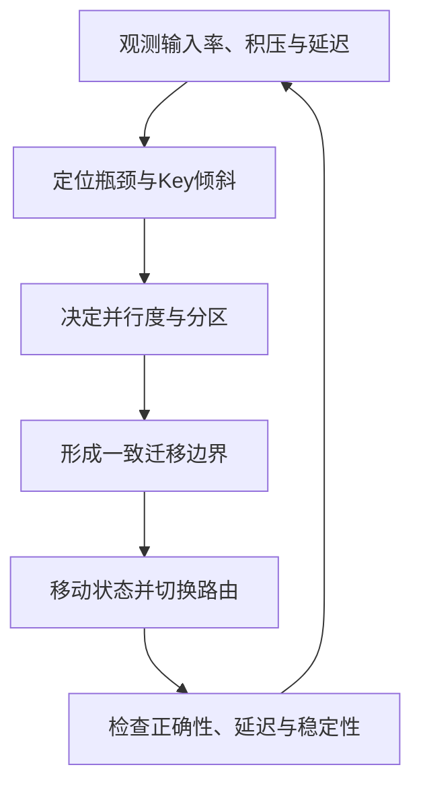

# 流处理弹性与重配置

弹性是资源随负载变化，重配置是修改并行度、路由或状态分布。依据流处理综述§6（PDF pp.22–26）：要把“何时扩容”的策略与“如何迁移”的机制分开；不存在通用零停顿、零代价的扩缩容。

## 过载与流控（§6.1–6.2）

Load shedding选择性舍弃记录，交换计算压力与结果质量；backpressure让上游放慢生产，需要缓冲或可重放日志来承接积压。二者没有天然代际排他性，早期系统也研究了调度与重配置。

Credit-based flow control限制在途记录，不能消除下游算力瓶颈，也不是背压的对立概念。延迟、公平性取决于credit分配与调度，不能只凭采用credit就断言一定低延迟、无饥饿。

## 弹性策略与机制（§6.3、Table6）

策略包括阈值/启发式与预测模型：先观察输入率、处理率、积压、延迟与热点，判断是资源不足、倾斜还是下游故障，再决定扩哪些算子。论文包含多种自动控制研究，不宜归结为“大多数系统只有告警”。

| 重配置方式 | 行为 | 权衡 |
|---|---|---|
| Stop-and-restart | 暂停全作业、快照、按新配置恢复 | 实现直接，但影响全部算子 |
| Partial-pause-and-restart | 暂停受影响子图并迁移状态 | 减少影响范围，仍有局部等待 |
| 预复制/近实时切换 | 事先维护可迁移状态副本 | 用持续额外资源换较短切换 |
| 一次性/渐进状态传输 | 整块传，或分块与处理交错 | 渐进可平滑延迟尖峰，却可能延长总迁移时间 |

SEEP将扩缩容与恢复机制相结合；Chi被§4.6用于说明一致对齐边界与重配置的关系；Megaphone在§6.3.2对应渐进迁移。原综述没有支撑“SEEP仅面向Storm”“Chi保证零停机”“Megaphone仅支持无环图”这些旧稿断言，故不保留。

## Fig.9：一个Key从旧Owner迁往新Owner

1. 暂停旧owner上游发送，新增输入暂存。
2. 旧owner排空已接收输入，提取状态。
3. 新owner加载状态，完成路由切换的协调。
4. 上游收到恢复信号，按新owner发送后续记录。

必须保持“同一key的已有状态与后续事件由同一有效owner处理”。若先切路由后加载状态，可能用空状态计算；若旧owner迁移期间继续修改状态，则需额外日志/版本协议，否则会丢更新。

## 如何判断迁移是否成功

除了扩容后吞吐，还要报告迁移总时长、迁移期间P95/P99延迟、暂停时长、状态传输量、重复/遗漏结果和收敛后资源成本。负载突变与key倾斜应分别测试；扩机器不一定解决一个不可拆分热key。Table6是机制分类，没有统一的性能优胜者。

关联：[[流处理状态管理]]、[[流处理容错模型]]、[[Stream-Processing-System-Generations]]、[[知识库/sources/papers/SP-Survey/精读分析]]。
