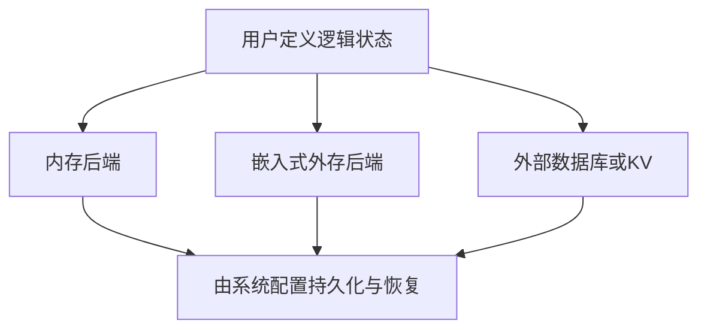
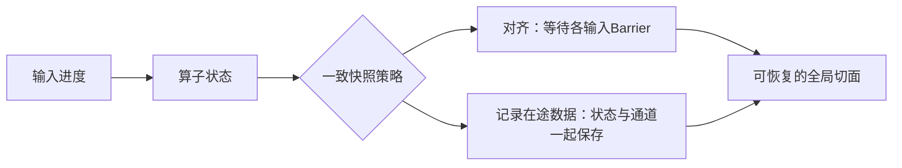

# 流处理状态管理

状态保存过去输入对未来计算的影响，如窗口、按key聚合、join缓冲与用户变量。流处理综述 §4（PDF pp.11–16）将“谁定义状态”“驻留在哪里”“何时持久化”“如何分片”分别讨论，避免把使用RocksDB等同于已经实现分布式容错。

## 逻辑责任与驻留位置

系统定义synopsis→应用自行管理→用户定义、系统管理，是论文概括的演化趋势，不是严格互斥代际。

| 架构 | 机制 | 代价与边界 |
|---|---|---|
| In-memory | 算子状态驻留内存 | 受容量限制；可以配合快照/复制，不等于必然不可恢复 |
| Out-of-core | 部分状态放内存、部分落外存 | 后端I/O与访问模式重要，不限定数据结构 |
| External | 外部存储负责持久状态，算子仍可缓存近期变化 | 网络延迟、事务范围及恢复协议成为依赖 |

### RocksDB与FASTER必须区分

RocksDB/LevelDB使用LSM结构，compaction可带来写放大。FASTER采用hash index与hybrid log，其内存/磁盘分层也能处理超内存数据，**不能统称为LSM变体**。这一点修正了综述§4.3本身的过度概括，依据[微软官方结构说明](https://microsoft.github.io/FASTER/docs/fasterkv-basics/)。

Millwheel在综述中是外部状态的例子：输出记录与状态更新结合持久化，保存恢复需要的信息。这里的原子范围需要看原系统协议，不能泛化为“Bigtable提供任意跨表事务”或“用了外部DB便无需checkpoint”。

## 持久化粒度（§4.4、§4.6）

| 粒度 | 如何形成提交边界 | 核心权衡 |
|---|---|---|
| Batch | 一批输入的计算结束后保存状态 | 批大小影响等待与恢复重算 |
| Epoch | 按时间或输入进度形成跨算子一致边界 | 快照频率、barrier与通道状态开销 |
| Record | 每条记录相关状态/输出进入持久协议 | 细粒度提交开销及外部存储契约 |

综述使用“unaligned/Chandy-Lamport”与“aligned”比较通道记录和barrier等待。不能把其术语无条件等同于所有现代框架同名配置，也不能断言不对齐总最快、对齐总恢复最快；反压、通道量、存储带宽和状态规模都会改变结果。

## key语义、故障与迁移的例子

一个累计计数器A的已提交状态为10；处理新事件3后为13。恢复到旧快照时必须从对应输入offset重放3。若输入从更新后的offset恢复却只恢复旧状态，将丢失这次贡献；若恢复新状态却重放同一事件，可能双计。

扩容时，A的历史状态与后续A事件必须迁往同一个owner。Keyed state可按key group分片；非分区operator state、全局单例与broadcast复制状态不是同一概念，分配/复制方式需单独定义。

## 评价与局限

评价后端需固定状态规模、key倾斜、读写比例与checkpoint配置，报告吞吐、尾延迟、磁盘/网络写量、checkpoint大小及恢复时间。综述Table3是设计特征表，未提供统一benchmark。单源的归纳不应当提升为已验证性能排序。

- [[LSM-Tree]]、[[LSM-Tree-写放大]]：仅对LSM后端应用相应成本模型。
- [[流处理容错模型]]：状态一次与外部效果一次。
- [[流处理弹性与重配置]]：迁移同时维护状态和输入路由。
- [[知识库/sources/papers/SP-Survey/精读分析]]：论文位置与整体验证范围。
