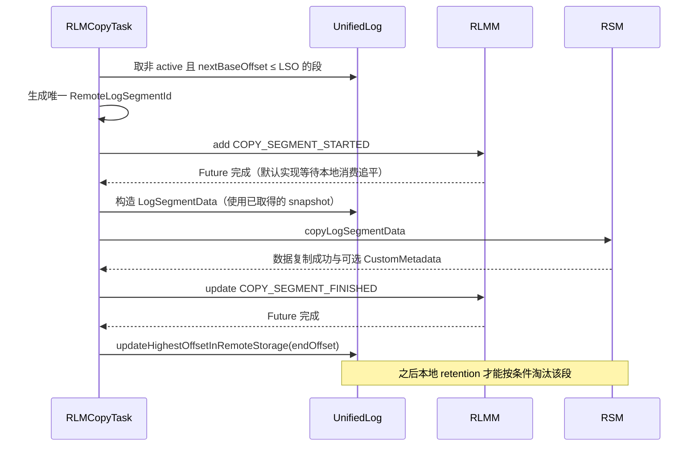
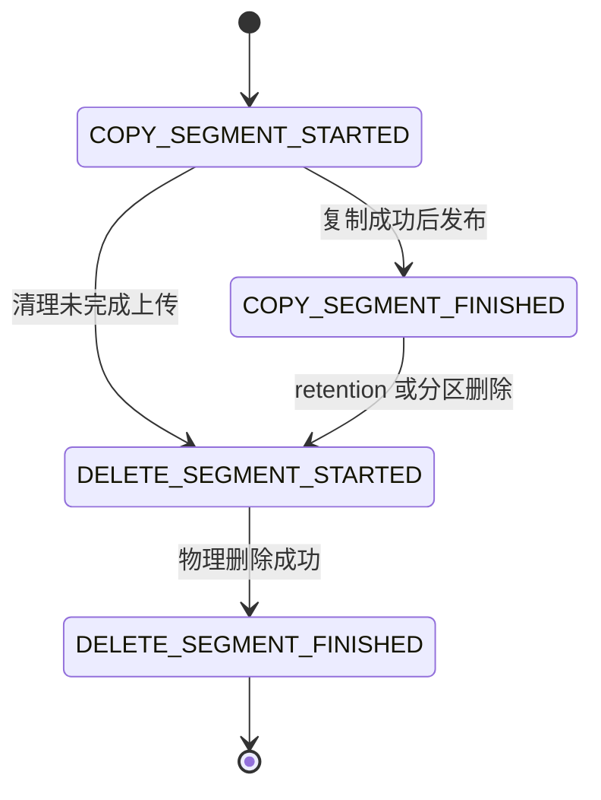
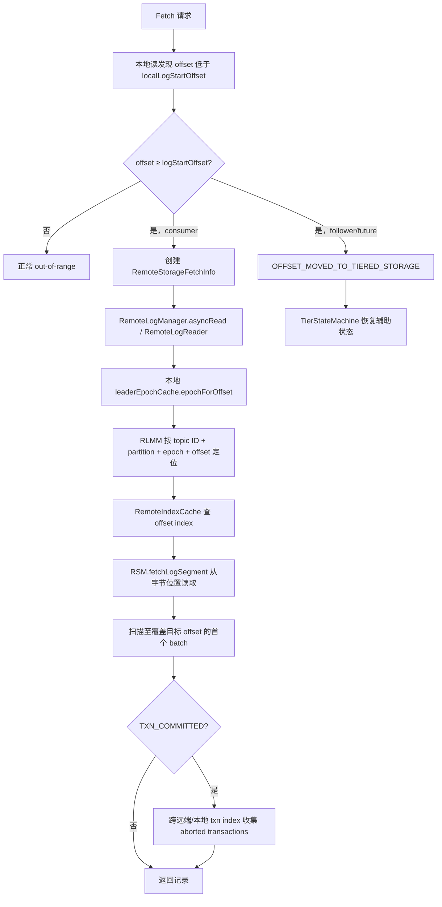
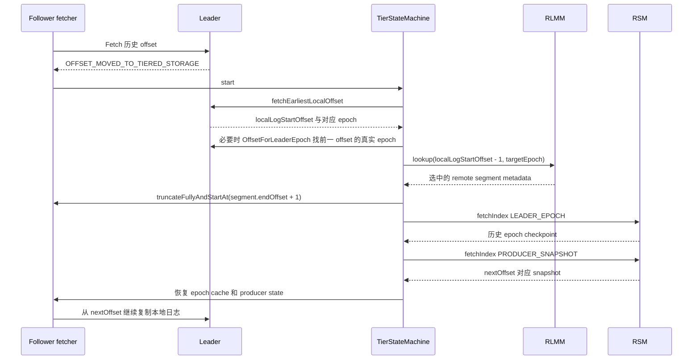
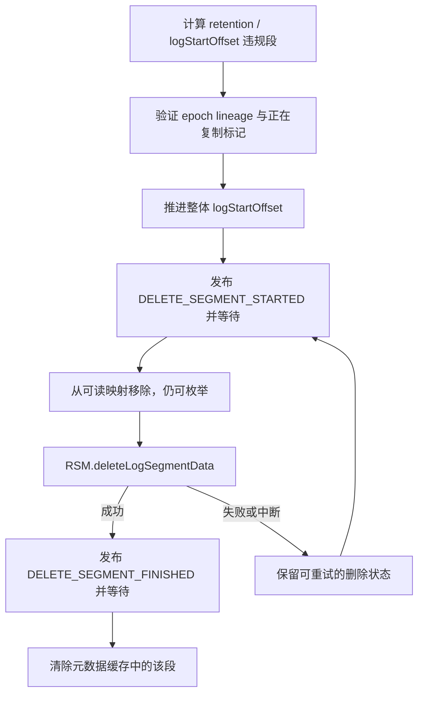

# KIP-405 实现核验：Apache Kafka 3.9.0

> 范围：以下实现结论逐项对照 apache/kafka 的固定发布标签 `3.9.0`，不把 KIP 中的设想、较早实验实现或后续版本行为混写进来。方法名与行号均来自该标签。本文是静态源码与已有测试核验，未在本次工作中编译 Kafka 或运行集成测试。

## 先记住五个结论

1. **Kafka 异步上传的是已滚动、边界落在 LSO 之前的日志段。** 判断使用下一段的 baseOffset ≤ lastStableOffset，上传段的 inclusive endOffset 则为下一段 baseOffset − 1。即使段已滚动，也不代表立即可以上传。
2. **远端数据可发现、可读，取决于元数据状态，不取决于对象桶里是否已经出现文件。** COPY_SEGMENT_FINISHED 才进入可读 offset 映射；DELETE_SEGMENT_STARTED 就退出该映射，但仍保留在清理枚举中。
3. **read_committed 没有因为“冷数据都在 LSO 以下”而省掉事务处理。** LSO 以下包含已提交、已中止与非事务记录。broker 必须收集 aborted transaction 信息，且可能跨越多个远端 txn index，最后继续查本地 txn index。
4. **落后副本不需要把所有冷日志下载回本地。** TierStateMachine 恢复历史 leader epoch checkpoint 和 producer snapshot，再从选中远端段的 endOffset + 1 继续复制 leader 的本地部分。
5. **3.9.0 默认元数据管理器的实际实现是 Kafka topic 事件流 + 每 broker 内存缓存 + 分配后重放。** 它创建的是 cleanup.policy=delete、默认 retention.ms=−1 的内部 topic，不能写成“默认 compact topic”，也不能把旧版文件快照恢复逻辑当作此标签的当前路径。

---

## 1. 三个核心组件如何分工

### RemoteLogManager：broker 内的编排器

位置：`core/src/main/java/kafka/log/remote/RemoteLogManager.java`。

它初始化存储与元数据插件；接收 leader/follower、stop partition 事件；调度上传与删除；提供异步远端读取、索引定位和时间戳查找。三个后台角色在 3.9.0 被分开：

- leader copy task：上传已稳定的封闭段；
- leader expiration task：执行远端 retention 清理；
- follower task：查询已上传位置，推进该 follower 的 highestOffsetInRemoteStorage，让本地淘汰遵守上传完成边界。

leader 变化首先通知 RLMM 管理分配，再创建/取消任务。变成 follower 会取消 copy 与 expiration 任务；变成 leader 则取消 follower task 并调度相应 leader 任务。remote.log.copy.disable 为 true 时不创建 copy task，但 expiration task 仍会创建。

源码：[onLeadershipChange](https://github.com/apache/kafka/blob/84caaa6e9da06435411510a81fa321d4f99c351f/core/src/main/java/kafka/log/remote/RemoteLogManager.java#L431-L463)、[RLMFollowerTask](https://github.com/apache/kafka/blob/84caaa6e9da06435411510a81fa321d4f99c351f/core/src/main/java/kafka/log/remote/RemoteLogManager.java#L1420-L1432)、[角色任务切换](https://github.com/apache/kafka/blob/84caaa6e9da06435411510a81fa321d4f99c351f/core/src/main/java/kafka/log/remote/RemoteLogManager.java#L1842-L1900)。

### RemoteStorageManager：数据平面 SPI

RSM 接受日志段及辅助文件，提供 copyLogSegmentData、fetchLogSegment、fetchIndex、deleteLogSegmentData。它不负责根据 topic/offset 自行决定哪个远端对象属于当前合法日志。

上传的材料包括：

- .log 数据
- offset index
- time index
- 可选 transaction index
- producer snapshot
- leader epoch checkpoint

接口定义了五类 IndexType：OFFSET、TIMESTAMP、PRODUCER_SNAPSHOT、TRANSACTION、LEADER_EPOCH。copy 返回可选 CustomMetadata，交由 Kafka 存入该段元数据并在后续操作传回插件；不要把这些字段未经验证地解释成某个对象存储实现专属的路径、ETag 或版本号。

copy 与 delete 要按 SPI 契约支持幂等。delete 遇到资源已经不存在应成功，而非把“上次已删掉”当作失败。copy 的每次调用由调用者提供唯一 RemoteLogSegmentId；相同逻辑 offset 范围可能出现多个不同 segment ID，因此对象命名不能只依赖起始 offset。

源码：[RSM 接口、ID 与一致性契约](https://github.com/apache/kafka/blob/84caaa6e9da06435411510a81fa321d4f99c351f/storage/api/src/main/java/org/apache/kafka/server/log/remote/storage/RemoteStorageManager.java#L28-L95)、[fetch 与 delete 契约](https://github.com/apache/kafka/blob/84caaa6e9da06435411510a81fa321d4f99c351f/storage/api/src/main/java/org/apache/kafka/server/log/remote/storage/RemoteStorageManager.java#L97-L152)。

### RemoteLogMetadataManager：元数据平面 SPI

RLMM 管理“哪个 topic ID/partition 的哪个 leader epoch、offset 属于哪个远端段，以及其生命周期状态”。主要 API：

- addRemoteLogSegmentMetadata：新段的 COPY_SEGMENT_STARTED
- updateRemoteLogSegmentMetadata：生命周期推进
- remoteLogSegmentMetadata(topicIdPartition, epochForOffset, offset)：定位可读段
- highestOffsetForEpoch：查询该 epoch 的上传进度
- listRemoteLogSegments：枚举段，供清理等管理操作
- onPartitionLeadershipChanges / onStopPartitions：管理本 broker 所需元数据范围

API 文档要求强一致语义。默认实现通过元数据 topic 的有序追加、消费重放，以及写入 Future 完成前等待本地消费追平来落实关键顺序。**不要把这个契约进一步解释为 RSM 与 RLMM 之间存在一个共同的原子分布式事务。**

源码：[RLMM 接口](https://github.com/apache/kafka/blob/84caaa6e9da06435411510a81fa321d4f99c351f/storage/api/src/main/java/org/apache/kafka/server/log/remote/storage/RemoteLogMetadataManager.java#L30-L202)。

---

## 2. 先分清四个 offset，再读上传与淘汰

- logStartOffset：这个 partition 的整体逻辑可读起点，覆盖远端和本地；低于它的记录即使对象还在，也不属于当前可服务的日志范围。
- localLogStartOffset：本地层的逻辑起点。清掉本地旧段只需推进它，不必推进整体 logStartOffset。
- highestOffsetInRemoteStorage：inclusive 上传进度标记；初值 −1，正常更新只前进。它不是“对象桶里现存数据最小到最大边界”的直接快照。
- lastStableOffset：LSO，事务稳定读取的 exclusive 上界，受 high watermark 与 first unstable offset 共同约束。LSO 以下的事务已经有结果，结果可以是 abort。

在本地读因 offset 超出本地范围失败后，ReplicaManager 仅当：
`logStartOffset <= fetchOffset < localLogStartOffset`
且 tiered storage 已开启时，才把它解释成远端读取范围。普通消费者走远端读取；follower/future replica 则收到 OFFSET_MOVED_TO_TIERED_STORAGE，转入辅助状态恢复。

正常启用上传时，本地 retention 清理推进 localLogStartOffset；整体 retention 或 DeleteRecords 推进 logStartOffset。两层之间可以存在数据重叠，并非上传完就立刻搬走本地文件。

源码：[UnifiedLog 的三个存储边界](https://github.com/apache/kafka/blob/84caaa6e9da06435411510a81fa321d4f99c351f/core/src/main/scala/kafka/log/UnifiedLog.scala#L127-L191)、[整体起点更新与 epoch/producer 状态维护](https://github.com/apache/kafka/blob/84caaa6e9da06435411510a81fa321d4f99c351f/core/src/main/scala/kafka/log/UnifiedLog.scala#L979-L1027)、[本地淘汰推进哪个起点](https://github.com/apache/kafka/blob/84caaa6e9da06435411510a81fa321d4f99c351f/core/src/main/scala/kafka/log/UnifiedLog.scala#L1480-L1533)、[远端范围分流](https://github.com/apache/kafka/blob/84caaa6e9da06435411510a81fa321d4f99c351f/core/src/main/scala/kafka/server/ReplicaManager.scala#L1746-L1800)。

一个经常遗漏的保护条件是：在 remote copy 仍启用时，普通本地淘汰要求段的 upperBoundOffset − 1 不超过 highestOffsetInRemoteStorage；另外允许整体 logStartOffset 已越过整个段的删除。它还受到 high watermark 限制。因此 local.retention 很短，也不能把尚未成功上传且仍在逻辑日志内的段直接删掉。若上传长期落后，本地占用可能继续增长；这是耐久性保护的自然结果。

---

## 3. 上传链路：边界、发布顺序和故障窗口

### 3.1 候选段不是“所有非 active 段”

RLMCopyTask 首次运行先恢复起点和上传进度：

1. maybeUpdateLogStartOffsetOnBecomingLeader → findLogStartOffset；
2. maybeUpdateCopiedOffset → findHighestRemoteOffset；
3. fromOffset = max(copiedOffset + 1, log.logStartOffset)；
4. 读取 lastStableOffset；
5. candidateLogSegments 遍历本地段，只选存在下一段且下一段 baseOffset ≤ LSO 的段。

假设段边界为 0、100、200，当前 LSO=150：只能上传 [0,99]，不能上传 [100,199]；后者虽然可能已经封闭，其整体区间仍越过 LSO。LSO=200 时 [100,199] 才满足条件。active segment 永远不会进入这个候选列表。

源码：[初始化与 candidateLogSegments](https://github.com/apache/kafka/blob/84caaa6e9da06435411510a81fa321d4f99c351f/core/src/main/java/kafka/log/remote/RemoteLogManager.java#L775-L865)。已有测试直接覆盖 [跳过 active 段与 LSO 边界](https://github.com/apache/kafka/blob/84caaa6e9da06435411510a81fa321d4f99c351f/core/src/test/java/kafka/log/remote/RemoteLogManagerTest.java#L1838-L1885)。

### 3.2 copyLogSegment 的真实顺序

copyLogSegment 的 endOffset 明确为 nextSegmentBaseOffset−1。producer snapshot 在发布 STARTED 之前先通过 fetchSnapshot(nextSegmentBaseOffset) 取得，代表进入下一段之前恢复 producer 状态所需的边界。

这里有两种用途不同的 epoch 数据：

- RemoteLogSegmentMetadata.segmentLeaderEpochs：只描述该段范围的 epoch 映射；
- 随 LogSegmentData 上传的 leaderEpochsIndex：getLeaderEpochEntries(log, −1, nextSegmentBaseOffset)，包含截至该段结束边界之前的可用历史，用于副本恢复 epoch cache。

不能把两者写成完全相同的一份“小段内 epoch 索引”。

源码：[copyLogSegment 全链路](https://github.com/apache/kafka/blob/84caaa6e9da06435411510a81fa321d4f99c351f/core/src/main/java/kafka/log/remote/RemoteLogManager.java#L927-L1002)、[epoch 范围的 inclusive/exclusive 约定](https://github.com/apache/kafka/blob/84caaa6e9da06435411510a81fa321d4f99c351f/core/src/main/java/kafka/log/remote/RemoteLogManager.java#L698-L713)。

### 3.3 为什么 STARTED/FINISHED 必须分开

- 只有 STARTED，或者远端对象只复制了一部分：读定位不会返回这个段。
- RSM 复制抛出 RemoteStorageException：RLM 立即尝试调用 deleteLogSegmentData 清理本次 segment ID 的残留。清理也可能失败并记录日志；不应声称“任何失败都保证没有垃圾对象”。
- 对象复制成功、FINISHED 未确认：存在对象已在而元数据尚不可读的窗口。本地上传进度不会因此提前推进。
- FINISHED 已发布但本 broker 没收到成功结果：可能发生重复上传。设计允许不同 ID 的重复/重叠段，再由 epoch 映射与清理处理，不能声称整个跨系统操作 exactly once。
- CustomMetadata 超限：尝试删除该次上传对象，并取消该 copy task，避免不停产生无法登记的对象。

源码：[失败清理、CustomMetadata 与完成边界](https://github.com/apache/kafka/blob/84caaa6e9da06435411510a81fa321d4f99c351f/core/src/main/java/kafka/log/remote/RemoteLogManager.java#L911-L1002)。

从实现推得的取舍：以异步整段上传换取热写路径不必等待远端；代价是远端可见性至少受 segment roll、事务 LSO、后台调度、复制与元数据确认约束。不能把“消息被 Kafka ack”解释成“该消息已经进入对象存储”。

---

## 4. 默认 RLMM：事件流、缓存与重放

### 4.1 内部 topic 的实现事实

TopicBasedRemoteLogMetadataManager 默认 topic 是 __remote_log_metadata。它创建 topic 时显式设置：

- cleanup.policy=delete
- remote.storage.enable=false
- retention.ms 使用 metadata 配置，默认 −1
- 默认 50 partitions，replication factor=3

构造元数据内部 producer properties 时显式设置 acks=all、enable.idempotence=true（在复制用户配置后覆盖），ProducerManager 发布时使用 null key；consumer 禁用自动提交，auto.offset.reset=earliest。相同 TopicIdPartition 用固定分区算法进入同一 metadata partition。这个算法包含 topic UUID 与 partition number，并不只按 topic 名字决定身份。也因此不能随意改变元数据 topic 分区数而期待既有映射仍不变。

源码：[创建 topic](https://github.com/apache/kafka/blob/84caaa6e9da06435411510a81fa321d4f99c351f/storage/src/main/java/org/apache/kafka/server/log/remote/metadata/storage/TopicBasedRemoteLogMetadataManager.java#L500-L507)、[默认值与 retention 风险说明](https://github.com/apache/kafka/blob/84caaa6e9da06435411510a81fa321d4f99c351f/storage/src/main/java/org/apache/kafka/server/log/remote/metadata/storage/TopicBasedRemoteLogMetadataManagerConfig.java#L43-L65)、[内部客户端参数](https://github.com/apache/kafka/blob/84caaa6e9da06435411510a81fa321d4f99c351f/storage/src/main/java/org/apache/kafka/server/log/remote/metadata/storage/TopicBasedRemoteLogMetadataManagerConfig.java#L198-L216)、[分区算法](https://github.com/apache/kafka/blob/84caaa6e9da06435411510a81fa321d4f99c351f/storage/src/main/java/org/apache/kafka/server/log/remote/metadata/storage/RemoteLogMetadataTopicPartitioner.java#L27-L59)。

DELETE_SEGMENT_FINISHED 从 live cache 移除段，并不清除 durable event-log 中已经追加的生命周期事件；delete policy 加上默认无限 retention 不会像 compaction 一样按 key 自动折叠历史状态。因此长期元数据事件积累、重放时间与当前活跃段缓存大小，是三种不同成本。源码：[null-key 事件发布](https://github.com/apache/kafka/blob/84caaa6e9da06435411510a81fa321d4f99c351f/storage/src/main/java/org/apache/kafka/server/log/remote/metadata/storage/ProducerManager.java#L62-L89)。

retention=−1 是重要默认值，不是让运维随意缩短元数据保留时间的邀请。源码配置文档要求若改为有限值，应高于所有开启 tiering 业务 topic 的最大 retention period。丢了用于重放的段基础元数据，远端对象存在本身并不足以恢复完整可查询目录。

### 4.2 一个 update 的“完成”意味着什么

storeRemoteLogMetadata：

1. ProducerManager.publishMessage 把事件写到对应 metadata partition；
2. producer 返回 RecordMetadata；
3. thenAcceptAsync 调 ConsumerManager.waitTillConsumptionCatchesUp；
4. 本 broker metadata consumer 的 readOffset 达到该条 produced offset 后，Future 才完成。

这保证调用上传/删除的 RLM 在 Future.get 返回后，自身缓存已越过那个事件；**不是等待所有 brokers 同时应用事件**。对全局并发读写、在途 fetch、对象删除竞态的分析，应保留这一实现边界，不能只用“强一致”三个字代替协议说明。

源码：[storeRemoteLogMetadata](https://github.com/apache/kafka/blob/84caaa6e9da06435411510a81fa321d4f99c351f/storage/src/main/java/org/apache/kafka/server/log/remote/metadata/storage/TopicBasedRemoteLogMetadataManager.java#L180-L211)、[消费追平等待](https://github.com/apache/kafka/blob/84caaa6e9da06435411510a81fa321d4f99c351f/storage/src/main/java/org/apache/kafka/server/log/remote/metadata/storage/ConsumerManager.java#L89-L125)。

### 4.3 初始化不是“空缓存也可以先回答不存在”

3.9.0 RemotePartitionMetadataStore 的实际字段是 TopicIdPartition → RemoteLogMetadataCache 的内存 Map。收到新的 user partition 分配时：

1. 为其创建缓存；
2. consumer 显式 assign 对应 metadata partitions；
3. 新分配 user partition 所属 metadata partition 会 seekToBeginning；
4. 记录当时的 beginning/end offsets，消费事件并按 user partition/已处理 offset 去重；
5. readOffset + 1 ≥ 分配时捕获的 exclusive endOffset，或 beginningOffset = endOffset（该 metadata partition 为空）时，标记对应 user partition initialized；
6. 未初始化的缓存查询抛可重试 ReplicaNotAvailableException，而非返回一个貌似权威的“没有远端段”。

一个 metadata partition 可承载多个业务 partition，因此新增分配触发的重放可能重读已有业务 partition 的事件，去重与初始化屏障都有必要。

源码：[内存存储与初始化门禁](https://github.com/apache/kafka/blob/84caaa6e9da06435411510a81fa321d4f99c351f/storage/src/main/java/org/apache/kafka/server/log/remote/metadata/storage/RemotePartitionMetadataStore.java#L44-L67)、[getRemoteLogMetadataCache 与 maybeLoadPartition](https://github.com/apache/kafka/blob/84caaa6e9da06435411510a81fa321d4f99c351f/storage/src/main/java/org/apache/kafka/server/log/remote/metadata/storage/RemotePartitionMetadataStore.java#L123-L178)、[事件处理与 ready 条件](https://github.com/apache/kafka/blob/84caaa6e9da06435411510a81fa321d4f99c351f/storage/src/main/java/org/apache/kafka/server/log/remote/metadata/storage/ConsumerTask.java#L165-L220)、[分配与 seek](https://github.com/apache/kafka/blob/84caaa6e9da06435411510a81fa321d4f99c351f/storage/src/main/java/org/apache/kafka/server/log/remote/metadata/storage/ConsumerTask.java#L223-L283)。

注意：TopicBasedRemoteLogMetadataManager.remoteLogSize 方法附近残留“file-based”的注释，不足以推翻默认构造器实际使用 RemotePartitionMetadataStore 和该类内存 Map 的证据。学习源码时应以执行路径为准，不能单凭旧注释推导当前实现。

### 4.4 生命周期状态控制“可读集合”和“可清理集合”

同状态重放被视为合法，用来支持重试与 failover。倒退状态例如 DELETE_SEGMENT_STARTED → COPY_SEGMENT_FINISHED 会被拒绝/丢弃。

RemoteLogMetadataCache 有两层：

- idToSegmentMetadata：保留所有尚未 DELETE_SEGMENT_FINISHED 的段；
- leaderEpochEntries：每个 epoch 的 RemoteLogLeaderEpochState，进一步维护可读 offsetToId 和 unreferencedSegmentIds。

因此：
- STARTED：可枚举清理，不可读；
- COPY_FINISHED：可读，也可枚举；
- DELETE_STARTED：不可读，仍可枚举以重试；
- DELETE_FINISHED：从缓存删除。

highestOffsetForEpoch 的含义又不相同：它跟踪曾经到达 COPY_FINISHED 的最高 offset，并不会因为该段正常删除就倒退。这是上传进度信息，不能代替当前可读目录查询。

源码：[状态转换验证](https://github.com/apache/kafka/blob/84caaa6e9da06435411510a81fa321d4f99c351f/storage/api/src/main/java/org/apache/kafka/server/log/remote/storage/RemoteLogSegmentState.java#L91-L115)、[缓存状态语义](https://github.com/apache/kafka/blob/84caaa6e9da06435411510a81fa321d4f99c351f/storage/src/main/java/org/apache/kafka/server/log/remote/metadata/storage/RemoteLogMetadataCache.java#L40-L90)、[highestOffsetForEpoch](https://github.com/apache/kafka/blob/84caaa6e9da06435411510a81fa321d4f99c351f/storage/src/main/java/org/apache/kafka/server/log/remote/metadata/storage/RemoteLogMetadataCache.java#L280-L288)、[epoch 状态结构及完成/删除更新](https://github.com/apache/kafka/blob/84caaa6e9da06435411510a81fa321d4f99c351f/storage/src/main/java/org/apache/kafka/server/log/remote/metadata/storage/RemoteLogLeaderEpochState.java#L40-L159)。

---

## 5. 远端读取：控制平面定位，再做数据平面范围读取

### 5.1 为什么 lookup 要传 leader epoch

RemoteLogManager.read 先用本地 leaderEpochCache.epochForOffset 得到目标 offset 的 epoch，再调用 fetchRemoteLogSegmentMetadata。后者补上 topic UUID，交给 RLMM 查找。

默认缓存会在该 epoch 的可读 offsetToId 中做 floorEntry，再检查目标 offset 是否超出该段内此 epoch 的上界：存在下一个 epoch 时上界是其 startOffset−1，否则是 segment.endOffset。

这样做是因为 leader 变化、不同滚段时点与重试可能让远端存在多个 offset 重叠的对象。topic/partition/offset 不足以表达历史 lineage。RemoteLogLeaderEpochState 对后续上传的覆盖段会调整可读映射，把被覆盖旧段列为 unreferenced，避免 floor 查找落到已被更完整段替代的对象。

这里要区分两件事：普通读路径通过 epoch-aware lookup 定位；后文 retention 的 isRemoteSegmentWithinLeaderEpochs 是更完整的整段 lineage 检查，不应画成每次 read 都调用了该辅助方法。

源码：[read 的 epoch 查询](https://github.com/apache/kafka/blob/84caaa6e9da06435411510a81fa321d4f99c351f/core/src/main/java/kafka/log/remote/RemoteLogManager.java#L1582-L1629)、[topic UUID 转换](https://github.com/apache/kafka/blob/84caaa6e9da06435411510a81fa321d4f99c351f/core/src/main/java/kafka/log/remote/RemoteLogManager.java#L578-L586)、[cache floorEntry 与 epoch 上界](https://github.com/apache/kafka/blob/84caaa6e9da06435411510a81fa321d4f99c351f/storage/src/main/java/org/apache/kafka/server/log/remote/metadata/storage/RemoteLogMetadataCache.java#L119-L150)、[重复与重叠段处理](https://github.com/apache/kafka/blob/84caaa6e9da06435411510a81fa321d4f99c351f/storage/src/main/java/org/apache/kafka/server/log/remote/metadata/storage/RemoteLogLeaderEpochState.java#L101-L129)。

### 5.2 索引缓存并不是整个冷日志缓存

RemoteIndexCache 缓存 offset、time、transaction indexes，按 segment UUID 区分。在磁盘上保存索引文件；启动时可重建缓存；使用 Caffeine Window TinyLFU 驱逐，并通过清理线程删除已驱逐索引文件。

缺失或损坏的索引通过 RSM 重新取回，先写临时文件再 atomic move。TRANSACTION index 可以不存在：RSM 应抛 RemoteResourceNotFoundException；RemoteIndexCache 对这一特例创建空 transaction index。**这个特例不代表 offset index、time index 或所有远端文件都可以缺失而当作空数据成功。**

RLM 用 offset index 得到近似字节位置，再顺序找第一个 lastOffset ≥ fetchOffset 的 batch，处理首个 batch 大于 maxBytes 时的 minOneMessage 规则。该 read 调用通常从选中的一个远端 log segment 流读取；不要把它描述成把整个 segment 下载进本地日志目录后才返回。

源码：[缓存类型](https://github.com/apache/kafka/blob/84caaa6e9da06435411510a81fa321d4f99c351f/storage/src/main/java/org/apache/kafka/storage/internals/log/RemoteIndexCache.java#L63-L76)、[索引加载和缺失事务索引处理](https://github.com/apache/kafka/blob/84caaa6e9da06435411510a81fa321d4f99c351f/storage/src/main/java/org/apache/kafka/storage/internals/log/RemoteIndexCache.java#L340-L439)、[流读取与 batch 规则](https://github.com/apache/kafka/blob/84caaa6e9da06435411510a81fa321d4f99c351f/core/src/main/java/kafka/log/remote/RemoteLogManager.java#L1612-L1672)。

### 5.3 线程隔离与 3.9.0 限制

ReplicaManager.processRemoteFetch 使用 RLM.asyncRead，把阻塞远端 I/O 交给 remote reader pool，再用 DelayedRemoteFetch/purgatory 等待回调。线程池队列拒绝任务和远端等待超时都是真实故障面，不能把远端读取视为与本地 page cache 命中同等成本。

3.9.0 的 fetchMessages 只选该 Fetch 请求中第一个需要远端数据的 topic-partition 提交远端读取，其余分区可能返回当前已有结果或等待后续 Fetch。这个实现限制解释了冷消费吞吐为什么不能只看对象存储带宽。这一限制已在 4.2.0 通过 KAFKA-14915 改变，见[[知识库/专题跟踪/KIP-405/01-落地轨迹与设计演进|落地轨迹]]，此处只描述 3.9.0。

源码：[异步调度与 DelayedRemoteFetch](https://github.com/apache/kafka/blob/84caaa6e9da06435411510a81fa321d4f99c351f/core/src/main/scala/kafka/server/ReplicaManager.scala#L1466-L1494)、[只选首个远端分区](https://github.com/apache/kafka/blob/84caaa6e9da06435411510a81fa321d4f99c351f/core/src/main/scala/kafka/server/ReplicaManager.scala#L1522-L1581)。

---

## 6. 事务正确性：跨段 txn index 是必要条件

### 6.1 LSO 解决“结果是否已确定”，不负责删除 abort 内容

UnifiedLog 的注释明确把 LSO 以下描述为 decided data，包含 committed、aborted、non-transactional 三类。上传不会重写 log segment，把已中止记录物理过滤掉。

所以 read_committed 冷读至少需要两个条件：

1. 可上传段完整位于稳定边界之前；
2. FetchResponse 携带覆盖所返回记录范围的 abortedTransactions，让客户端跳过已中止的事务 batch。

Java consumer 的 CompletedFetch 在 READ_COMMITTED 模式下维护 aborted producer 集合，遇到对应 transactional batch 则跳过；abort marker 又会更新这个集合。broker 不是将远端日志字节逐条“净化”后再传给 consumer。

源码：[LSO 注释](https://github.com/apache/kafka/blob/84caaa6e9da06435411510a81fa321d4f99c351f/core/src/main/scala/kafka/log/UnifiedLog.scala#L127-L136)、[客户端 abort 过滤](https://github.com/apache/kafka/blob/84caaa6e9da06435411510a81fa321d4f99c351f/clients/src/main/java/org/apache/kafka/clients/consumer/internals/CompletedFetch.java#L203-L223)。

### 6.2 为什么当前段的 txn index 可能不够

考虑事务 T：
- 数据从段 A 的 offset 80 开始；
- 跨过段边界继续写入段 B；
- abort marker 在段 B。

段 A 的 log 字节里有 T 的数据，但在读取 A 时需要的信息可能记录在后面的 transaction index 中。A 现在可上传，意味着事务结果已确定，并不意味着它的 abort 说明必然位于 A 的 txn index。

RLM 的实现：

1. read 判断 fetchIsolation == TXN_COMMITTED；
2. addAbortedTransactions 从返回的首 batch.baseOffset 起算；
3. 利用 offset index 和本次返回字节数估算 exclusive upperBoundOffset，找不到时取段 endOffset+1；
4. collectAbortedTransactions 从当前远端段开始；
5. 每次 txnIndex.collectAbortedTxns(startOffset, upperBoundOffset)，累积并去重结果；
6. 若 isComplete=false，按当前段 endOffset+1 再结合本地 epoch cache 查下一个远端段；
7. 远端部分耗尽后继续遍历本地段的 txn indexes；
8. 找到能够证明覆盖范围完整的索引结果才提前结束。

TransactionIndex 的 isComplete 判据不是“已读到本 segment 尾部”，而是某条 abortedTxn 中记录的 lastStableOffset ≥ upperBoundOffset。没有这一证明时继续查后面的索引，因此空 transaction index 不能直接被解释成“这个 fetch 范围没有 aborted transaction”。

源码：[read_committed 分支](https://github.com/apache/kafka/blob/84caaa6e9da06435411510a81fa321d4f99c351f/core/src/main/java/kafka/log/remote/RemoteLogManager.java#L1582-L1589)、[范围估计、远端到本地的跨段扫描](https://github.com/apache/kafka/blob/84caaa6e9da06435411510a81fa321d4f99c351f/core/src/main/java/kafka/log/remote/RemoteLogManager.java#L1684-L1762)、[TransactionIndex 覆盖条件](https://github.com/apache/kafka/blob/84caaa6e9da06435411510a81fa321d4f99c351f/storage/src/main/java/org/apache/kafka/storage/internals/log/TransactionIndex.java#L161-L179)。

从这条路径可推得：冷读性能不只取决于所读 log 字节量。跨段事务、索引 cache miss 和末尾 marker 所在层级，都可能增加索引读取与扫描成本。

---

## 7. 副本恢复：下载“进入热层所需状态”，跳过完整冷历史

### 7.1 具体调用链

ReplicaFetcherThread 将 TierStateMachine 传入 AbstractFetcherThread。收到 OFFSET_MOVED_TO_TIERED_STORAGE 时，handleOffsetsMovedToTieredStorage 调用 start：

1. 向 leader 查询 earliest local offset 及 epoch；
2. 以 leaderLocalLogStartOffset−1 为目标，查覆盖热层之前边界的远端段；
3. 若这个 offset 可能落在前一个 epoch，用 OffsetForLeaderEpoch 得到实际 epoch，而不是简单 epoch−1 就直接作为答案；
4. nextOffset = selectedRemoteSegment.endOffset + 1；
5. truncateFullyAndStartAt(nextOffset, ..., leaderLogStartOffset)；
6. 保留/推进整体 logStartOffset=leaderLogStartOffset，本地起点推进到 nextOffset；
7. 从 RSM 下载 LEADER_EPOCH checkpoint，assign 到本地 epoch cache；
8. 下载 PRODUCER_SNAPSHOT 到临时文件，atomic move，然后 truncateFullyAndReloadSnapshots/loadProducerState(nextOffset)；
9. 更新 follower fetch state 为 Fetching，从 nextOffset 接着拉 leader。

注意 nextOffset 的代码来源是**选中远端段的 endOffset+1**，不要简化成“永远严格等于 leaderLocalLogStartOffset”。不同副本可能有不同的 segment 边界和覆盖段。

源码：[错误分流](https://github.com/apache/kafka/blob/84caaa6e9da06435411510a81fa321d4f99c351f/core/src/main/scala/kafka/server/AbstractFetcherThread.scala#L398-L415)、[handleOffsetsMovedToTieredStorage](https://github.com/apache/kafka/blob/84caaa6e9da06435411510a81fa321d4f99c351f/core/src/main/scala/kafka/server/AbstractFetcherThread.scala#L744-L783)、[TierStateMachine.start](https://github.com/apache/kafka/blob/84caaa6e9da06435411510a81fa321d4f99c351f/core/src/main/java/kafka/server/TierStateMachine.java#L94-L127)、[epoch/snapshot 下载](https://github.com/apache/kafka/blob/84caaa6e9da06435411510a81fa321d4f99c351f/core/src/main/java/kafka/server/TierStateMachine.java#L130-L175)、[buildRemoteLogAuxState](https://github.com/apache/kafka/blob/84caaa6e9da06435411510a81fa321d4f99c351f/core/src/main/java/kafka/server/TierStateMachine.java#L177-L266)。

### 7.2 为什么 producer snapshot 不能省略

仅知道“从 offset N 继续复制”还不够。broker 后续还要理解 producer ID/epoch/sequence 与事务相关的状态，否则冷历史已不在本地时，单靠新到达记录无法可靠重建此前状态。实现恢复 producer snapshot，正是把已有 Kafka 的幂等 producer、事务状态恢复机制延伸到 tiered storage 边界。

这不等于“Kafka 只需要 producer snapshot，历史日志可以不可靠”。snapshot、epoch checkpoint、元数据与 log segment 是相互配合的恢复材料；插件必须保证这些对象能按其契约一起使用。

### 7.3 leader 接任时如何决定从哪里继续上传

findHighestRemoteOffset 从本地最新 epoch 往前遍历，调用 RLMM.highestOffsetForEpoch。若 highestRemoteOffset 达到或超过本地当前 lineage 中该 epoch 的 exclusive endOffset（endOffset ≤ highestRemoteOffset），则把恢复上传位置截到 endOffset−1。这样 unclean leader election 后不会把远端某段更长但不属于当前本地历史的尾部直接当作当前日志上传进度。

源码：[findHighestRemoteOffset](https://github.com/apache/kafka/blob/84caaa6e9da06435411510a81fa321d4f99c351f/core/src/main/java/kafka/log/remote/RemoteLogManager.java#L1777-L1808)、[unclean leader election 测试](https://github.com/apache/kafka/blob/84caaa6e9da06435411510a81fa321d4f99c351f/core/src/test/java/kafka/log/remote/RemoteLogManagerTest.java#L319-L340)。

这个机制不能把 unclean election 导致的数据丢失风险变没；它的目标是让当前被选中的日志 lineage 与远端目录协调，不能把远端所有曾经上传的字节直接拼成一条合法当前日志。

---

## 8. 删除：先退出逻辑可读范围，再删除对象，最后删除目录状态

### 8.1 全局 retention 的顺序

RLMExpirationTask.cleanupExpiredRemoteLogSegments：

1. 枚举元数据，整理远端 epochs；
2. 对当前 leader epoch cache 过滤没有实际记录的 epoch；
3. 依据业务 topic 的 retention.ms/retention.bytes 和整体 logStartOffset 找待删段；
4. 用 isRemoteSegmentWithinLeaderEpochs 检查段与当前 lineage 的关系；
5. 先推进整体 logStartOffset；
6. 每个待删段依次发布 DELETE_SEGMENT_STARTED → RSM.deleteLogSegmentData → DELETE_SEGMENT_FINISHED；
7. 对早于当前最早 epoch 的无引用历史再执行清理。

**3.9.0 实际顺序是整体起点更新在物理删除之前。** 源码虽然有一行“after retention cleanup is done”的宽泛注释，但紧随其后的说明明确强调“updated log start offsets, but not initiated a deletion”。应按执行顺序写。

源码：[retention 判据与单段删除协议](https://github.com/apache/kafka/blob/84caaa6e9da06435411510a81fa321d4f99c351f/core/src/main/java/kafka/log/remote/RemoteLogManager.java#L1065-L1173)、[筛选及起点先行](https://github.com/apache/kafka/blob/84caaa6e9da06435411510a81fa321d4f99c351f/core/src/main/java/kafka/log/remote/RemoteLogManager.java#L1237-L1321)、[旧 epoch 清理](https://github.com/apache/kafka/blob/84caaa6e9da06435411510a81fa321d4f99c351f/core/src/main/java/kafka/log/remote/RemoteLogManager.java#L1326-L1363)。

这么安排的意义：如果更新 logStartOffset 后 leader 切换，新 leader 无论是否已经学到该起点，都会分别以“起点已越过”或原 retention 原因重新发现待删除段。删除对象与发布 FINISHED 之间故障，则依赖幂等 delete 重试。

但不要承诺“任何正在执行的读绝不会碰上对象删除”：已经取得旧元数据的在途读，以及其他 broker 尚未消费删除事件的时间窗，仍须靠错误处理/重试与上层边界校验应对。状态机定义的是发现与生命周期顺序，不是给每个对象加全局读锁。

### 8.2 retention.bytes 不是“远端 bucket 总容量”

3.9.0 buildRetentionSizeData 根据当前 lineage 的远端段加上 onlyLocalLogSegmentsSize 计算逻辑日志大小；对跨 epoch 段用 segment ID 去重；只计 COPY_FINISHED 和 DELETE_STARTED 的远端段，排除尚未复制完成的 STARTED。onlyLocalLogSegmentsSize 又依据 highestOffsetInRemoteStorage 边界选择尚未上传的本地段。

因此它试图避免本地/远端重叠被双重计数，同时不会把所有重试垃圾对象和插件内部开销都当作 topic 的 retention size。对象存储账单大小与此逻辑值可以不同。

源码：[buildRetentionSizeData](https://github.com/apache/kafka/blob/84caaa6e9da06435411510a81fa321d4f99c351f/core/src/main/java/kafka/log/remote/RemoteLogManager.java#L1372-L1416)、[onlyLocalLogSegmentsSize](https://github.com/apache/kafka/blob/84caaa6e9da06435411510a81fa321d4f99c351f/core/src/main/scala/kafka/log/UnifiedLog.scala#L1622-L1632)。

### 8.3 删除整个 partition：不要照搬接口设想替代实际入口

RLMM API 包含 RemotePartitionDeleteMetadata 及 MARKED/STARTED/FINISHED 的概念，其文档还描述 remote partition remover。可是当前 RLM.stopPartitions(deleteRemoteLog=true) 实际调用 deleteRemoteLogPartition：

- listRemoteLogSegments 取全部未终结段；
- 批量发布 DELETE_SEGMENT_STARTED 并等全部完成；
- 逐段调用 RSM.deleteLogSegmentData；
- 清除对应 indexCache 项；
- 批量发布 DELETE_SEGMENT_FINISHED。

讲 3.9.0 调用链时应把这个实际入口作为主线，不能仅凭接口注释写成“controller 给 partition marker，专门 remover 就异步完成一切”。

源码：[stopPartitions 与整分区删除](https://github.com/apache/kafka/blob/84caaa6e9da06435411510a81fa321d4f99c351f/core/src/main/java/kafka/log/remote/RemoteLogManager.java#L482-L575)。

---

## 9. 正确性与性能的对应关系

- 异步整段复制 → 热写延迟不必包含对象上传时间；但冷层落后受 segment roll/LSO/后台负载影响。
- 元数据 STARTED/FINISHED 分离 → 半上传对象不会被正常 lookup 当作完整段；但多系统间有可重试故障窗口与重复/垃圾对象。
- 默认 topic 元数据事件流 → 利用 Kafka 已有复制与顺序保证；但元数据 topic 可用性、磁盘保留、重放成本进入 tiered storage 的关键依赖。
- epoch-aware lookup → 支持 leader 变化与远端重叠段；但 offset 数字本身不能证明历史一致。
- 本地淘汰等待上传完成 → 降低仍有效数据尚未远端持久化就丢失的风险；但远端故障会让本地磁盘压力上升。
- 索引缓存 → 避免每次 fetch 都重新取索引；但冷启动和跨段事务查询仍可能触发多次远端请求。
- 只恢复 epoch/snapshot 再拉热尾部 → 缩短大历史分区的副本引导时间；但扩容/故障恢复仍依赖远端元数据与辅助对象的正确性。
- 先推进逻辑起点再物理删除 → 删除可跨 leader 切换重试；但物理数据消失与逻辑不可读不是同一瞬间，也不等价于对象桶立即省钱。
- 3.9.0 只接受非 compact、非内部 topic 进入这套正常路径 → 不能根据 read 内为 compaction 预留的注释/分支，推断此版本已经支持 tiered compacted topics。

最后一项的直接开关判断：[UnifiedLog.isRemoteLogEnabled](https://github.com/apache/kafka/blob/84caaa6e9da06435411510a81fa321d4f99c351f/core/src/main/scala/kafka/log/UnifiedLog.scala#L1990-L1998)。

## 10. 适合复习的追问

1. 为什么下一段 baseOffset=LSO 时，前一段可以上传？
2. 为什么只有 COPY_SEGMENT_STARTED 的段可以被 list 到，却不能被 offset lookup 读到？
3. 为什么 highestOffsetForEpoch 在远端旧段被 retention 删除后仍可以不下降？
4. 为什么 producer snapshot 取在 nextSegmentBaseOffset，epoch 文件却保存到该边界前的历史？
5. abort marker 在后一个本地段，数据在前一个远端段时，read_committed 如何正确过滤？
6. 为什么 follower 收到 OFFSET_MOVED_TO_TIERED_STORAGE 后不应照搬 consumer 的冷读路径？
7. 元数据 publish Future 完成，是否意味着所有 follower 的 RLMM 缓存都同步了？
8. DELETE_SEGMENT_STARTED 已发布但 RSM 删除失败后，下一轮为什么仍能找到它？
9. 为什么 tiered storage 不能把 unclean leader election 自动变成无数据丢失？
10. 如果 local.retention.bytes 很小而远端连续上传失败，本地磁盘为什么仍会增长？

## 核验范围说明

已对照该标签的真实类、方法及相关单元测试源码；未声称本次执行过这些测试，未把后续修复自动归入 3.9.0。代码中存在面向未来功能的注释、旧实现残留注释以及 API 层的设计描述，本文在发生差异时以 3.9.0 默认对象构造与实际调用路径为准。

