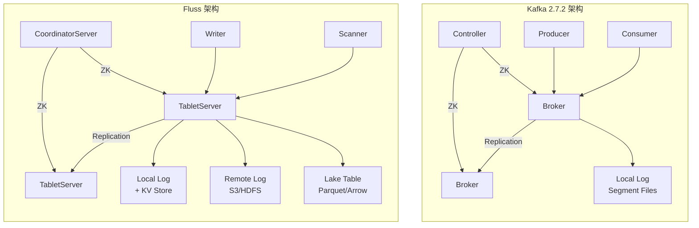

# 01 - 整体架构对比：Fluss vs Kafka 2.7.2

> 本文分析 Fluss trunk 与 Apache Kafka 2.7.2 的整体架构差异和模块映射关系。

## 1.1 核心概念映射

| Fluss 概念 | Kafka 2.7.2 概念 | 说明 |
|------------|-----------------|------|
| **Database** | （无直接对应） | Fluss 引入 Database 作为 Table 的命名空间容器 |
| **Table** | **Topic** | 基本的数据组织单元 |
| **Partition** | **Partition** | Table/Topic 的子分区（语义一致） |
| **TableBucket** | **Partition（Replica）** | 物理存储单元，Fluss 的 bucket 即 Kafka 的 partition replica |
| **Tablet** | **Partition（逻辑）** | Fluss 中 Tablet 是表级别管理单元 |
| **TabletServer** | **Broker** | 数据服务节点 |
| **CoordinatorServer** | **Controller** | 集群管理节点 |
| **LogTablet** | **Log（Partition Log）** | 物理日志实体 |
| **KV Store** | **（无对应，是 Fluss 独有）** | 主键表/PK 表的 RocksDB 存储 |
| **Lake Table** | **（无对应）** | 湖表，数据以 Parquet/Arrow 格式写入 Lakehouse |
| **Changelog** | **（无对应）** | Fluss 为 PK 表自动生成 changelog |
| **Merge Engine** | **（无对应）** | 行级合并策略（aggregate/partial update/dedupe） |
| **RemoteLogManager** | **（KIP-405 后才有，2.7.2 不存在）** | 远程分层存储 |
| **Row / InternalRow** | **Record（Key+Value bytes）** | Fluss 用 Arrow 列式（schema-aware），Kafka 用字节流 |

## 1.2 核心差异总览



### 关键差异总结

| 维度 | Fluss | Kafka 2.7.2 |
|------|-------|-------------|
| **架构** | 存算分离（TabletServer 专注存储） | 存算耦合（Broker 同时服务读写+复制） |
| **数据模型** | Table（有 schema，支持 PK）+ Database 命名空间 | Topic（无 schema，key/value bytes） |
| **存储层** | 三层：本地 Log + KV Store + Remote/Lake Storage | 单层：本地 Log Segment 文件 |
| **记录格式** | Arrow 列式（支持列裁剪 + 谓词下推） | 行式字节流 |
| **一致性** | ISR 协议（同 Kafka） | ISR 协议 |
| **协调** | CoordinatorServer（类似 Controller，但职责更多） | Controller（仅管理分区/副本状态） |
| **计算引擎** | 原生集成 Flink/Spark（作为 Sink/Source） | 通过 Connect Framework + 外部连接器 |
| **表类型** | 3 种：普通表、PK 表（KV）、Lake 表 | 无表类型概念 |
| **分层存储** | 原生支持 Remote Log + Lake Table | KIP-405 后才有（2.7.2 尚未引入） |

## 1.3 模块级映射（Maven 模块 ↔ Gradle 模块）

| Fluss Maven 模块 | Kafka 2.7.2 Gradle 模块 | 功能 |
|-------------------|-------------------------|------|
| `fluss-common` | `clients` (common部分) + 无对应 Arrow 部分 | 公共数据结构、配置、Arrow 列式记录格式、文件系统抽象 |
| `fluss-server` | `core` | 服务器核心：Log/Replica/KV/Coordinator/Tablet 管理 |
| `fluss-client` | `clients` (Producer/Consumer/Admin) | 客户端：Writer/Scanner/Admin/元数据缓存 |
| `fluss-rpc` | `clients` (network部分) + 无对应 | RPC 框架：Gateway Proxy、Netty 传输、API 管理 |
| `fluss-flink` | （外部 connector） | Flink Source/Sink/Table Connector |
| `fluss-spark` | （外部 connector） | Spark Source/Sink |
| `fluss-kafka` | （无对应） | **Kafka 协议兼容层**（关键差异化模块） |
| `fluss-lake` | （无对应） | 湖存储层：Lake Catalog、Writer、Committer |
| `fluss-metrics` | `clients` (metrics部分) | 指标收集与上报 |
| `fluss-filesystems` | （外部插件） | 文件系统插件（S3、HDFS、OSS 等） |
| `fluss-protogen` | （无对应，用 protobuf 生成） | RPC 消息的 Protobuf 代码生成 |
| `fluss-jmh` | `jmh-benchmarks` | JMH 性能基准测试 |
| `fluss-dist` | `tools`（分布部分） | 发行版打包 |

## 1.4 命名空间对比

```
Kafka 层级:
  /brokers/topics/[topic]/partitions/[partitionId]/state    ← ZK 路径
  /brokers/ids/[brokerId]

Fluss 层级:
  /fluss/databases/[database]                               ← ZK 路径
  /fluss/database/[database]/tables/[table]/partitions/[part]/
  /fluss/tablet_servers/[serverId]
  /fluss/coordinator/leader
```

## 1.5 Server 启动流程对比

### Kafka Broker 启动
```
KafkaServer.startup()
  → LogManager (创建/恢复本地日志)
  → SocketServer (启动网络层)
  → KafkaApis (注册请求处理器)
  → ReplicaManager (启动副本管理)
  → KafkaController (如果是 controller)
  → GroupCoordinator (消费者组协调)
```

### Fluss TabletServer 启动
```
FlussServer.startup()  [extends RpcServiceBase]
  → LogManager (创建/恢复本地日志)
  → KvManager (创建/恢复 KV 存储)
  → ReplicaManager (启动副本管理)
  → RemoteLogManager (远程日志分层管理)
  → RpcServiceBase (启动 RPC 网络层)
  → 向 Coordinator 注册
```

### Fluss CoordinatorServer 启动
```
CoordinatorServer.startup()  [extends RpcServiceBase]
  → ZooKeeperClient (连接 ZK)
  → CoordinatorEventProcessor (事件处理线程)
  → CoordinatorService (集群管理逻辑)
  → MetadataManager (元数据管理)
  → AutoPartitionManager (自动分区)
  → RebalanceManager (TableBucket 重平衡)
  → LeaseManager (租约管理)
  → ProducerOffsetsManager (Producer ID 管理)
  → LakeTableTieringManager (Lake 表分层)
```

## 1.6 Fluss 独有的核心能力（Kafka 2.7.2 无对应）

1. **KV Store (RocksDB)**：为 PK 表提供点查/更新/删除，Kafka 本质是 append-only log
2. **Arrow 列式记录**：支持列裁剪、谓词下推、向量化计算，Kafka 是行式字节流
3. **Lake Table**：数据可直接以 Parquet/Arrow 格式写入数据湖（Iceberg/Paimon）
4. **Remote Log**：本地仅保留 N 个 segment，老数据自动 tier 到远程存储
5. **Merge Engine**：行级聚合、部分更新、去重——Kafka 无此能力
6. **Primary Key 表**：支持 Upsert/Delete，自动生成 Changelog
7. **Schema 管理**：内建 schema evolution（通过 schema id）
8. **存算分离**：TabletServer 可独立扩缩，CoordinatorServer 可独立高可用

### Kafka 2.7.2 独有（Fluss 无对应）

1. **Connect Framework**：标准化的数据源/目标连接器生态系统
2. **Streams DSL**：内建流处理库（但可被 Flink/Spark 替代）
3. **KRaft**：KIP-500 去 ZK 化（2.7.2 中已引入 Raft 模块）
4. **事务生产者**：完整的事务语义（Fluss 当前无分布式事务）
5. **幂等生产者**：Producer ID + Sequence Number 机制
6. **分区的 compaction 策略**：基于 key 的日志压缩

## 1.7 已确认的代码复用

Fluss 多个核心模块标注 `/* This file is based on source code of Apache Kafka Project */`：

| Fluss 文件 | Kafka 来源 | 复用程度 |
|------------|-----------|----------|
| `LocalLog.java` | `kafka.log.Log.scala` | 高度复用 Log Segment 管理逻辑 |
| `LogTablet.java` | `kafka.log.Log.scala` | 复用了追加、读取、分段逻辑 |
| `LogManager.java` | `kafka.log.LogManager.scala` | 复用了日志目录管理 |
| `LogSegment.java` | `kafka.log.LogSegment.scala` | 高度复用 |
| `ReplicaManager.java` | `kafka.server.ReplicaManager.scala` | 复用副本管理框架 |
| `ReplicaFetcherThread.java` | `kafka.server.AbstractFetcherThread.scala` | 复用 Follower 拉取逻辑 |
| `DelayedOperation.java` | `kafka.server.DelayedOperation.scala` | 复用延时操作框架 |
| `LeaderAndIsr` (ZK data) | `kafka.common.TopicAndPartition` | 复用 ISR 数据结构 |

---

> **下一步**：逐模块深读 → [[02-存储引擎模块|02 - 存储引擎]] | [[03-分布式协调|03 - 分布式协调]] | [[04-数据面-网络与RPC|04 - 数据面]] | [[05-客户端与计算集成|05 - 客户端]]
