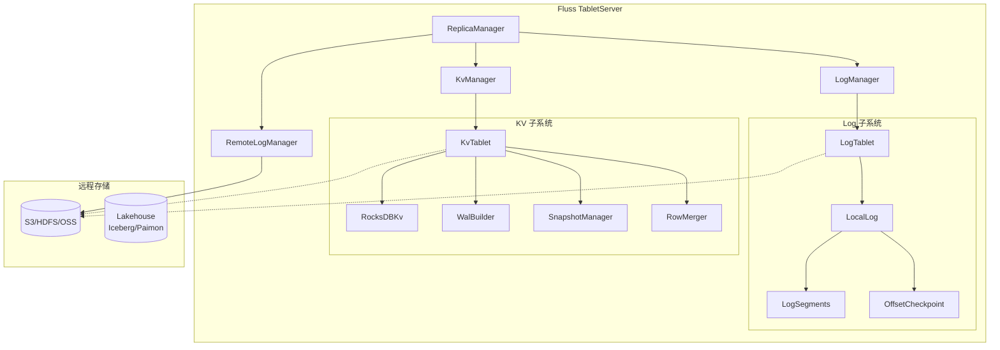
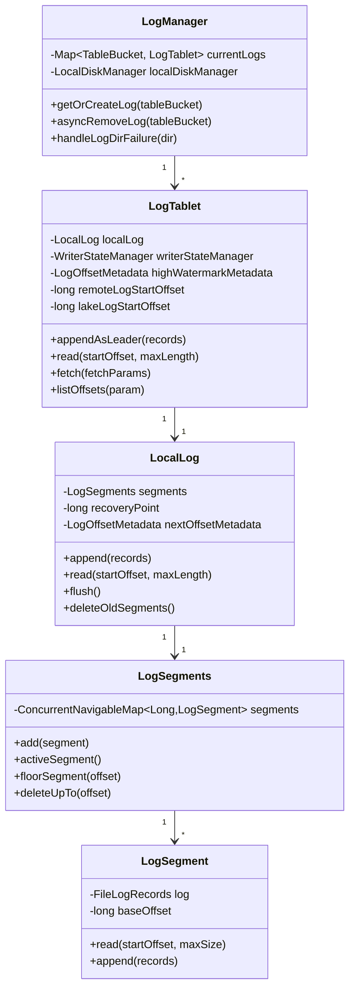
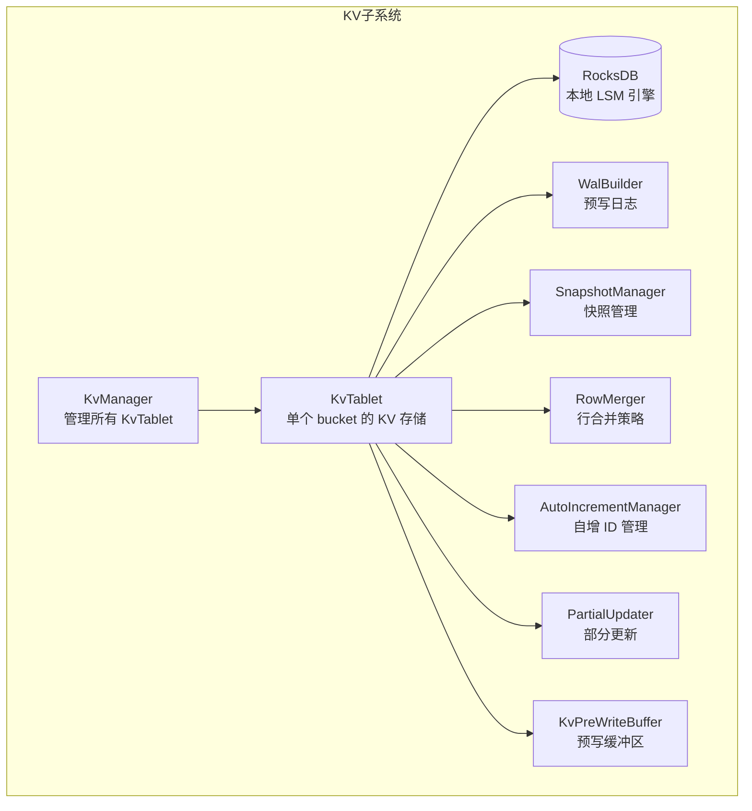
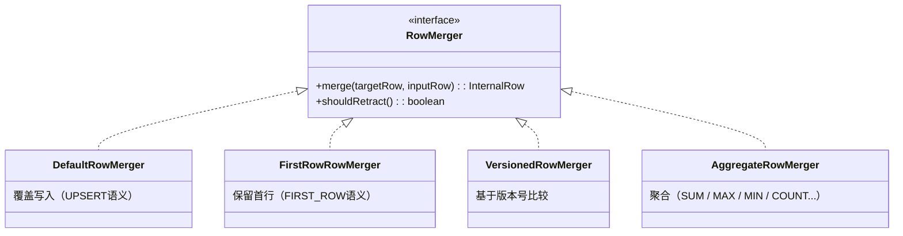
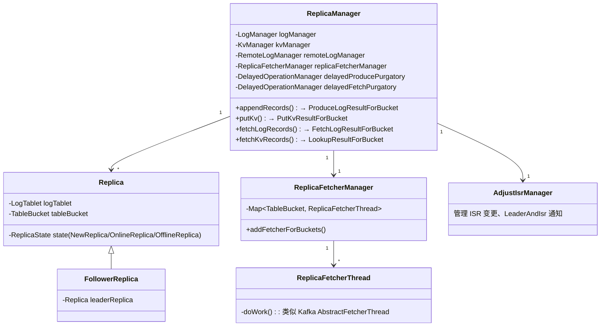

# 02 - 存储引擎模块分析

## 2.1 整体架构概览



### Fluss 三层存储模型 vs Kafka 单层

| 层 | Fluss | Kafka 2.7.2 |
|----|-------|-------------|
| L1: 本地 Log | `LocalLog` (LogSegments) — 基于 Kafka Log 改造 | `Log` (LogSegments) — 文件系统 Segment |
| L2: KV Store | `KvTablet` (RocksDB) — **Fluss 独有** | 无——Kafka 本质无 KV 概念 |
| L3: 远程分层 | `RemoteLogManager` (S3/HDFS) — **原生支持** | KIP-405 后引入（2.7.2 无） |

---

## 2.2 Log 子系统

### 2.2.1 核心类关系



### 2.2.2 Fluss Log vs Kafka Log 关键差异

| 特性 | Fluss LogTablet/LocalLog | Kafka Log |
|------|--------------------------|-----------|
| 文件结构 | `.log` Segment 文件（同 Kafka） | `.log` + `.index` + `.timeindex` |
| 索引 | Fluss 无独立 `.index` 文件（内存索引位于 LogSegments NavigableMap） | 稀疏索引文件 `.index` |
| 时间索引 | 无 `.timeindex` 文件 | 时间索引 `.timeindex` 用于时间戳定位 |
| Recovery Point | `OffsetCheckpointFile`（同 Kafka） | `recovery-point-offset-checkpoint` |
| 记录格式 | Arrow 列式（带 schema id）+ 支持索引格式 | Key/Value 行式字节流 |
| LogFormat 枚举 | `ARROW` / `COMPACTED` / `INDEXED` | 无（固定二进制格式） |
| 写入管理 | `WriterStateManager`（类似 Kafka ProducerStateManager） | `ProducerStateManager` |
| 远程日志 | 内建 `remoteLogStartOffset/remoteLogEndOffset` | 无（KIP-405 后独立模块） |
| Lake 日志 | 内建 `lakeLogStartOffset/lakeLogEndOffset` | 无 |
| ChangeLog | `isChangelog` 标志，`minRetainOffset` 保护 KV 快照依赖的分段 | 无对应概念 |
| Segment 文件名 | `00000000000000000000.log` （20 位，offset 为 segment 名） | 同 |

### 2.2.3 LogAppendInfo

Fluss 的 `LogAppendInfo` 结构：

```
LogAppendInfo {
    long firstOffset       // 第一条消息的 offset
    long lastOffset        // 最后一条消息的 offset
    long maxTimestamp      // 最大时间戳
    long logAppendTime     // append 操作时间
    LogOffsetMetadata logAppendTimeMetadata // offset 元数据
}
```

与 Kafka `LogAppendInfo` 基本一致。

### 2.2.4 Checkpoint 机制

- `OffsetCheckpointFile`：存储每个 replica 的 recovery point
- 文件格式：`<version>`\n`<entries_count>`\n`<tableBucket> <offset>`
- 与 Kafka 的 `OffsetCheckpoint` 文件完全兼容

---

## 2.3 KV 存储子系统（Fluss 独有）

### 2.3.1 概述

KV 存储是 Fluss 最大的差异化模块，为 **Primary Key 表** 提供类数据库的 Upsert/Delete 语义。Kafka 2.7.2 完全没有对应模块。



### 2.3.2 KvManager

```
class KvManager extends TabletManagerBase implements ServerReconfigurable {
    - Map<TableBucket, KvTablet> currentKvs
    - LogManager logManager        // 关联到 Log 层（写入 changelog）
    - BufferAllocator arrowBufferAllocator  // Arrow 内存分配器
    - MemorySegmentPool memorySegmentPool   // 内存段池
    - FsPath remoteKvDir           // 远程 KV 快照目录
    - RateLimiter sharedRocksDBRateLimiter  // RocksDB 限速器（防 IO 风暴）
}
```

KvManager 依赖 LogManager，因为 KV 表的每次变更会同时写入：
1. RocksDB（本地 KV 存储）
2. Changelog（追加到 LogTablet，用于恢复和复制）

### 2.3.3 RocksDB 集成

```
RocksDBKv extends AbstractRocksDBKv {
    - RocksDB db
    - ColumnFamilyHandle defaultCF
    WriteBatch (批量写入, 原子性)
    Iterator (范围扫描)
}
```

- `RocksDBResourceContainer`：管理 shared write buffer、block cache、rate limiter
- `RocksDBKvBuilder`：Builder 模式创建 RocksDB 实例
- `RocksDBWriteBatchWrapper`：封装 RocksDB WriteBatch 操作

### 2.3.4 WAL 设计（WalBuilder）

Fluss KV 的 WAL 不是额外的文件——它**直接在 changelog LogTablet 中写入**！

```
interface WalBuilder {
    +buildWal(walBatchData): MemoryLogRecords
    +recover(walBatchIterator): void
}
```

三种实现：
| 实现 | 适用场景 | 格式 |
|------|----------|------|
| `ArrowWalBuilder` | `LogFormat.ARROW` | Arrow 列式 WAL |
| `CompactedWalBuilder` | `LogFormat.COMPACTED` | 压缩格式 WAL |
| `IndexWalBuilder` | `LogFormat.INDEXED` | 索引格式 WAL |

**关键洞察**：Fluss 的 KV 恢复不是读 WAL 文件，而是**重放 changelog LogTablet**。这是与 RocksDB 标准 WAL 的核心差异——它把 WAL 复用为 LogTablet 的 segment，实现 Write-Once，Read-Multiple。

### 2.3.5 Snapshot 机制

完整的 Snapshot 子系统包含近 30 个文件，核心流程：

```
PeriodicSnapshotManager (定时触发)
  → KvTabletSnapshotTarget (执行快照)
  → RocksIncrementalSnapshot (RocksDB 增量快照)
  → KvSnapshotDataUploader (上传至远程存储)
  → CompletedKvSnapshotCommitter (提交快照元数据)
  → ZooKeeperCompletedSnapshotHandleStore (ZK 中记录)
```

- **增量快照**：基于 RocksDB 的 Checkpoint 机制，仅传输变更的 SST 文件
- **共享文件注册**：`SharedKvFileRegistry` 去重已存在于远程存储的文件
- **快照下载**：`KvSnapshotDataDownloader` 用于 Tablet 迁移/恢复
- **快照清理**：`SnapshotsCleaner` 删除过期快照

### 2.3.6 RowMerger（行合并引擎）



支持的聚合函数（`FieldAggregator` 接口）：
- `SUM` / `MAX` / `MIN` / `PRODUCT`
- `FIRST_VALUE` / `LAST_VALUE` / `FIRST_NON_NULL_VALUE` / `LAST_NON_NULL_VALUE`
- `BOOL_AND` / `BOOL_OR`
- `STRING_AGG` / `LISTAGG`
- `ROARING_BITMAP_32` / `ROARING_BITMAP_64`

### 2.3.7 Partial Updater

`PartialUpdater` / `PartialUpdaterCache`：支持对 PK 表的部分列更新（Partial Update），只更新指定的列，不影响其余列。

### 2.3.8 AutoIncrementManager

- `AutoIncrementManager`：PK 表的自增 ID 管理
- `ZkSequenceGeneratorFactory`：基于 ZK 的 ID 范围分段分配

---

## 2.4 Tablet 抽象

### 2.4.1 Tablet 定义

Fluss 中的 "Tablet" 是一个**物理存储代理单元**：

```
Tablet = LogTablet（普通表） 或  KvTablet（PK 表）
```

- `LogTablet`：管理本地 Log + 远程 Log + Lake Log 的统一视图
- `KvTablet`：管理 RocksDB KV 存储 + Changelog LogTablet

两者都实现 `TabletManagerBase` 的生命周期：
- `create()` / `recover()` / `markOnline()` / `markOffline()`

### 2.4.2 Tablet vs Kafka Partition

| 维度 | Fluss Tablet | Kafka Partition |
|------|-------------|----------------|
| 物理实体 | LogTablet（仅日志）或 KvTablet（日志+KV） | Partition（仅日志） |
| 存储层 | 本地 Log + 可选 KV + 可选远程 | 仅本地 Log |
| 恢复方式 | Log replay 或 Snapshot restore | 仅 Log replay |
| 合并策略 | RowMerger（UPSERT/AGGREGATE/PARTIAL_UPDATE） | 无 |
| 删除语义 | 真正的 DELETE（从 KV 中删除） | Tombstone（追加标记） |
| 索引 | RocksDB（PK 索引）+ LSM | OffsetIndex + TimeIndex |
| 文件结构 | `.log` Segment + `KvTablet/rocksdb/` | `.log` + `.index` + `.timeindex` |

---

## 2.5 Replica 机制

### 2.5.1 Fluss ReplicaManager



### 2.5.2 与 Kafka ReplicaManager 对照

| 特性 | Fluss ReplicaManager | Kafka 2.7.2 ReplicaManager |
|------|---------------------|---------------------------|
| 管理对象 | `Map<TableBucket, Replica>` | `Pool[TopicPartition, Partition]` |
| 写入路径 | `appendRecords()`（写入 Log）+ `putKv()`（写入 KV） | `appendRecords()`（仅写入 Log） |
| 读取路径 | `fetchLogRecords()` + `fetchKvRecords()` + `lookup()` | `fetchMessages()` |
| 延时操作 | `DelayedWrite` / `DelayedFetchLog` | `DelayedProduce` / `DelayedFetch` |
| 水印管理 | `LogOffsetMetadata highWatermarkMetadata` | `LogOffsetMetadata highWatermarkMetadata`（一致） |
| ISR 管理 | `AdjustIsrManager` | `ReplicaManager.maybePropagateIsrChanges()` |
| Fetcher | `ReplicaFetcherManager` / `ReplicaFetcherThread` | `ReplicaFetcherManager` / `AbstractFetcherThread` |
| KV 支持 | ✅ `KvManager` + `putKv()` / `lookup()` / `limitScan()` | ❌ 无 |
| 异构存储 | ✅ `RemoteLogManager` + Lake 集成 | ❌ 无 |

### 2.5.3 延时操作框架

Fluss 完全复用了 Kafka 的 `DelayedOperation` 框架：

| Fluss | Kafka | 
|-------|-------|
| `DelayedOperation` | `DelayedOperation` |
| `DelayedOperationKey` | `DelayedOperationKey` |
| `DelayedOperationManager` | `DelayedOperationPurgatory` |
| `DelayedTableBucketKey` | `TopicPartitionOperationKey` |
| `DelayedWrite` | `DelayedProduce` |
| `DelayedFetchLog` | `DelayedFetch` |

---

## 2.6 记录格式

### 2.6.1 Fluss Row 格式（Arrow 列式）

```
LogRecordBatch (interface)
├── logFormat: ARROW | COMPACTED | INDEXED
├── schemaId: short
├── baseLogOffset: long
├── lastLogOffset: long
├── writerId: long
├── batchSequence: int
├── leaderEpoch: int
├── commitTimestamp: long
└── records(ReadContext) → CloseableIterator<LogRecord>
     其中 ReferenceRecord 包含
     ├── offset: long
     ├── timestamp: long
     ├── ChangeType (APPEND | UPDATE | DELETE)
     └── RowKind (INSERT | UPDATE_BEFORE | UPDATE_AFTER | DELETE)
```

Fluss 定义了 3 种 Log Format：

| Format | 用途 | 说明 |
|--------|------|------|
| `ARROW` | 通用日志 | Apache Arrow 列式格式，支持列裁剪和谓词下推 |
| `COMPACTED` | 压缩日志（PK 表） | 每个 Key 只保留最新值，适用于 Changelog |
| `INDEXED` | 索引日志 | 支持点查/前缀查找，用于 Lookup 场景 |

### 2.6.2 Row/Aarrow 体系

```
InternalRow (行式抽象，类似 Flink RowData)
├── 支持 projection（列投影）
├── 支持 RowKind（INSERT/UPDATE/DELETE）
└── ColumnRow (Arrow 列式实现)
    ├── VectorSchemaRoot (Arrow 列式批量)
    ├── 列裁剪：ProjectionPushdownCache
    └── FlussVectorLoader → Arrow VectorLoader
```

### 2.6.3 与 Kafka Record 格式对比

| 维度 | Fluss Record | Kafka 2.7.2 Record |
|------|-------------|-------------------|
| **数据格式** | Arrow 列式（schema-aware） | 行式字节流（opaque bytes） |
| **Schema** | 有（schema id），服务端可理解数据 | 无（key/value 为 bytes，服务端不解析） |
| **列裁剪** | ✅ 支持（ProjectionPushdownCache） | ❌ 不支持 |
| **谓词下推** | ✅ 基于 Arrow 的统计信息过滤 | ❌ 不支持（2.7.2） |
| **统计信息** | `LogRecordBatchStatistics`（Min/Max/NullCount/Count） | 无 batch 级统计信息 |
| **增量** | `MemoryLogRecordsArrowBuilder` 持 Arrow Buffer | `MemoryRecordsBuilder` 持 ByteBuffer |
| **文件格式** | `FileLogRecords`（基于 FileChannel mmap 或 direct I/O） | `FileRecords`（基于 FileChannel） |
| **RecordBatch Magic** | `LOG_MAGIC_VALUE_V0` (0) | Magic V2 (2) |
| **Checksum** | CRC32（batch 级） | CRC32C（batch 级，V2） |

---

## 2.7 核心类级对照表

| Fluss 类 | Kafka 2.7.2 类 | 功能 | 差异 |
|----------|---------------|------|------|
| `LogManager` | `kafka.log.LogManager` | 日志管理入口 | 基本一致，增加远程日志支持 |
| `LogTablet` | `kafka.log.Log` + `kafka.cluster.Partition` | 统一的 Log + Partition 视图 | 合并了 Partition 元数据、远程日志引用 |
| `LocalLog` | `kafka.log.Log` | 本地日志操作 | 索引由内存 NavigableMap 替代文件索引 |
| `LogSegments` | `kafka.log.LogSegments` | Segment 集合管理 | 基本一致 |
| `LogSegment` | `kafka.log.LogSegment` | 单个 Segment | 增加了 Fluss 文件格式支持 |
| `ReplicaManager` | `kafka.server.ReplicaManager` | 副本管理 | 增加 KV 操作路径 + 远程日志集成 |
| `Replica` | `kafka.cluster.Partition` (部分) | 单个副本 | 更轻量，不包含延迟操作 |
| `FollowerReplica` | `kafka.cluster.Replica` | Follower 副本 | 基本一致 |
| `ReplicaFetcherManager` | `kafka.server.ReplicaFetcherManager` | Fetcher 管理 | 基本一致 |
| `ReplicaFetcherThread` | `kafka.server.AbstractFetcherThread` | Follower 拉取 | 基本一致 |
| `AdjustIsrManager` | `ReplicaManager.maybePropagateIsrChanges()` | ISR 变更管理 | 独立类 |
| `OffsetCheckpointFile` | `kafka.server.checkpoints.OffsetCheckpointFile` | Recovery Point | 基本一致 |
| `LogAppendInfo` | `kafka.log.LogAppendInfo` | 追加操作结果 | 基本一致 |
| `KvManager` | **无对应** | KV 存储管理 | Fluss 独有 |
| `KvTablet` | **无对应** | KV 存储单元 | Fluss 独有 |
| `RocksDBKv` | **无对应** | RocksDB 封装 | Fluss 独有 |
| `WalBuilder` | **无对应** | WAL 构建器 | Fluss 独有（复用 LogTablet 作为 WAL） |
| `RowMerger` | **无对应** | 行合并策略 | Fluss 独有 |
| `PartialUpdater` | **无对应** | 部分列更新 | Fluss 独有 |
| `AutoIncrementManager` | **无对应** | 自增 ID 管理 | Fluss 独有 |
| `SnapshotManager` | **无对应** | RocksDB 快照管理 | Fluss 独有（参考 Flink StateBackend） |
| `RemoteLogManager` | **无对应（2.7.2）** | 远程日志分层 | KIP-405 后引入 |
| `LogRecordBatch` | `org.apache.kafka.common.record.RecordBatch` | 记录批量抽象 | Fluss 基于 Arrow，支持 schema |
| `MemoryLogRecords` | `org.apache.kafka.common.record.MemoryRecords` | 内存记录 | Fluss 支持多种 Builder |
| `FileLogRecords` | `kafka.log.FileRecords` | 文件映射记录 | 基本一致 |

---

> **下一篇**：[[03-分布式协调|03 - 分布式协调层分析]]
