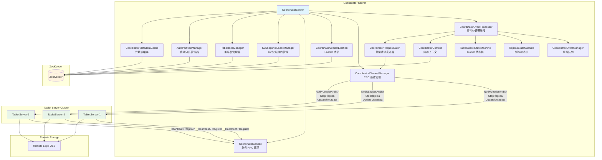
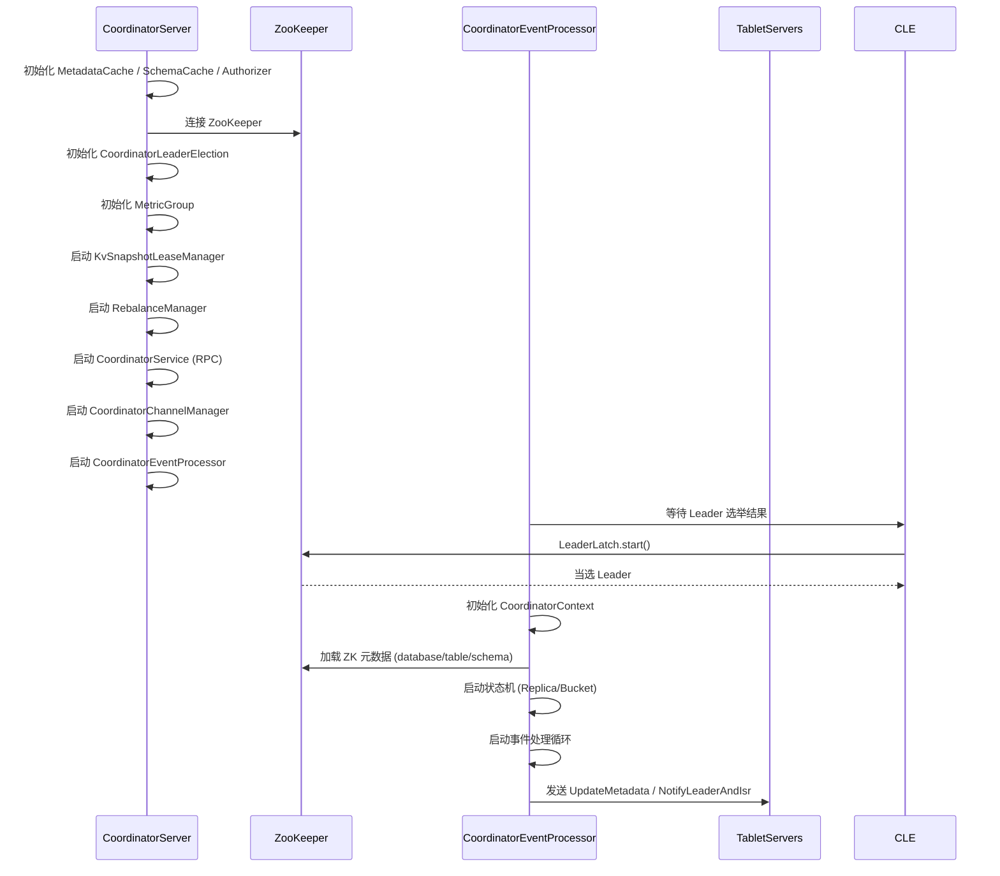
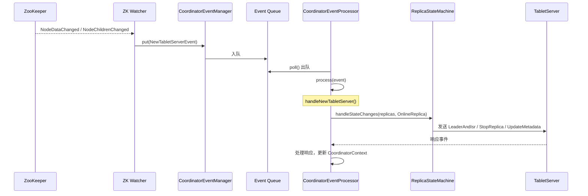
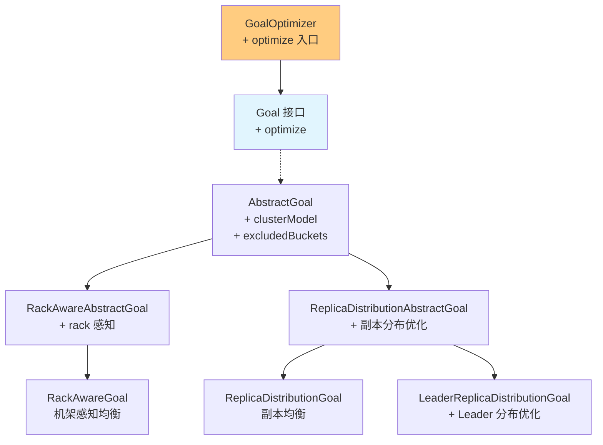
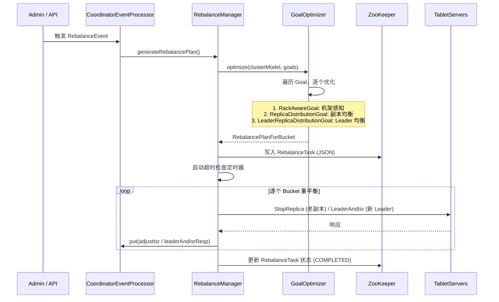
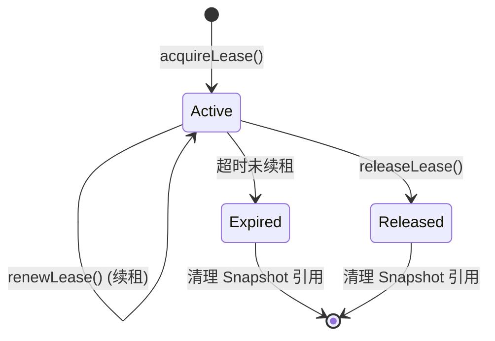
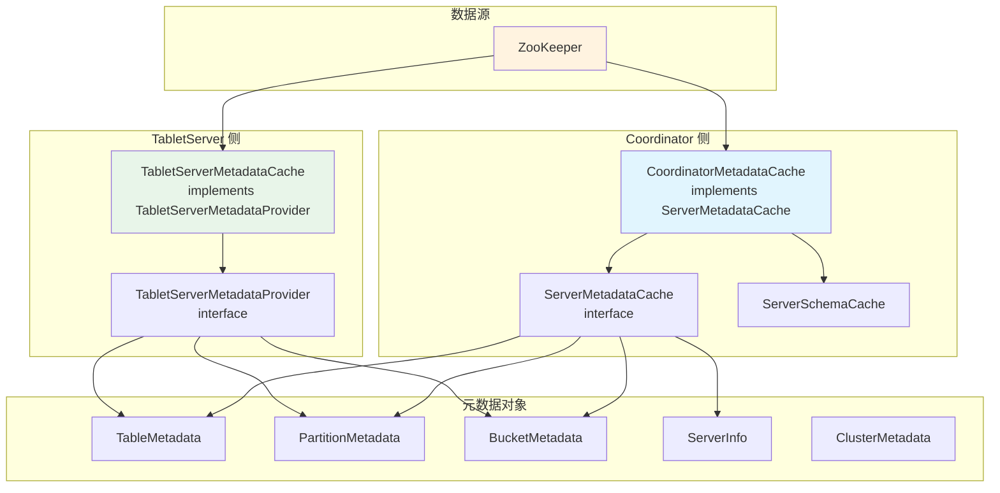
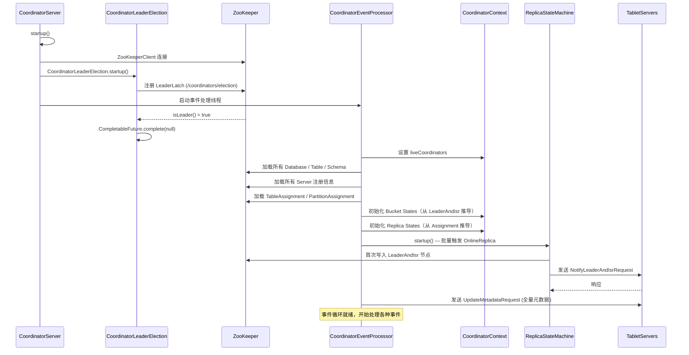

# 03 - 分布式协调层分析

## 3.1 整体架构概览

Fluss 的分布式协调层采用 **Coordinator Server（协调器）** 架构，对标 Kafka 的 **Controller** 角色，但进行了现代化重构（Java 实现、事件驱动、统一 RPC 通道）。核心组件关系如下：



**架构要点：**

| 维度 | Fluss Coordinator | Kafka Controller (2.7.2) |
|------|-------------------|--------------------------|
| 语言 | Java | Scala |
| 角色命名 | Coordinator | Controller |
| 事件模型 | `CoordinatorEvent` → `CoordinatorEventManager` → `CoordinatorEventProcessor` | `ControllerEvent` → `ControllerEventManager` → `KafkaController` |
| 状态机 | `ReplicaStateMachine` + `TableBucketStateMachine` | `ReplicaStateMachine` + `PartitionStateMachine` |
| Leader 选举 | Curator `LeaderLatch` | ZK 临时节点 `/controller` 竞争 |
| 通道管理 | `CoordinatorChannelManager` (Protobuf RPC) | `ControllerChannelManager` (Kafka 二进制协议) |
| 元数据缓存 | `CoordinatorMetadataCache` → `ServerMetadataCache` | `MetadataCache` (Broker 内) |
| 唯一 ID 分配 | ZK 序列节点 (`table_seqid`) | ZK 序列节点 (topic id 等) |

---

## 3.2 Coordinator 系统

### 3.2.1 CoordinatorServer 架构

**文件：** `fluss-server/.../coordinator/CoordinatorServer.java`

`CoordinatorServer` 是协调器的启动入口，负责组装所有子组件：

```java
// 组件装配清单（startup 方法中逐项初始化）
coordinatorMetadataCache = new CoordinatorMetadataCache();       // 元数据缓存
serverMetadataCache = new ServerMetadataCache(configuration);    // Server 信息缓存
serverSchemaCache = new ServerSchemaCache();                     // Schema 缓存
remoteLogMetadataManager = ...;                                  // 远程日志元数据管理器
authorizer = FlussAuthorizer.create(configuration, ...);         // 权限验证
zooKeeperClient = new ZooKeeperClient(...);                      // ZK 客户端
coordinatorLeaderElection = new CoordinatorLeaderElection(...);  // Leader 选举器
metricGroup = new CoordinatorMetricGroup(...);                   // 指标组
kvSnapshotLeaseManager = new KvSnapshotLeaseManager(...);        // KV 快照租约
rebalanceManager = ...;                                          // 重平衡管理器
autoPartitionManager = ...;                                      // 自动分区管理器
remoteDirDynamicLoader = new RemoteDirDynamicLoader(...);        // 远程目录加载器
coordinatorService = new CoordinatorService(...);                // 业务 RPC 处理
dynamicConfigManager = ...;                                      // 动态配置管理
rpcServer = ...;                                                 // RPC 服务器
rpcClient = ...;                                                 // RPC 客户端
coordinatorChannelManager = ...;                                 // RPC 通道
coordinatorEventProcessor = new CoordinatorEventProcessor(...);  // 事件处理器
```

**启动流程：**



### 3.2.2 事件处理机制

**文件：** `fluss-server/.../coordinator/event/CoordinatorEvent.java`

```java
// 标记接口 - 所有协调器事件的基础类型
public interface CoordinatorEvent {}
```

**事件管理器：** `EventManager.java` — 单方法接口 `void put(CoordinatorEvent event)`，具体实现为 `CoordinatorEventManager`（带队列的事件处理器）。

**事件处理器：** `CoordinatorEventProcessor.java` — 核心事件分发循环：

```java
public class CoordinatorEventProcessor implements Runnable {
    // 关键字段（参照 Kafka ControllerEventManager 的设计）
    private final CoordinatorContext coordinatorContext;
    private final EventManager eventManager;
    private final RebalanceManager rebalanceManager;
    private final ReplicaStateMachine replicaStateMachine;
    private final TableBucketStateMachine tableBucketStateMachine;
    private final CoordinatorRequestBatch coordinatorRequestBatch;
    private final ZooKeeperClient zooKeeperClient;
    
    // 事件处理方法（switch-case 分发）
    public void process(CoordinatorEvent event) {
        if (event instanceof NewCoordinatorEvent) { handleNewCoordinator(); }
        else if (event instanceof FencedCoordinatorEvent) { handleFencedCoordinator(); }
        else if (event instanceof DeadCoordinatorEvent) { handleDeadCoordinator(); }
        else if (event instanceof NewTabletServerEvent) { handleNewTabletServer(); }
        else if (event instanceof DeadTabletServerEvent) { handleDeadTabletServer(); }
        else if (event instanceof CreateTableEvent) { handleCreateTable(); }
        else if (event instanceof DropTableEvent) { handleDropTable(); }
        else if (event instanceof CreatePartitionEvent) { handleCreatePartition(); }
        else if (event instanceof DropPartitionEvent) { handleDropPartition(); }
        else if (event instanceof AdjustIsrReceivedEvent) { handleAdjustIsr(); }
        else if (event instanceof NotifyLeaderAndIsrResponseReceivedEvent) { handleLeaderAndIsrResp(); }
        else if (event instanceof DeleteReplicaResponseReceivedEvent) { handleDeleteReplicaResp(); }
        else if (event instanceof RebalanceEvent) { handleRebalance(); }
        else if (event instanceof SchemaChangeEvent) { handleSchemaChange(); }
        else if (event instanceof CommitKvSnapshotEvent) { handleCommitKvSnapshot(); }
        else if (event instanceof ControlledShutdownEvent) { handleControlledShutdown(); }
        // ... 更多事件类型
    }
}
```

**事件类型清单：**

| 事件类 | 触发场景 | 对应 Kafka 事件 |
|--------|---------|----------------|
| `NewCoordinatorEvent` | 当前节点当选 Coordinator | `BecomeLeader` → `RegisterBrokerAndReelect` |
| `FencedCoordinatorEvent` | Coordinator Epoch 过期 | `ControllerMovedException` |
| `DeadCoordinatorEvent` | 其他 Coordinator 宕机 | `BrokerChange` 感知 Controller 变化 |
| `NewTabletServerEvent` | TabletServer 注册 | `BrokerChange` |
| `DeadTabletServerEvent` | TabletServer 失联 | `BrokerChange` |
| `CreateTableEvent` | 创建表 | `CreateTopics` |
| `DropTableEvent` | 删除表 | `DeleteTopics` |
| `CreatePartitionEvent` | 创建分区 | `CreatePartitions` |
| `DropPartitionEvent` | 删除分区 | (Kafka 无直接等价) |
| `AdjustIsrReceivedEvent` | TabletServer 上报 ISR 变更 | `AlterIsr` |
| `NotifyLeaderAndIsrResponseReceivedEvent` | Leader/ISR 通知响应 | `LeaderAndIsrResponseReceived` |
| `DeleteReplicaResponseReceivedEvent` | 副本删除响应 | `TopicDeletionStopReplicaResponseReceived` |
| `RebalanceEvent` | 触发集群重平衡 | (Kafka 使用 Cruise Control 外挂) |
| `SchemaChangeEvent` | Schema 变更 | (Kafka 无 Schema 管理) |
| `CommitKvSnapshotEvent` | KV 快照提交 | (Kafka 无 KV 快照) |
| `RebalanceTaskTimeoutEvent` | 重平衡任务超时 | (无直接等价) |
| `AccessContextEvent` | 权限上下文变更 | (无直接等价) |
| `AddServerTagEvent` / `RemoveServerTagEvent` | Server 标签管理 | (无直接等价) |

**事件驱动流转：**



### 3.2.3 状态机模型

Fluss 采用 **双状态机模型**，一个管理 TableBucket 生命周期，一个管理 Replica 生命周期。

#### ReplicaStateMachine

**Enums: `ReplicaState.java`**

```
                 ┌──────────────────────┐
                 │  NonExistentReplica  │ ← ReplicaDeletionSuccessful
                 └─────────┬────────────┘
                           │ (创建副本)
                           ▼
                 ┌──────────────────────┐
                 │     NewReplica       │
                 └─────────┬────────────┘
                           │
              ┌────────────┼────────────┐
              ▼            ▼            │
    ┌──────────────┐ ┌──────────┐      │
    │OnlineReplica │ │OfflineReplica│◄──┘
    └──────┬───────┘ └─────┬─────┘
           │               │
           └───────┬───────┘
                   ▼
         ┌──────────────────────┐
         │ReplicaMigrationStarted│ (跨节点迁移)
         └──────────────────────┘
                   │
                   ▼
         ┌──────────────────────┐
         │ReplicaDeletionStarted│ (副本删除)
         └──────────┬───────────┘
                    ▼
         ┌──────────────────────┐
         │ReplicaDeletionSuccessful│
         └──────────────────────┘
```

**关键方法：**

| 方法 | 职责 |
|------|------|
| `startup()` | 从 ZK 加载初始状态，触发 Online/Offline 状态转换 |
| `handleStateChanges(Set<TableBucketReplica>, ReplicaState)` | 批量状态转换，发送对应 RPC 命令 |
| `initializeReplicaState()` | 从 ZK `TableAssignment` 推导所有 Replica 初始状态 |

#### TableBucketStateMachine

**Enums: `BucketState.java`**

```
    ┌──────────────────┐
    │ NonExistentBucket│
    └────────┬─────────┘
             │
             ▼
    ┌──────────────────┐
    │    NewBucket     │
    └────────┬─────────┘
             │
    ┌────────┼────────┐
    ▼        ▼        │
┌──────────┐ ┌──────────┐
│OnlineBucket│ │OfflineBucket│◄──┘
└──────────┘ └──────────┘
```

**关键方法：**

| 方法 | 职责 |
|------|------|
| `startup()` | 初始化所有 TableBucket 状态（有 Leader → Online，无 Leader → New/Offline） |
| `handleStateChanges(Set<TableBucket>, BucketState)` | 从 LeaderAndIsr ZK 数据触发状态流转 |
| `electLeaderForBuckets(Set<TableBucket>)` | 为指定 Bucket 执行 Leader 选举 |

**Leader 选举策略 (`ReplicaLeaderElection.java`)：**
- `DefaultLeaderElection`：在 AR（Assigned Replicas）中选取第一个 ISR 内的副本
- `ControlledShutdownLeaderElection`：优雅关闭时的 Leader 迁移
- `ReassignmentLeaderElection`：副本迁移期间的特殊选举

#### 与 Kafka 状态机对照

| 维度 | Fluss | Kafka 2.7.2 |
|------|-------|-------------|
| 分区状态机 | `TableBucketStateMachine` (管理 `TableBucket`) | `PartitionStateMachine` (管理 `TopicPartition`) |
| 副本状态机 | `ReplicaStateMachine` (管理 `TableBucketReplica`) | `ReplicaStateMachine` (管理 `PartitionAndReplica`) |
| Online 状态 | `OnlineBucket` / `OnlineReplica` | `OnlinePartition` / `OnlineReplica` |
| Offline 状态 | `OfflineBucket` / `OfflineReplica` | `OfflinePartition` / `OfflineReplica` |
| New 状态 | `NewBucket` / `NewReplica` | `NewPartition` / `NewReplica` |
| 删除状态 | `ReplicaDeletionStarted` → `ReplicaDeletionSuccessful` | `ReplicaDeletionStarted` → `ReplicaDeletionSuccessful` |
| 迁移状态 | `ReplicaMigrationStarted` | (Kafka 通过 reassign partition 实现) |
| Leader 选举 | `ReplicaLeaderElection` 接口（3 种实现） | `Election.scala`（Preferred / Unclean / Reassign）|

### 3.2.4 与 Kafka GroupCoordinator 对照

⚠️ **重要区别：Fluss Coordinator ≠ Kafka GroupCoordinator**

| 维度 | Fluss Coordinator | Kafka GroupCoordinator |
|------|-------------------|------------------------|
| 职责 | 集群全局协调：元数据管理、副本分配、Leader 选举、重平衡 | Consumer Group 管理：组成员、offset 提交、分区分配 |
| 对标角色 | **Kafka Controller** | Kafka GroupCoordinator |
| 运行位置 | 独立 Coordinator 节点 | 嵌入在某个 Broker 中 |
| Leader 选举 | ZK LeaderLatch | Group 内选举（First-Join-Wins） |
| 分区单位 | TableBucket | TopicPartition |
| 状态管理 | Bucket/Replica 双状态机 | Group 状态机（Empty/PreparingRebalance/...） |

**Fluss 社区目前没有独立的 GroupCoordinator**，因为 Fluss 是存储系统而非消息队列，消费端 offset 管理通过 Producer（Flink Job）的 `ProducerOffsets` 快照实现。

---

## 3.3 TableBucket 重平衡

### 3.3.1 重平衡算法

**文件：** `fluss-server/.../coordinator/rebalance/RebalanceManager.java`

Fluss 的重平衡基于 **Goal 驱动优化模型**，类似 Kafka Cruise Control 的核心思想：

```java
public class RebalanceManager {
    // 核心组件
    private final ZooKeeperClient zkClient;
    private final CoordinatorEventProcessor eventProcessor;
    private final EventManager eventManager;
    
    // 进行中的重平衡任务队列
    private final Queue<TableBucket> inProgressRebalanceTasksQueue;
    private final Map<TableBucket, RebalanceResultForBucket> inProgressRebalanceTasks;
    
    // 超时检查（硬编码 2 分钟超时 / 30 秒检查间隔）
    private static final long REBALANCE_TASK_TIMEOUT_MS = 2 * 60 * 1000L;
    private static final long TIMEOUT_CHECK_INTERVAL_MS = 30 * 1000L;
}
```

**重平衡 Goal 体系：**



**模型层：**

| 类 | 职责 |
|----|------|
| `ClusterModel` | 集群拓扑模型：包含所有 Server 和 Bucket |
| `ServerModel` | 单节点模型：承载的 Replica、负载指标 |
| `BucketModel` | Bucket 模型：Replica 分布、Leader 位置 |
| `RackModel` | 机架模型：机架内 Server 集合 |
| `ReplicaModel` | 副本模型：绑定到特定 Server |
| `ClusterModelStats` | 集群统计：标准差、均值等均衡度指标 |

**重平衡流程：**



**重平衡状态机：**

```
NOT_STARTED → REBALANCING → COMPLETED
                             CANCELED
```

**关键方法：**

| 方法 | 职责 |
|------|------|
| `generateRebalancePlan()` | 基于 Goal 优化器生成 Bucket 迁移计划 |
| `executeRebalanceSteps()` | 逐步执行迁移方案（StopReplica + LeaderAndIsr） |
| `completeRebalance()` | 标记重平衡完成，更新 ZK |
| `cancelRebalance()` | 取消进行中的重平衡 |
| `checkTimeout()` | 定时检查超时的 RebalanceTask |

### 3.3.2 与 Kafka Consumer Rebalance 对照

| 维度 | Fluss TableBucket Rebalance | Kafka Consumer Group Rebalance |
|------|----------------------------|-------------------------------|
| 触发方 | Coordinator（集群内） | GroupCoordinator（消费组内） |
| 目的 | 副本迁移、负载均衡 | 分区在 Consumer 之间重新分配 |
| 算法 | Goal 优化（RackAware / Distribution） | PartitionAssignor（Range/RoundRobin/Sticky） |
| 粒度 | Bucket 级别（TableBucket） | Partition 级别（TopicPartition） |
| 参与者 | TabletServer（存储节点） | Consumer（消费客户端） |
| 状态持久化 | ZK RebalanceZNode | `__consumer_offsets` 内部 Topic |

**Fluss 的 Rebalance 本质上对标 Kafka 的数据迁移（Partition Reassignment），而非 Consumer Group Rebalance。**

---

## 3.4 租约管理（Lease）

### 3.4.1 Lease 机制

**文件：** `fluss-server/.../coordinator/lease/KvSnapshotLeaseManager.java`

```java
@ThreadSafe
public class KvSnapshotLeaseManager {
    // Lease ID → Lease Handler 映射
    private final ConcurrentHashMap<String, KvSnapshotLeaseHandler> kvSnapshotLeaseMap;
    
    // (TableBucket + SnapshotId) → 引用计数（多个 Lease 可共享同一快照）
    private final Map<TableBucketSnapshot, AtomicInteger> refCount;
    
    // 定时过期检查
    private final ScheduledExecutorService scheduledExecutor;
    
    // 核心方法
    public String acquireKvSnapshotLease(TableBucket tableBucket, long snapshotId, 
                                          long leaseTimeoutMs);
    public boolean renewKvSnapshotLease(String leaseId, long renewTimeoutMs);
    public void releaseKvSnapshotLease(String leaseId);
    public void dropKvSnapshotLease(String leaseId);
}
```

**Lease 生命周期：**



**用途场景：** Flink Job 在消费数据时需要保护 KV Snapshot 不被 GC 清理。通过 Lease 机制保证 Snapshot 在消费完成前可用。

**ZK 存储位置：** `/leases/kv_snapshot/{leaseId}` — 存储 `KvSnapshotLeaseMetadata`（包含 tableId, bucketId, snapshotId, expiration time）。

### 3.4.2 类似 Kafka 的心跳/会话机制

| 维度 | Fluss KvSnapshotLease | Kafka Group 心跳（Session） |
|------|----------------------|---------------------------|
| 保护对象 | KV Snapshot（数据快照） | Consumer Group Membership |
| 超时处理 | 过期后允许 GC 删除 Snapshot | 触发 Rebalance，移除 Consumer |
| 存储位置 | ZK `/leases/` | `__consumer_offsets` 内部 Topic |
| 续租方式 | `renewKvSnapshotLease()` | `HeartbeatRequest` |
| 引用计数 | 支持多个 Lease 共享同一 Snapshot | 不支持 |

**Fluss Lease 不是心跳机制**，而是资源保护锁。Kafka 的 Group 心跳保障 Consumer 存活，Fluss 的 Lease 保障 Snapshot 不被提前回收。

---

## 3.5 Producer ID 管理

### 3.5.1 与 Kafka TransactionCoordinator 对照

Fluss 没有独立的 `TransactionCoordinator`。Producer ID 的管理通过 ZK 的 `/producers/{producerId}` 节点实现：

```java
// ZK 数据结构
public static final class ProducersZNode {
    public static String path() { return "/producers"; }
}

public static final class ProducerIdZNode {
    // 存储 ProducerOffsets（JSON 序列化）
    // 包含：expiration_time, tables(List of TableOffsetMetadata)
    public static String path(String producerId) {
        return ProducersZNode.path() + "/" + producerId;
    }
}
```

**`ProducerOffsets` 数据结构：**
```java
// ProducerOffsets JsonSerde
{
    "expiration_time": 1718000000000,    // TTL for auto cleanup
    "tables": [{
        "table_id": 1,
        "partition_id": null,
        "buckets": [{
            "bucket_id": 0,
            "remote_log_offset_file": "s3://.../offsets/bucket-0.json"
        }]
    }]
}
```

| 维度 | Fluss Producer 管理 | Kafka TransactionCoordinator |
|------|---------------------|------------------------------|
| 存储 | ZK `/producers/` (JSON) | `__transaction_state` 内部 Topic |
| Producer ID | Flink Job ID (String) | `transactional.id` → `producerId` (Long) |
| 事务支持 | ❌ 不支持 | ✅ 完整事务语义 |
| ID 分配 | 外部指定（Flink Job ID） | `InitProducerIdRequest` 分配 |
| Offset 管理 | 快照式（批量 Commit） | 流式（每个消息的 offset） |
| 过期机制 | `expiration_time` 硬编码 TTL | `transaction.timeout.ms` 可配置 |

---

## 3.6 ZooKeeper 集成

### 3.6.1 Fluss ZK 数据结构

**文件：** `fluss-server/.../zk/data/ZkData.java`

```mermaid
graph TB
    ROOT[/]
    
    ROOT --> METADATA[/metadata/]
    ROOT --> COORDS[/coordinators/]
    ROOT --> CLUSTER[/cluster/]
    ROOT --> PRODUCERS[/producers/]
    ROOT --> LEASES[/leases/]
    
    METADATA --> DBS[/metadata/databases/]
    METADATA --> TSEQ[/metadata/table_seqid]
    METADATA --> PSEQ[/metadata/partition_seqid]
    METADATA --> WID[/metadata/writer_id]
    
    DBS --> DB[/databases/{dbName}/]
    DB --> TABLES[/tables/]
    DB --> TABLES2[tables/{tableName}]
    
    TABLES2 --> SCHEMAS[/schemas/]
    TABLES2 --> PARTS[/partitions/]
    TABLES2 --> AUTO[/auto_inc/]
    
    SCHEMAS --> SCHEMA[/schemas/{schemaId}]
    PARTS --> PART[/partitions/{partName}]
    
    COORDS --> CIDS[/coordinators/ids/]
    COORDS --> CELEC[/coordinators/election]
    CIDS --> CID[/ids/{serverId}]
    
    CLUSTER --> TIDS[/cluster/table_ids/]
    CLUSTER --> PIDS[/cluster/partition_ids/]
    CLUSTER --> SERVERIDS[/cluster/server_ids/]
    CLUSTER --> TAGS[/cluster/server_tags/]
    CLUSTER --> REBAL[/cluster/rebalance]
    CLUSTER --> REMOTEL[/cluster/remote_logs/]
    
    TIDS --> TID[/table_ids/{tableId}: TableAssignment]
    PIDS --> PID[/partition_ids/{partitionId}: PartitionAssignment]
    SERVERIDS --> SID[/server_ids/{serverId}: TabletServerRegistration]
    
    PRODUCERS --> PROD[/producers/{producerId}: ProducerOffsets]
    LEASES --> KVLEASE[/leases/kv_snapshot/{leaseId}: KvSnapshotLeaseMetadata]

    style METADATA fill:#e1f5fe
    style COORDS fill:#fff3e0
    style CLUSTER fill:#e8f5e9
    style PRODUCERS fill:#fce4ec
    style LEASES fill:#f3e5f5
```

**ZK 数据节点详细说明：**

| ZK 路径 | 节点类型 | 存储内容 | 用途 |
|---------|---------|---------|------|
| `/metadata/databases/{db}` | 持久 (PERSISTENT) | `DatabaseRegistration` (JSON) | 数据库注册信息 |
| `/metadata/databases/{db}/tables/{table}` | 持久 | `TableRegistration` (JSON) | 表元数据：bucket_count, partition_keys, schema 引用 |
| `/metadata/databases/{db}/tables/{table}/schemas/{id}` | 持久 | `Schema` (JSON) | Schema 定义 |
| `/metadata/databases/{db}/tables/{table}/partitions/{name}` | 持久 | `PartitionRegistration` (JSON) | 分区注册信息 |
| `/metadata/databases/{db}/tables/{table}/auto_inc/col_{id}` | 持久 | 自增列当前值 | Auto Increment Column |
| `/metadata/table_seqid` | 持久序列 | 表唯一 ID 生成器 | `createSequential()` |
| `/metadata/partition_seqid` | 持久序列 | 分区唯一 ID 生成器 | `createSequential()` |
| `/metadata/writer_id` | 持久序列 | Writer 唯一 ID 生成器 | `createSequential()` |
| `/coordinators/ids/{serverId}` | 临时 (EPHEMERAL) | `CoordinatorAddress` (JSON) | Coordinator 节点注册/存活检测 |
| `/coordinators/election` | 临时序列 | LeaderLatch 选举 | Coordinator Leader 选举 |
| `/cluster/table_ids/{tableId}` | 持久 | `TableAssignment` (JSON) | Bucket → [Replica IDs] 映射 |
| `/cluster/partition_ids/{partitionId}` | 持久 | `PartitionAssignment` (JSON) | 分区 Bucket 副本分布 |
| `/cluster/server_ids/{serverId}` | 临时 | `TabletServerRegistration` (JSON) | TabletServer 注册 |
| `/cluster/server_tags/{serverId}` | 持久 | `ServerTags` (JSON) | Server 资源标签（用于重平衡） |
| `/cluster/rebalance` | 持久 | `RebalanceTask` (JSON) | 重平衡任务状态 |
| `/cluster/remote_logs/` | 持久 | 远程日志清单 | `RemoteLogManifestHandle` |
| `/producers/{producerId}` | 持久 | `ProducerOffsets` (JSON) | Producer Offset 快照 |
| `/leases/kv_snapshot/{leaseId}` | 持久 | `KvSnapshotLeaseMetadata` (JSON) | KV Snapshot Lease |

**核心数据类：**

`TableAssignment` — Bucket 级副本分布：
```java
public class TableAssignment {
    // Key: bucketId, Value: [replicaId1, replicaId2, replicaId3]
    // 第一个 replica 默认为 Preferred Leader
    private final Map<Integer, BucketAssignment> assignments;
}
```

`LeaderAndIsr` — 每个 Bucket 的 Leader/ISR 状态：
```java
public class LeaderAndIsr {
    private final int leader;           // Leader replica id, -1 = NO_LEADER
    private final int leaderEpoch;      // Leader 任期
    private final List<Integer> isr;    // In-Sync Replica 列表
    private final List<Integer> standbyReplicas; // 备用副本
    private final int coordinatorEpoch; // Coordinator 任期
    private final int bucketEpoch;      // Bucket 状态版本号
}
```

### 3.6.2 Kafka ZK 数据结构对照

| Fluss ZK Path | Kafka ZK Path (2.7.2) | 差异说明 |
|---------------|----------------------|---------|
| `/metadata/databases/...` | `/brokers/topics/{topic}` | Fluss 多一层 Database 命名空间 |
| `/metadata/.../tables/{table}` | `/brokers/topics/{topic}` | Fluss 存 Schema 和分区信息；Kafka 仅存分区数 |
| `/metadata/table_seqid` | (Kafka 无统一 ID，用 topic 名做 key) | Fluss 统一数字 ID |
| `/coordinators/ids/` | `/controller` (单节点临时) | Fluss 支持多 Coordinator 注册 |
| `/coordinators/election` | `/controller` (竞争临时节点) | Fluss 用 Curator LeaderLatch；Kafka 自己竞争 |
| `/cluster/table_ids/{id}` | `/brokers/topics/{topic}/partitions/{p}/state` | Fluss 存完整 BucketAssignment；Kafka 存 leader/isr |
| `/cluster/server_ids/{id}` | `/brokers/ids/{id}` | 等价，节点注册信息 |
| `/cluster/rebalance` | `/admin/reassign_partitions` | Fluss 内置重平衡；Kafka 依赖 admin 操作 |
| `/producers/` | `__transaction_state` Topic (非 ZK) | Fluss 用 ZK 存 Producer offset 快照 |
| `/leases/` | (无直接等价) | Fluss 特有 KV Snapshot Lease |

---

## 3.7 元数据管理

### 3.7.1 Table/Partition/TableBucket 元数据

#### 元数据缓存架构



**`TableMetadata`：**
```java
public class TableMetadata {
    private final TableInfo tableInfo;              // 通用表信息（Schema、配置等）
    private final List<BucketMetadata> bucketMetadataList; // 所有 Bucket 的元数据
    // 对于分区表，bucketMetadataList 为空；详细信息在 PartitionMetadata 中
}
```

**`BucketMetadata`：**
```java
public class BucketMetadata {
    private final int bucketId;
    private final @Nullable Integer leaderId;      // 当前 Leader Server ID
    private final @Nullable Integer leaderEpoch;    // Leader 任期
    private final List<Integer> replicas;           // 副本分布 [s1, s2, s3]
}
```

**`PartitionMetadata`：**
```java
public class PartitionMetadata {
    private final long partitionId;
    private final String partitionName;
    private final List<BucketMetadata> bucketMetadataList;
}
```

**`TableBucket`（公共 API）：**
```java
public class TableBucket implements Serializable {
    private final long tableId;       // 表 ID
    private final int bucket;         // Bucket 编号
    private final @Nullable Long partitionId; // 分区 ID（分区表非空）
    // 缓存 hashCode 用于 RecordAccumulator 等性能敏感路径
}
```

**`CoordinatorMetadataCache` 核心方法：**
```java
public class CoordinatorMetadataCache implements ServerMetadataCache {
    // ReentrantLock 保护的可变快照
    private volatile NodeMetadataSnapshot metadataSnapshot;
    
    // 查询 TabletServer 是否存活
    public boolean isAliveTabletServer(int serverId);
    // 获取特定 TabletServer 的 RPC 地址
    public Optional<ServerNode> getTabletServer(int serverId, String listenerName);
    // 获取所有存活的 TabletServer
    public Map<Integer, ServerNode> getAllAliveTabletServers(String listenerName);
    // 获取 Coordinator Server 地址
    public @Nullable ServerNode getCoordinatorServer(String listenerName);
    // 获取 Server Tag 标签
    public Map<Integer, ServerTag> getServerTags();
}
```

### 3.7.2 与 Kafka Topic/Partition 对照

#### 元数据模型对照

| Fluss | Kafka 2.7.2 | 说明 |
|-------|-------------|------|
| `DatabaseDescriptor` | (无，Kafka 无 Database 概念) | Fluss 引入 Database 做逻辑隔离 |
| `TableInfo` | Topic 元数据（无独立类，散落在 ZK） | Fluss 结构化为独立 POJO |
| `TablePath` (db.table) | Topic Name (String) | Fluss 增加命名空间 |
| `TableBucket(tableId, bucket)` | `TopicPartition(topic, partition)` | Fluss 的 Bucket 比 Kafka Partition 语义更轻 |
| `TableBucket(tableId, partitionId, bucket)` | `TopicPartition(topic, partition)` | Fluss 分区表有二级结构：Partition → Bucket |
| `BucketMetadata` | 无，信息散落在 `PartitionStateInfo` | Fluss 独立抽象 |
| `TableMetadata` | `MetadataCache` 的内存结构 | Fluss 独立 POJO 传输 |
| `PartitionAssignment(bucket → replicas)` | `ReplicaAssignment` (replicas + adding + removing) | Fluss 更简单，无动态迁移字段 |
| `LeaderAndIsr` | `LeaderAndIsr` (Kafka API) | 结构一致（leader/epoch/isr） |

#### RPC 通道消息对照

| Fluss RPC 消息 | Kafka RPC 消息 | 说明 |
|----------------|---------------|------|
| `NotifyLeaderAndIsrRequest` | `LeaderAndIsrRequest` | Leader/ISR 变更通知 |
| `StopReplicaRequest` | `StopReplicaRequest` | 副本删除/下线通知 |
| `UpdateMetadataRequest` | `UpdateMetadataRequest` | 元数据广播 |
| `NotifyKvSnapshotOffsetRequest` | (无等价) | Fluss KV Snapshot Offset 通知 |
| `NotifyLakeTableOffsetRequest` | (无等价) | Fluss Lake Table (Paimon/Iceberg) Offset |
| `NotifyRemoteLogOffsetsRequest` | (无等价) | 远程日志 Offset 通知 |

---

## 3.8 核心类级对照表

### Coordinator → Controller 对照

| Fluss 类 | Kafka 2.7.2 类 (Scala) | 职责对比 |
|----------|------------------------|---------|
| `CoordinatorServer` | `KafkaServer` (部分) + `KafkaController` | Fluss 将 Controller 服务独立为单独进程 |
| `CoordinatorEventProcessor` | `KafkaController` (impl `ControllerEventProcessor`) | 事件处理循环 + 状态机编排 |
| `CoordinatorContext` | `ControllerContext` | 内存状态：live servers, bucket states, replica states |
| `CoordinatorEventManager` | `ControllerEventManager` | 事件队列管理 |
| `CoordinatorChannelManager` | `ControllerChannelManager` | RPC 通道到 Worker 节点（TabletServer / Broker） |
| `CoordinatorRequestBatch` | (分散在 Controller 方法中) | Fluss 隔离批处理逻辑为独立类 |
| `CoordinatorLeaderElection` | ZK `/controller` 竞争逻辑 (KafkaController 内部) | Fluss 用 Curator LeaderLatch 解耦 |
| `CoordinatorService` | `KafkaApis` (处理 Controller 相关请求部分) | RPC 请求处理（table/database/rebalance） |
| `CoordinatorMetadataCache` | Broker 内 `MetadataCache` | Fluss Coordinator 专用缓存 |
| `AutoPartitionManager` | (Kafka 无等价，分区手动创建) | 自动分区创建 |
| `KvSnapshotLeaseManager` | (无等价) | KV Snapshot 生命周期管理 |
| `RebalanceManager` | (Kafka 依赖外挂 Cruise Control) | 内置 Goal 驱动重平衡 |
| `RemoteDirDynamicLoader` | (无等价) | 远程存储目录动态发现/加载 |

### 状态机对照

| Fluss | Kafka 2.7.2 |
|-------|-------------|
| `ReplicaStateMachine` | `ReplicaStateMachine` |
| `TableBucketStateMachine` | `PartitionStateMachine` |
| `ReplicaState` enum (7 states) | `ReplicaState` enum (6 states, 无 MigrationStarted) |
| `BucketState` enum (4 states) | `PartitionState` enum (4 states) |
| `ReplicaLeaderElection` interface | `Election` object + `ElectionStrategy` |
| `DefaultLeaderElection` | `OfflinePartitionLeaderElectionStrategy` |
| `ControlledShutdownLeaderElection` | `ControlledShutdownLeaderElectionStrategy` |
| `ReassignmentLeaderElection` | `ReassignPartitionLeaderElectionStrategy` |

### ZK 数据对照

| Fluss | Kafka 2.7.2 |
|-------|-------------|
| `ZooKeeperClient` | `KafkaZkClient` |
| `ZkData` (静态内部类) | `ZkData` (object) |
| `ZkData.DatabaseZNode` | (无) |
| `ZkData.TableZNode` | `TopicZNode` |
| `ZkData.PartitionZNode` | (无独立节点) |
| `ZkData.TableIdZNode` | `TopicPartitionStateZNode` |
| `ZkData.ServerIdZNode` | `BrokerIdZNode` |
| `ZkData.CoordinatorIdsZNode` | `ControllerIdZNode` |
| `ZkData.CoordinatorElectionZNode` | `ControllerEpochZNode` |
| `TableRegistration` | (无独立注册类) |
| `TableAssignment` | `ReplicaAssignment` |
| `LeaderAndIsr` | `LeaderAndIsr` (Kafka API 类) |
| `BuckerAssignment` | `ReplicaAssignment.replicas` |
| `ProducersZNode` → `ProducerOffsets` | `__transaction_state` Topic |

### RPC 服务接口对照

| Fluss RPC 接口 (CoordinatorService) | Kafka 对应 (KafkaApis) |
|-------------------------------------|------------------------|
| `createDatabase()` | `handleCreateTopics()` (无 Database 层) |
| `dropDatabase()` | `handleDeleteTopics()` |
| `createTable()` | `handleCreateTopics()` |
| `dropTable()` | `handleDeleteTopics()` |
| `createPartition()` | `handleCreatePartitions()` |
| `dropPartition()` | (无直接等价) |
| `alterTable()` | `handleAlterConfigs()` |
| `registerTabletServer()` | (通过 ZK `/brokers/ids/` 自动注册) |
| `heartbeat()` | (ZK 临时节点心跳，无显式 RPC) |
| `acquireKvSnapshotLease()` | (无等价) |
| `releaseKvSnapshotLease()` | (无等价) |
| `commitKvSnapshot()` | (无等价) |
| `commitLakeTableSnapshot()` | (无等价 — Fluss Lake Table 特有) |
| `adjustIsr()` | `handleAlterIsr()` |
| `getTableInfo()` | `handleMetadataRequest()` |
| `getSchemaInfo()` | (Schema Registry 独立服务) |
| `rebalance()` | (外挂 Cruise Control API) |

---

## 3.9 Coordinator 启动与 Leader 选举序列



## 3.10 关键设计总结

### Fluss Coordinator 相比 Kafka Controller 的主要改进

1. **Java 实现 vs Scala**：更广泛的社区基础，更易维护
2. **Curator LeaderLatch**：比 Kafka 手写的 ZK 竞争逻辑更健壮
3. **事件类型扁平化**：30+ 事件类型 vs Kafka 的 20+，覆盖更多场景
4. **内置重平衡**：Goal 驱动模型直接内置，不需要 Kafka 的 Cruise Control 外挂
5. **KV Snapshot Lease**：针对 Flink 集成的独特设计
6. **AutoPartitionManager**：自动分区创建，Kafka 依赖手动调用 API
7. **Database 命名空间**：TablePath(db.table) 提供逻辑隔离层
8. **分类 RPC 通道**：`NotifyLeaderAndIsr` / `StopReplica` / `UpdateMetadata` / `NotifyKvSnapshotOffset` / `NotifyLakeTableOffset` / `NotifyRemoteLogOffsets` — 六条独立通道
9. **Server Tag 机制**：支持资源标签，用于重平衡的机架感知和隔离
10. **Remote Log Manifest**：原生支持远程日志（OSS/S3），Kafka 通过 Tiered Storage KIP 后期增强

### 架构层级总览

```
┌─────────────────────────────────────────────────┐
│               CoordinatorServer                  │
│  ┌───────────────────────────────────────────┐  │
│  │   CoordinatorService (RPC 处理)           │  │
│  │   ┌──────┬──────┬──────┬──────┬──────┐   │  │
│  │   │Table │DB    │Server│Lease │Rebal │   │  │
│  │   │  CRUD│CRUD  │Reg   │Mgr   │Mgr   │   │  │
│  │   └──────┴──────┴──────┴──────┴──────┘   │  │
│  └───────────────────────────────────────────┘  │
│  ┌───────────────────────────────────────────┐  │
│  │   CoordinatorEventProcessor (事件循环)     │  │
│  │   ┌──────────────────────────────────┐    │  │
│  │   │ CoordinatorEventManager (队列)    │    │  │
│  │   └──────────────────────────────────┘    │  │
│  └───────────────────────────────────────────┘  │
│  ┌──────────────┐  ┌────────────────────────┐  │
│  │ReplicaState   │  │TableBucketStateMachine │  │
│  │   Machine     │  │                        │  │
│  └──────────────┘  └────────────────────────┘  │
│  ┌───────────────────────────────────────────┐  │
│  │   CoordinatorChannelManager (RPC 通道)     │  │
│  └───────────────────────────────────────────┘  │
│  ┌───────────────────────────────────────────┐  │
│  │   ZooKeeperClient / MetadataCache          │  │
│  └───────────────────────────────────────────┘  │
└─────────────────────────────────────────────────┘
```
