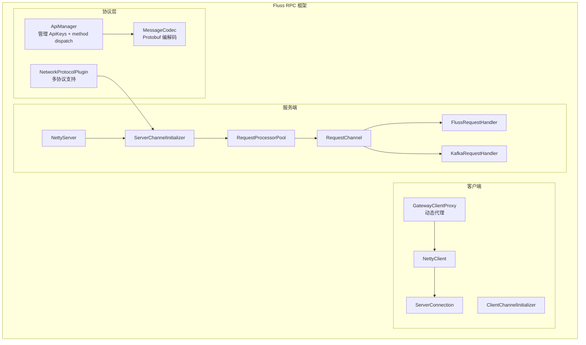
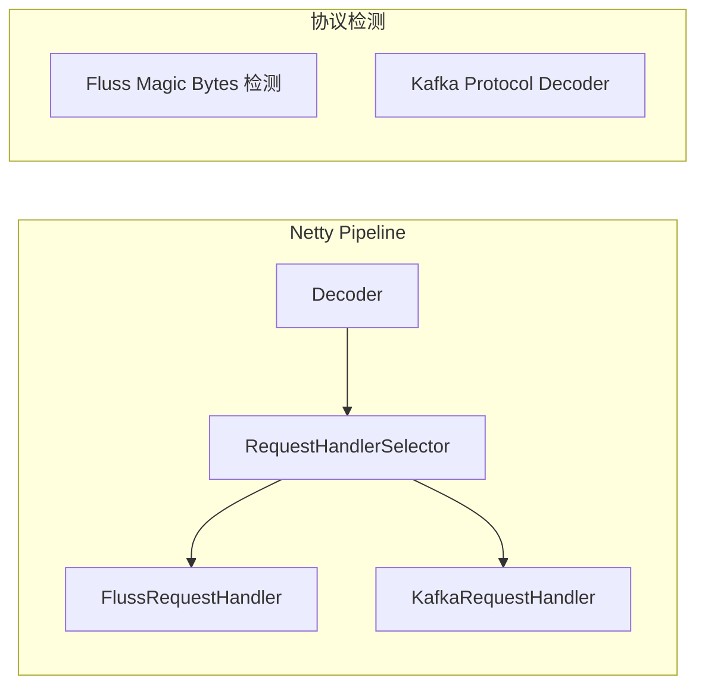
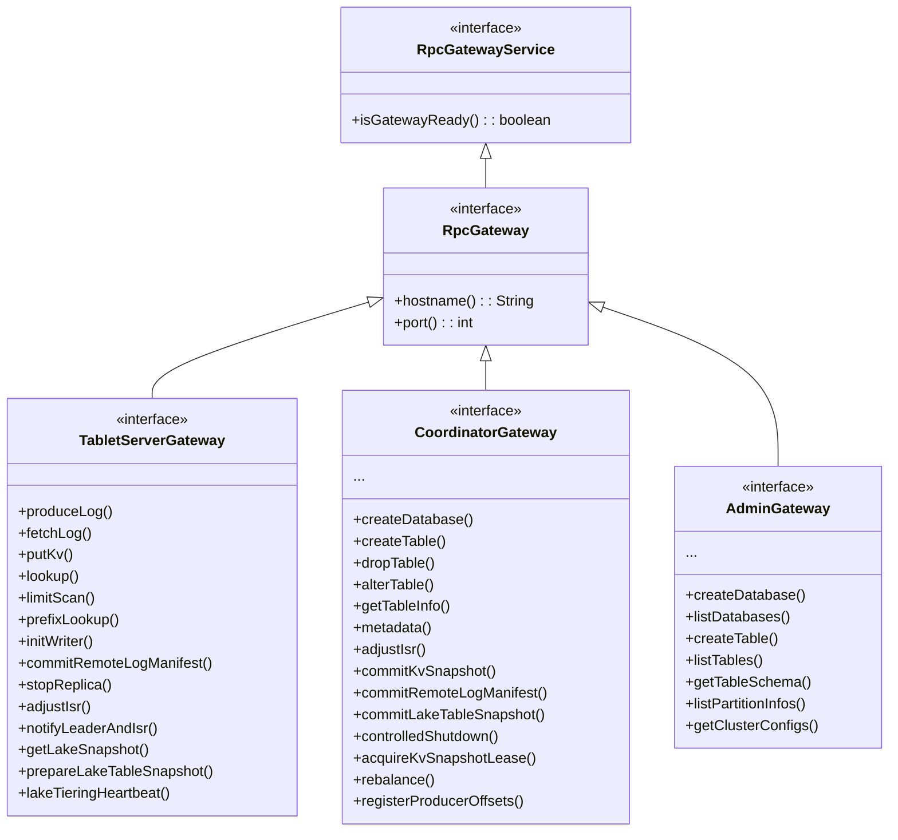

# 04 - 数据面：网络与 RPC

## 4.1 整体架构概览



---

## 4.2 RPC 协议设计

### 4.2.1 协议栈对比

| 维度 | Fluss | Kafka 2.7.2 |
|------|-------|-------------|
| **传输** | Netty 4（shaded） | 原生 Java NIO (`SocketServer`) |
| **序列化** | Protobuf（生成代码） | 自定义二进制格式（`RequestHeader` / `ResponseHeader`） |
| **API 标识** | `ApiKeys` enum (ID 1000+)，字符串 method name + 反射 | `ApiKeys` enum (ID 0-99)，请求头 int16 apiKey |
| **方法分发** | `GatewayClientProxy` Dynamic Proxy + 反射 methodName | `KafkaApis.handle()` switch-case apiKey |
| **多协议** | ✅ `RequestType.FLUSS` / `RequestType.KAFKA` 双协议 | 单一 Kafka 协议 |
| **版本协商** | `ApiVersions`（Protobuf 级） | `ApiVersions`（Kafka protocol 级） |

### 4.2.2 ApiKeys 分类（Fluss 完整 API 清单）

Fluss 的 API Key 从 1000 开始（0-999 预留给 Kafka 协议兼容）：

#### DDL / 管理（PUBLIC）

| API Key | Method | 说明 |
|---------|--------|------|
| 1000 | `ApiVersions` | 协议版本协商 |
| 1001 | `CreateDatabase` | 创建数据库 |
| 1002 | `DropDatabase` | 删除数据库 |
| 1003 | `ListDatabases` | 列出数据库 |
| 1004 | `DatabaseExists` | 检查数据库是否存在 |
| 1005 | `CreateTable` | 创建表 |
| 1006 | `DropTable` | 删除表 |
| 1007 | `GetTableInfo` | 获取表信息 |
| 1008 | `ListTables` | 列出表 |
| 1009 | `ListPartitionInfos` | 列出分区信息 |
| 1010 | `TableExists` | 检查表是否存在 |
| 1011 | `GetTableSchema` | 获取表 Schema |
| 1035 | `GetDatabaseInfo` | 获取数据库信息 |
| 1036 | `CreatePartition` | 创建分区 |
| 1037 | `DropPartition` | 删除分区 |
| 1044 | `AlterTable` | 修改表配置/Schema |
| 1060 | `AlterDatabase` | 修改数据库配置 |

#### 数据流（PUBLIC）

| API Key | Method | 说明 |
|---------|--------|------|
| 1012 | `GetMetadata` | 获取集群元数据（类似 Kafka Metadata request） |
| 1014 | `ProduceLog` | 写入日志记录 |
| 1015 | `FetchLog` | 拉取日志记录 |
| 1016 | `PutKv` | 写入 KV 记录 |
| 1017 | `Lookup` | 点查 KV 记录 |
| 1021 | `ListOffsets` | 列举 offset 信息 |
| 1023 | `GetLatestKvSnapshots` | 获取最新 KV 快照信息 |
| 1024 | `GetKvSnapshotMetadata` | 获取 KV 快照元数据 |
| 1025 | `GetFilesystemSecurityToken` | 获取文件系统安全令牌 |
| 1026 | `InitWriter` | 初始化 Writer（分配 writer id） |
| 1033 | `LimitScan` | 范围扫描 |
| 1034 | `PrefixLookup` | 前缀查找 |
| 1032 | `GetLakeSnapshot` | 获取 Lake 快照 |
| 1059 | `GetTableStats` | 获取表统计信息 |
| 1061 | `ScanKv` | KV 扫描 |

#### 内部（PRIVATE）

| API Key | Method | 说明 |
|---------|--------|------|
| 1013 | `UpdateMetadata` | Coordinator → TabletServer 元数据更新 |
| 1018 | `NotifyLeaderAndIsr` | Coordinator → TabletServer Leader/ISR 通知 |
| 1019 | `StopReplica` | Coordinator → TabletServer 停止副本 |
| 1020 | `AdjustIsr` | TabletServer → Coordinator ISR 变更通知 |
| 1022 | `CommitKvSnapshot` | TabletServer → Coordinator 提交 KV 快照 |
| 1027 | `CommitRemoteLogManifest` | TabletServer → Coordinator 提交远程日志 manifest |
| 1028 | `NotifyRemoteLogOffsets` | Coordinator → TabletServer 通知远程日志 offset |
| 1029 | `NotifyKvSnapshotOffset` | Coordinator → TabletServer 通知 KV 快照 offset |
| 1030 | `CommitLakeTableSnapshot` | TabletServer → Coordinator 提交 Lake 表快照 |
| 1031 | `NotifyLakeTableOffset` | Coordinator → TabletServer 通知 Lake 表 offset |
| 1042 | `LakeTieringHeartbeat` | TabletServer → Coordinator Lake 分层心跳 |
| 1043 | `ControlledShutdown` | TabletServer → Coordinator 优雅关闭 |
| 1052 | `PrepareLakeTableSnapshot` | TabletServer → Coordinator 准备 Lake 快照 |

#### ACL / 集群管理（PUBLIC）

| API Key | Method | 说明 |
|---------|--------|------|
| 1038 | `Authenticate` | 认证 |
| 1039 | `CreateAcls` | 创建 ACL |
| 1040 | `ListAcls` | 列出 ACL |
| 1041 | `DropAcls` | 删除 ACL |
| 1045 | `DescribeClusterConfigs` | 查看集群配置 |
| 1046 | `AlterClusterConfigs` | 修改集群配置 |
| 1047 | `AddServerTag` | 添加服务器标签 |
| 1048 | `RemoveServerTag` | 删除服务器标签 |
| 1049 | `Rebalance` | 触发重平衡 |
| 1050 | `ListRebalanceProgress` | 查看重平衡进度 |
| 1051 | `CancelRebalance` | 取消重平衡 |
| 1053 | `RegisterProducerOffsets` | 注册 Producer offset |
| 1054 | `GetProducerOffsets` | 获取 Producer offset |
| 1055 | `DeleteProducerOffsets` | 删除 Producer offset |
| 1056 | `AcquireKvSnapshotLease` | 获取 KV 快照租约 |
| 1057 | `ReleaseKvSnapshotLease` | 释放 KV 快照租约 |
| 1058 | `DropKvSnapshotLease` | 删除 KV 快照租约 |

### 4.2.3 双协议引擎（Fluss + Kafka）



Fluss 通过 `NetworkProtocolPlugin` 接口实现协议热插拔：
- `FlussProtocolPlugin`：原生 Fluss 协议（Protobuf）
- `KafkaProtocolPlugin`：Kafka 协议兼容（`KafkaChannelInitializer` → 标准 Kafka 二进制协议）

`RequestType` 枚举：
```java
enum RequestType { FLUSS, KAFKA }
```

### 4.2.4 Gateway 抽象



### 4.2.5 GatewayClientProxy —— 核心 RPC 代理机制

`GatewayClientProxy` 使用 JDK 动态代理 + 反射实现 RPC 调用：

```java
// 核心流程：
invoke(proxy, method, args):
  1. apiMethod = ApiManager.forMethodName(method.getName())
     // 查找 ApiKeys 中 matching 的方法名
  2. request = apiMethod.serializeRequest(method, args)
  3. response = nettyClient.send(serverAddress, request)
  4. return apiMethod.deserializeResponse(response, method)
```

**与 Kafka 的对比**：
| 维度 | Fluss GatewayClientProxy | Kafka NetworkClient |
|------|-------------------------|-------------------|
| **调用方式** | JDK Dynamic Proxy (反射 methodName) | 显式调用 `send()` + `poll()` |
| **API 映射** | `ApiManager.forMethodName(methodName)` 自动匹配 | `ApiKeys.{key}` 硬编码 |
| **序列化** | Protobuf（自动生成） | 手动编写的 `Struct` / `Schema` |
| **异步模型** | `CompletableFuture` | `ClientResponse` callback |

---

## 4.3 网络传输层

### 4.3.1 Netty 集成

| Fluss (Netty) | Kafka (Java NIO) |
|---------------|-----------------|
| `NettyServer` | `SocketServer` + `Acceptor` + `Processor` |
| `NettyClient` | `NetworkClient` + `Selector` |
| `ServerChannelInitializer` | `ChannelBuilder` (new connection) |
| `ClientChannelInitializer` | `ChannelBuilder` |
| `NettyServerHandler` | `Processor` (read/write loops) |
| `NettyClientHandler` | `Send` / `NetworkReceive` |
| `RequestProcessorPool` | `RequestHandlerPool` (KafkaApis threads) |
| `RequestChannel` | `RequestChannel` (NIO queues) |

### 4.3.2 服务端请求处理路径

```
NettyServer (boss + worker event loops)
  → ServerChannelInitializer (decode protocol magic)
    → FlussRequestHandler 或 KafkaRequestHandler (decode)
      → RequestChannel (queue)
        → RequestProcessorPool (线程池)
          → RequestProcessor.run()
            → RpcGatewayService.processRequest()
              (CoordinatorService / FlussServer)
```

### 4.3.3 连接管理

| 特性 | Fluss | Kafka |
|------|-------|-------|
| 连接复用 | ✅（Netty Channel 复用） | ✅（ConnectionPool） |
| 空闲超时 | `KAFKA_CONNECTION_MAX_IDLE_TIME` 配置 (default 10min) | `connections.max.idle.ms` (default 10min) |
| 最大请求大小 | `NETTY_SERVER_MAX_REQUEST_SIZE` | `socket.request.max.bytes` |
| 并发连接限制 | Netty boss thread 自动处理 | `max.connections.per.ip` |
| TLS | 通过 Netty SslHandler | 通过 Java SSLContext |

### 4.3.4 Netty Shade 策略

Fluss 将 Netty 4 打包为 shaded 依赖 `org.apache.fluss.shaded.netty4`，避免与用户依赖冲突。但类路径中的 `netty4` 暗示依赖可能未被完全 shade。

---

## 4.4 请求/响应模型

### 4.4.1 Fluss 请求结构

```
RpcRequest {
    - String serverName
    - String methodName
    - int callerId
    - byte[] serializedRequest
    - RequestType requestType (FLUSS | KAFKA)
}
```

### 4.4.2 Protobuf 消息生成

`fluss-protogen` 模块负责 Protobuf → Java 代码生成：

```
fluss-protogen/src/main/proto/
├── common.proto             (RpcResult, TableBucket, Schema)
├── api_versions.proto       (ApiVersions request/response)
├── database.proto           (Database CRUD request/response)
├── table.proto              (Table CRUD request/response)
├── produce_log.proto        (ProduceLog request/response)
├── fetch_log.proto          (FetchLog request/response)
├── put_kv.proto             (PutKv request/response)
├── lookup.proto             (Lookup request/response)
├── limit_scan.proto         (LimitScan request/response)
├── list_offsets.proto       (ListOffsets request/response)
├── coordinator.proto        (Coordinator 类请求)
├── metadata.proto           (Metadata request/response)
├── server.proto             (Server 类请求)
└── ...
```

### 4.4.3 与 Kafka 请求模型对照

| 特性 | Fluss | Kafka |
|------|-------|-------|
| **请求类型** | `String methodName` | `ApiKeys` enum (int16) |
| **头结构** | 自定义 Protobuf 头 | `RequestHeader` (apiKey, apiVersion, correlationId, clientId) |
| **载荷** | Protobuf Message bytes | 自定义 Struct bytes |
| **版本管理** | Protobuf 字段 added/deprecated | `apiVersion` 手动兼容逻辑 |
| **错误码** | `ApiError` / `Errors` (类似 Kafka) | `Errors` enum |
| **CorrelationId** | 由 NettyClient 自动管理 | 显式传递 |
| **超时处理** | CompletableFuture timeout | `ClientRequest` deadline |

---

## 4.5 Kafka 协议兼容层深度

### 4.5.1 文件清单（5 个 Java 文件）

| 文件 | 功能 | 状态 |
|------|------|------|
| `KafkaProtocolPlugin` | 协议插件入口，注册 Netty ChannelHandler | ✅ 完整 |
| `KafkaChannelInitializer` | Netty Pipeline 初始化（decoder/encoder） | ✅ 完整 |
| `KafkaCommandDecoder` | 标准 Kafka 二进制协议解码 | ✅ 完整 |
| `KafkaRequest` | Kafka 请求封装 | ✅ 完整 |
| `KafkaRequestHandler` | **请求处理核心 → 绝大部分方法为空** | ⚠️ 骨架 |

### 4.5.2 KafkaRequestHandler 实现状态

```
✅ API_VERSIONS     — 完整实现（返回支持的 API 列表并限版本）
❌ PRODUCE          — 空方法 {}
❌ FETCH            — 空方法 {}
❌ METADATA         — 空方法 {}
❌ LIST_OFFSETS     — 空方法 {}
❌ FIND_COORDINATOR — 空方法 {}
❌ JOIN_GROUP       — 空方法 {}
❌ SYNC_GROUP       — 空方法 {}
❌ HEARTBEAT        — 空方法 {}
❌ LEAVE_GROUP      — 空方法 {}
❌ OFFSET_FETCH     — 空方法 {}
❌ OFFSET_COMMIT    — 空方法 {}
❌ CREATE_TOPICS    — 空方法 {}
❌ DELETE_TOPICS    — 空方法 {}
❌ DESCRIBE_CONFIGS — 空方法 {}
❌ ALTER_CONFIGS    — 空方法 {}
❌ INIT_PRODUCER_ID — 空方法 {}
❌ ... 所有事务相关 — 空方法 {}
```

**结论**：Fluss Kafka 兼容层当前处于 **协议栈就绪、业务逻辑空壳** 阶段。标准 Kafka Client 可以连接并完成 API_VERSIONS 协商，之后的所有操作均会因空方法而超时或返回错误。

### 4.5.3 兼容层限制说明

从代码注释提取的限制：

```java
// METADATA: Not support TopicId
apiVersionData.setMaxVersion(11); // latest > 11 ? 11

// FETCH: Not support TopicId  
short v = apiKey.latestVersion() > 12 ? 12; // latest > 12 ? 12
```

**兼容层实际支持范围**：
- ✅ API_VERSIONS 请求/响应
- ❌ 其他所有生产/消费/管理/事务请求
- ⚠️ TopicId 特性不支持
- ⚠️ 仅在 TabletServer 上启用（不能在 CoordinatorServer 上使用）

---

## 4.6 核心类级对照表

| Fluss 类 | Kafka 2.7.2 类 | 功能 |
|----------|---------------|------|
| `RpcServer` (interface) | `SocketServer` | 服务端网络抽象 |
| `NettyServer` | `SocketServer` (实现) | 服务端网络实现 |
| `NettyServerHandler` | `Processor` | 请求读取/响应写入 |
| `RpcClient` (interface) | `NetworkClient` | 客户端网络抽象 |
| `NettyClient` | `NetworkClient` (实现) | 客户端网络实现 |
| `ServerConnection` | `KafkaChannel` | 单连接抽象 |
| `RequestChannel` | `RequestChannel` | 请求队列 |
| `RequestProcessorPool` | `KafkaRequestHandlerPool` | 请求处理线程池 |
| `RequestProcessor` | `KafkaRequestHandler` | 单个请求处理器 |
| `RequestHandler<T>` | `KafkaApis` (handle 方法) | 请求分派处理 |
| `FlussRequestHandler` | `KafkaApis` (Fluss 协议) | Fluss 原生协议处理器 |
| `KafkaRequestHandler` | `KafkaApis` (Kafka 协议) | Kafka 兼容协议处理器（骨架） |
| `GatewayClientProxy` | 无（Kafka 显式调用） | 动态代理 RPC 客户端 |
| `ApiKeys` | `ApiKeys` | API 枚举标识 |
| `ApiManager` | `ApiKeys` (直接映射) | API 方法名 ↔ ID 映射 |
| `ApiMethod` | （隐式） | 单个 API 的序列化/反序列化 |
| `MessageCodec` | （不在客户端，服务端硬编码） | Protobuf 编解码 |
| `NetworkProtocolPlugin` | Listener security protocol | 协议插件接口 |
| `FlussProtocolPlugin` | PLAINTEXT/SASL_PLAINTEXT | Fluss 原生协议 |
| `KafkaProtocolPlugin` | （无，Kafka 只有一种协议） | Kafka 协议兼容层 |
| `RequestType` | （无，只有一种） | FLUSS / KAFKA |
| `RequestFrame` | `NetworkReceive` | 请求帧 |
| `ServerChannelInitializer` | `ChannelBuilder` | 服务端 Channel 初始化器 |
| `NettyUtils` | 分散在 Selector 中 | Netty 工具方法 |
| `ServerApiVersions` | 无（通过 RequestHeader.apiVersion） | 服务端 API 版本能力声明 |
| `RetryableGatewayClientProxy` | `Retryable-Cluster-Node` 逻辑 | 带重试的网关代理 |

---

> **下一篇**：[[05-客户端与计算集成|05 - 客户端与计算集成]]
