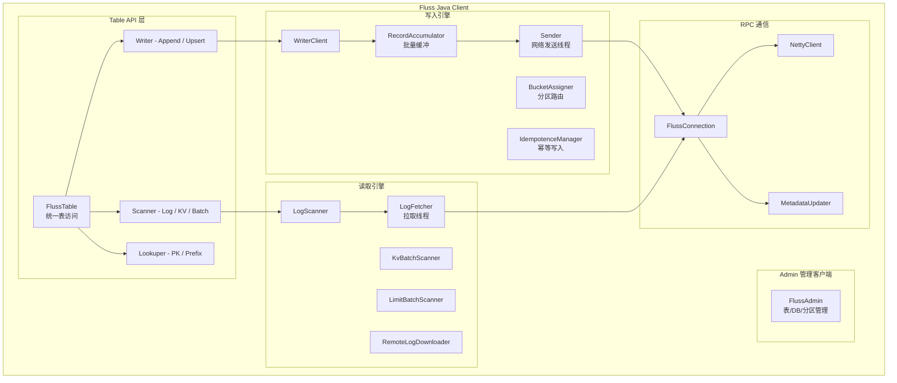
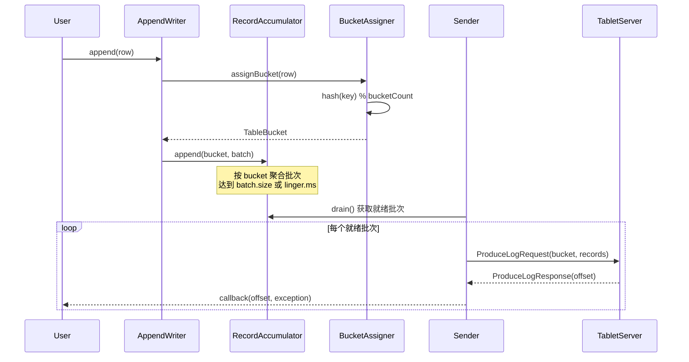
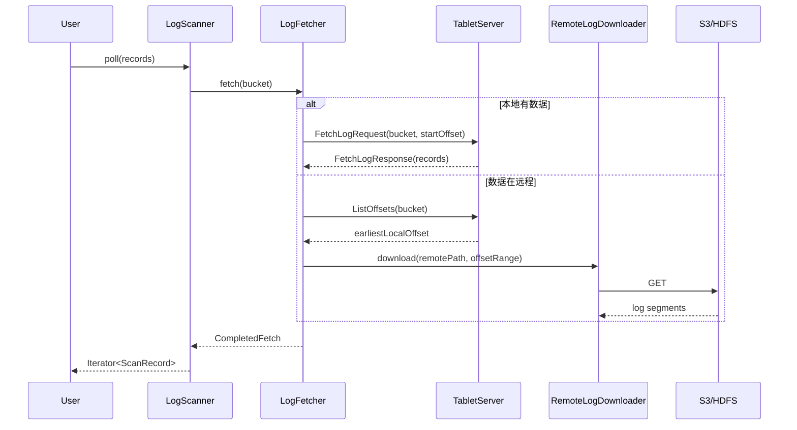
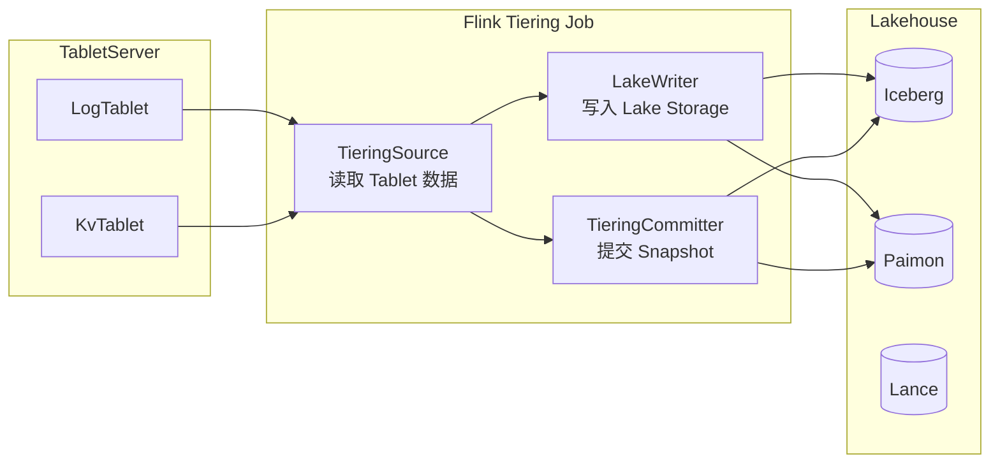

# 05 - 客户端与计算集成

## 5.1 客户端架构概览



### 5.1.1 与 Kafka Client 对照

| 组件 | Fluss | Kafka 2.7.2 |
|------|-------|-------------|
| **管理客户端** | `FlussAdmin` (implements `Admin`) | `KafkaAdminClient` (implements `Admin`) |
| **写入器** | `AppendWriter` / `UpsertWriter` / `TableWriter` | `KafkaProducer` |
| **读取器** | `LogScanner` / `BatchScanner` / `Lookuper` | `KafkaConsumer` |
| **连接管理** | `FlussConnection` (单连接复用) | `NetworkClient` (连接池) |
| **批量缓冲** | `RecordAccumulator` | `RecordAccumulator` |
| **发送线程** | `Sender` | `Sender` |
| **元数据更新** | `MetadataUpdater` | `Metadata` (ConsumerMetadata/ProducerMetadata) |
| **幂等保证** | `IdempotenceManager` / `IncompleteBatches` | `TransactionManager` / `InFlightBatches` |
| **分区分配** | `BucketAssigner` (Hash/RoundRobin/Static/Sticky/Dynamic) | `Partitioner` + 固定 partition 分配 |

---

## 5.2 写入路径

### 5.2.1 Writer API

```
Table.newWriter()              // 简单写入器
  ├── AppendWriter             // 追加写入（仅 APPEND 语义）
  │   └── ~ KafkaProducer.send()
  ├── UpsertWriter             // 写入/更新（UPSERT 语义，PK 表）
  │   └── ~ KafkaProducer + 服务端 Merge
  └── TableWriter<T>           // 类型化写入器

TypedAppendWriterImpl / TypedUpsertWriterImpl  // 类型安全包装
```

### 5.2.2 写入批次类型

| 批次类 | LogFormat | 适用表类型 | 说明 |
|--------|-----------|----------|------|
| `ArrowLogWriteBatch` | ARROW | 所有类型 | Arrow 列式批量写入 |
| `CompactedLogWriteBatch` | COMPACTED | PK 表 | 压缩格式写入 |
| `IndexedLogWriteBatch` | INDEXED | PK 表（点查优化） | 索引格式写入 |
| `KvWriteBatch` | — | PK 表 | KV 写入批次（RocksDB 写入） |

### 5.2.3 写入流程



### 5.2.4 BucketAssigner 路由策略

| 策略 | 类 | 说明 |
|------|-----|------|
| **Hash** | `HashBucketAssigner` | 基于 key hash 路由（默认） |
| **RoundRobin** | `RoundRobinBucketAssigner` | 轮询分配 |
| **Static** | `StaticBucketAssigner` | 固定 bucket 映射 |
| **Sticky** | `StickyBucketAssigner` | 粘性分配（同一 writer 尽量写入同一 bucket） |
| **Dynamic** | `DynamicBucketAssigner` | 动态路由 + 自动分区创建 |

### 5.2.5 IdempotenceManager

```
IdempotenceManager {
    - IdempotenceBucketMap bucketMap
    - long writerId
    - int nextSequence → 类似 Kafka ProducerIdManager
    
    保证：同一 Writer 的同一 offset 只会写入一次
    实现机制：writerId + sequenceNumber + bucket-based tracking
}
```

### 5.2.6 与 KafkaProducer 对照

| 特性 | Fluss Writer | Kafka 2.7.2 Producer |
|------|-------------|---------------------|
| **API 风格** | `AppendWriter.append(row)` / `UpsertWriter.upsert(row)` | `Producer.send(ProducerRecord)` |
| **写入语义** | Append / Upsert / Delete | Append（无语义区分） |
| **批次缓冲** | `RecordAccumulator`（同 Kafka） | `RecordAccumulator` |
| **Sender 线程** | ✅ 单线程 | ✅ 单线程 |
| **批次过期** | `request.timeout.ms` | `request.timeout.ms` |
| **linger** | ✅ `linger.ms` | ✅ `linger.ms` |
| **compression** | Arrow 列式压缩（整列压缩） | `gzip` / `snappy` / `lz4` / `zstd` |
| **幂等** | `IdempotenceManager`（无事务） | `TransactionManager`（有事务） |
| **acks** | 隐式（写入成功返回） | `acks=0/1/all` |
| **重试** | `RetryableGatewayClientProxy` | `retries` + `retry.backoff.ms` |
| **分区分配** | `BucketAssigner` 5 种策略 | `Partitioner` + 用户自定义 |
| **事务** | ❌ | ✅ `initTransactions()` / `commitTransaction()` |

---

## 5.3 读取路径

### 5.3.1 Scanner API

```
Table.newScan()                   // 扫描器
  ├── LogScanner                  // 日志扫描（顺序读）
  │   ├── 从指定的 offset 开始
  │   ├── 支持 bucketed / unbounded 模式
  │   └── 远程日志透明下载
  ├── BatchScanner                // 批量扫描（快照 + 日志合并）
  │   ├── KvBatchScanner          // 基于 KV 快照的过滤扫描
  │   ├── KvSnapshotBatchScanner  // 纯快照扫描（无日志）
  │   ├── SnapshotReaders         // 从远程下载快照并读取
  │   ├── LimitBatchScanner       // limit 扫描
  │   └── CompositeBatchScanner   // 多源组合扫描
  └── Lookuper                    // 点查
      ├── PrimaryKeyLookuper      // 按 PK 精确查找
      └── PrefixKeyLookuper       // 按前缀查找
```

### 5.3.2 BatchScanner 读取模式

```
CompositeBatchScanner:
  = KvBatchScanner + KvSnapshotBatchScanner（组合）
  
KvBatchScanner:
  1. 获取 KV 快照列表 (GetLatestKvSnapshots)
  2. 下载快照文件 (从远程存储)
  3. 读取快照 + 合并后续 Log（changelog）

KvSnapshotBatchScanner:
  1. 获取 Lake 快照 (GetLakeSnapshot)
  2. 读取 Lake 快照文件（Parquet/Arrow）
  3. 直接返回（无需合并 log，因为是物化视图）

LakeSnapshotAndLogSplitScanner:
  1. 读取 Lake 快照 split
  2. 合并 Log 中的增量数据
```

### 5.3.3 LogScanner 流程



### 5.3.4 LogFetchCollector 体系

| 类 | LogFormat | 说明 |
|----|-----------|------|
| `AbstractLogFetchCollector` | 通用基类 | 拉取结果收集与解析 |
| `ArrowLogFetchCollector` | ARROW | Arrow 列式拉取的收集器 |
| `ArrowScanRecords` / `ScanRecords` | — | 扫描结果封装 |

### 5.3.5 与 KafkaConsumer 对照

| 特性 | Fluss Scanner | Kafka 2.7.2 Consumer |
|------|--------------|---------------------|
| **API 风格** | `scanner.poll()` 返回 `Iterator<ScanRecord>` | `consumer.poll(Duration)` 返回 `ConsumerRecords` |
| **读取语义** | Log scan / Batch scan (snapshot+log) / Lookup | Log scan only |
| **Offset 管理** | 用户自行管理 offset | Consumer Group 协议自动管理 |
| **Rebalance** | 无 Consumer Group 概念 | Group Coordinator 协调 |
| **点查** | ✅ `Lookuper.lookup(key)` / `prefixLookup(prefix)` | ❌ 不支持 |
| **范围扫描** | ✅ `LimitBatchScanner.limitScan()` | ❌ 需要 seek + poll 模拟 |
| **谓词下推** | ✅ Arrow 列裁剪 + 统计信息 | ❌ 不支持（2.7.2） |
| **远程数据** | ✅ `RemoteLogDownloader` 透明下载 | ❌（2.7.2 无分层存储） |
| **快照读取** | ✅ 从 Lake snapshot 直接读 Parquet/Arrow | ❌ 不支持 |

---

## 5.4 Flink Connector 集成

### 5.4.1 模块结构

```
fluss-flink (215 Java files)
├── fluss-flink-1.18/     — Flink 1.18 适配
├── fluss-flink-1.19/     — Flink 1.19 适配
├── fluss-flink-1.20/     — Flink 1.20 适配（仅 DummyClass）
├── fluss-flink-2.2/      — Flink 2.2 适配
├── fluss-flink-common/   — 共享逻辑
└── fluss-flink-tiering/  — Lake Tiering 独立入口
```

### 5.4.2 核心能力矩阵

| 功能 | 实现 | Kafka 对应 |
|------|------|-----------|
| **Flink Catalog** | `FlinkCatalog` / `FlinkCatalogFactory` | 无标准 Catalog（通过 Connect 注册） |
| **Source** | `FlussSource` → `FlussSourceReader` → `FlussSplitReader` | `FlinkKafkaConsumer` |
| **Sink** | `FlussSink` → `SinkWriter` → `PreWriteBuffer` | `FlinkKafkaProducer` |
| **Lookup Join** | `FlussLookupFunction`（点查维表关联） | 无直接对应（需借助 HBase/JDBC lookup） |
| **Changelog Stream** | `FlussChangelogSource`（CDC 流） | `FlinkKafkaConsumer`（无法区分 CHANGE 类型） |
| **Tiering Committer** | `TieringCommitOperator` / `TieringCommitter` | 无 |
| **Lake Tiering Source** | `TieringSource` / `TieringSourceReader` | 无 |
| **RoaringBitmap 聚合** | `RbBuildAggFunction` / `RbAndAggFunction` / `RbOrAggFunction` | 无 |
| **谓词下推** | `PushdownUtils` → `PredicateConverter` | `FlinkKafkaConsumer` 不支持下推 |
| **Arrow 转换** | `FlussRowToFlinkRowConverter` ↔ Arrow ↔ RowData | 无 Arrow 支持 |

### 5.4.3 Sink 写入模型

```
Table API Insert:
  INSERT INTO fluss_table SELECT ...
    → FlussSink
      → SinkWriter (pre-commit → commit cycle)
        → RecordAccumulator (batch buffer)
        → AppendWriter / UpsertWriter
          → TabletServer (ProduceLog / PutKv)
```

### 5.4.4 Source 读取模型

```
SELECT * FROM fluss_table
  → FlussSource
    → FlussSourceEnumerator (split discovery)
      → LogSplit / KvSnapshotSplit / LakeSplit
    → FlussSourceReader
      → FlussSplitReader
        → LogScanner (log split)
        → KvBatchScanner (snapshot split)
        → IcebergLakeSource / PaimonLakeSource (lake split)
```

### 5.4.5 Tiering（分层）架构

Fluss 的 Flink Tiering 是一个**独立的 Flink 作业**，负责将 Tablet 的本地数据持续写入 Lakehouse：



---

## 5.5 数据转换层

### 5.5.1 类型系统映射

| Fluss Type | Flink Type | Java POJO Type | Kafka Type（无） |
|-----------|-----------|---------------|-----------------|
| `IntType` | `DataTypes.INT()` | `int` / `Integer` | bytes（服务端不解析） |
| `BigIntType` | `DataTypes.BIGINT()` | `long` / `Long` | bytes |
| `StringType` | `DataTypes.STRING()` | `String` | bytes |
| `BytesType` | `DataTypes.BYTES()` | `byte[]` | bytes (same) |
| `ArrayType` | `DataTypes.ARRAY(...)` | `List<T>` | 需自行序列化 |
| `MapType` | `DataTypes.MAP(...)` | `Map<K,V>` | 需自行序列化 |
| `RowType` | `DataTypes.ROW(...)` | POJO object | 需自行序列化 |

### 5.5.2 核心转换器

| 转换器 | 方向 | 用途 |
|--------|------|------|
| `FlussRowToFlinkRowConverter` | Fluss → Flink | Source 读取 |
| `FlinkRowToFlussRowConverter` | Flink → Fluss | Sink 写入 |
| `RowToPojoConverter` | Fluss Row → Java POJO | Java Client |
| `PojoToRowConverter` | Java POJO → Fluss Row | Java Client |
| `FlinkTypeToFlussType` | Flink DataType → Fluss DataType | Catalog |
| `FlussTypeToFlinkType` | Fluss DataType → Flink DataType | Catalog |
| `FlussDataTypeToIcebergDataType` | Fluss → Iceberg | Lake Storage |
| `FlussDataTypeToPaimonDataType` | Fluss → Paimon | Lake Storage |
| `FlussDataTypeToHudiDataType` | Fluss → Hudi | Lake Storage |

---

## 5.6 Lake Storage（湖存储层）

### 5.6.1 支持的后端

| Lake Storage | 模块 | 说明 |
|-------------|------|------|
| **Iceberg** | `fluss-lake-iceberg` (35+ files) | 完整实现：Catalog、Writer、Committer、Reader、Tiering |
| **Paimon** | `fluss-lake-paimon` (30+ files) | 完整实现：Catalog、Writer、Committer、Reader、Tiering |
| **Hudi** | `fluss-lake-hudi` (7 files) | 轻量实现：仅 Catalog + Storage |
| **Lance** | `fluss-lake-lance` (12 files) | Lance columnar format（Arrow native） |

### 5.6.2 Lake 插件架构

```java
interface LakeStoragePlugin {
    String name();                          // "iceberg" / "paimon" / "hudi" / "lance"
    LakeStorage createLakeStorage(config);  // 创建存储实例
}

interface LakeCatalog {
    createTable(TableDescriptor);
    List<String> listTables();
    Table getTable(String tableName);
    ...
}
```

### 5.6.3 Iceberg Lake 集成

```
IcebergLakeStorage
├── IcebergLakeCatalog (表管理)
├── IcebergLakeWriter (Tiering 写入)
│   ├── AppendOnlyTaskWriter (普通表)
│   └── DeltaTaskWriter (PK 表，支持 delete/update)
├── IcebergLakeCommitter (快照提交)
├── IcebergLakeSource (读取)
│   ├── IcebergSplitPlanner (分区规划)
│   └── IcebergRecordReader (记录读取)
└── IcebergRewriteDataFiles (数据文件压缩)
```

---

## 5.7 核心类级对照表

| Fluss 类 | Kafka 2.7.2 类 | 功能 |
|----------|---------------|------|
| `FlussAdmin` | `KafkaAdminClient` | 管理客户端 |
| `FlussTable` | 无（Kafka 无 Table 概念） | 统一表访问 API |
| `AppendWriter` | `KafkaProducer` | 追加写入器 |
| `UpsertWriter` | 无（Kafka 无 upsert） | Upsert 写入器 |
| `RecordAccumulator` | `RecordAccumulator` | 批次缓冲 |
| `Sender` | `Sender` | 后台发送线程 |
| `BucketAssigner` | `Partitioner` | 分区路由 |
| `IdempotenceManager` | `TransactionManager` (idempotent part) | 幂等管理 |
| `WriterClient` | `KafkaProducer` (internal send) | 写入客户端 |
| `LogScanner` | `Fetcher` (KafkaConsumer 内部) | 日志扫描器 |
| `LogFetcher` | `Fetcher` (KafkaConsumer 内部) | 拉取线程 |
| `KvBatchScanner` | 无 | KV 批量扫描 |
| `Lookuper` / `LookupClient` | 无 | 点查客户端 |
| `PrimaryKeyLookuper` | 无 | 主键精确查找 |
| `PrefixKeyLookuper` | 无 | 前缀查找 |
| `RemoteLogDownloader` | 无（2.7.2 无远程存储） | 远程日志下载 |
| `FlussConnection` | `NetworkClient` | 连接管理 |
| `MetadataUpdater` | `ConsumerMetadata` / `ProducerMetadata` | 元数据更新 |
| `FlinkCatalog` | 无（无标准 Flink Catalog） | Flink 目录 |
| `FlussSource` | `FlinkKafkaConsumer` | Flink Source |
| `FlussSink` | `FlinkKafkaProducer` | Flink Sink |
| `TieringCommitOperator` | 无 | Lake 快照提交 |
| `TieringSource` | 无 | Lake Tiering 来源 |

---

> **下一篇**：[[06-Lake层与湖仓融合|06 - Lake 层与湖仓融合]] | [[07-模块对应关系总表|07 - 模块对应总表]]
