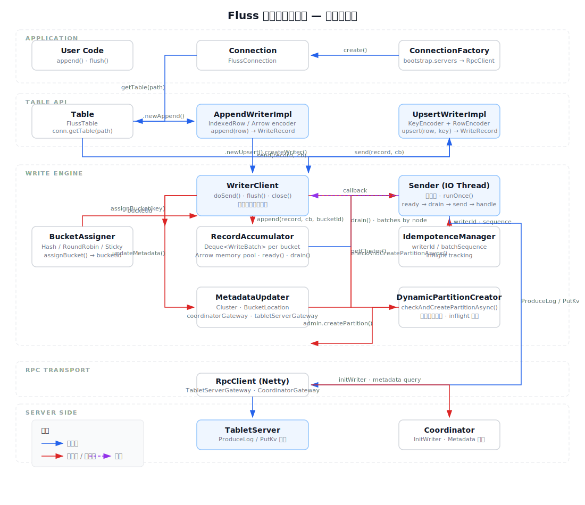

# 05b — 客户端写入流程深度分析

> **定位**：聚焦 Fluss 纯客户端（Java Client）写入全链路，从 `ConnectionFactory` 创建到 Server Ack 收到。
> **与 05 的区别**：[[Fluss源码分析/05-客户端与计算集成|05]] 以架构概览和 Flink/Spark 计算集成视角为主；本文深入客户端内部的写入引擎管线。
> **源码版本**：Fluss trunk，模块 `fluss-client`。

---

## 1. 写入 Demo

从单测 `FlussTableITCase.testAppendOnly()` 提取的最小写入示例：

```java
// 1. 创建连接（全局共享, 一个应用只创建一个）
Configuration conf = new Configuration();
conf.setString("bootstrap.servers", "localhost:9092");
try (Connection conn = ConnectionFactory.createConnection(conf)) {

    // 2. 获取 Table 句柄（轻量级，内部通过 MetadataUpdater 拉取 schema/bucket/format）
    Table table = conn.getTable(TablePath.of("db", "my_table"));

    // 3. 创建 AppendWriter + 写入多条数据
    AppendWriter writer = table.newAppend().createWriter();
    writer.append(GenericRow.of(1, BinaryString.fromString("hello")));
    writer.append(GenericRow.of(2, BinaryString.fromString("world")));
    writer.flush();  // 阻塞等待所有写入完成

    // 4. 关闭资源（try-with-resources: table → conn）
}
```

**三个关键约定**：
| 对象 | 生命周期 | 说明 |
|------|----------|------|
| `Connection` | 重量级、应用全局单例 | 内含 RpcClient、MetadataUpdater、WriterClient 等 |
| `Table` | 轻量级、per-thread | 通过 conn 获取，`AutoCloseable` |
| `AppendWriter` | 轻量级、per-thread | 通过 table 创建，异步写入、`flush()` 阻塞 |

---

## 2. 核心组件架构图



**分层结构**：
- **Application Layer**：用户代码通过 `ConnectionFactory` 初始化连接，得到 `Table` 句柄
- **Table API Layer**：`AppendWriterImpl` / `UpsertWriterImpl` 将 `InternalRow` 编码为 `WriteRecord`
- **Write Engine Layer**：`WriterClient`（协调中枢）→ `BucketAssigner`（路由）→ `RecordAccumulator`（缓冲）→ `Sender`（IO 线程发送），辅以 `MetadataUpdater`（元数据）、`IdempotenceManager`（幂等）、`DynamicPartitionCreator`（分区创建）
- **RPC Transport**：`RpcClient (Netty)` 提供 `TabletServerGateway` 和 `CoordinatorGateway`
- **Server Side**：`TabletServer` 处理 `ProduceLog`/`PutKv`，`Coordinator` 处理 `InitWriter` 和 metadata

---

## 3. 生命周期流程

### 3.1 创建流程

```
ConnectionFactory.createConnection(conf)
  │
  ├─ new FlussConnection(conf)
  │    ├─ FileSystem.initialize(conf)                    // 初始化 S3/HDFS/本地文件系统
  │    ├─ setupClientMetricsConfiguration()              // 创建 JMX 指标组
  │    └─ new RpcClient(conf, clientMetricGroup)         // 创建 Netty RPC 客户端
  │         └─ initializeCluster(conf, rpcClient)
  │              ├─ parseAndValidateAddresses("bootstrap.servers")
  │              ├─ 逐个地址尝试连接，指数退避重试 3 次
  │              └─ 通过 AdminReadOnlyGateway 获取:
  │                   ├─ Coordinator 地址 (ServerNode)
  │                   └─ TabletServer 列表
  │
  └─ conn.getTable(tablePath)
       ├─ metadataUpdater.updateTableOrPartitionMetadata() // 强制拉取元数据
       ├─ admin.getTableInfo(tablePath)                    // 获取 schema/bucket/format
       └─ new FlussTable(conn, tablePath, tableInfo)
```

**`table.newAppend().createWriter()`** → `new AppendWriterImpl(tablePath, tableInfo, writerClient)`，其中 `writerClient = conn.getOrCreateWriterClient()`：

```java
new WriterClient(conf, metadataUpdater, clientMetricGroup, admin)
  ├─ buildIdempotenceManager()
  │    └─ new IdempotenceManager(
  │         idempotenceEnabled,               // 默认 false
  │         maxInflightRequestsPerBucket,      // 默认 5
  │         coordinatorGateway,                // 用于 initWriter RPC
  │         metadataUpdater)
  ├─ configureAcks() / configureRetries()     // 幂等模式强制 acks=all, retries>0
  ├─ new RecordAccumulator(conf, ...)
  │    ├─ writerBufferPool (LazyMemorySegmentPool)        // 内存页池
  │    ├─ BufferAllocator (Arrow shaded allocator)        // Arrow 内存分配器
  │    └─ ArrowWriterPool                                 // Arrow Writer 复用池
  ├─ new Sender(accumulator, maxRequestTimeoutMs, maxRequestSize,
  │             acks, retries, metadataUpdater, idempotenceManager)
  └─ ioThreadPool = newFixedThreadPool(1, "fluss-write-sender")
       └─ ioThreadPool.submit(sender)         // 启动后台 Sender 线程
```

### 3.2 启动流程

`WriterClient` 构造完成后即自动启动，无显式 `start()` 调用：

```
WriterClient 构造 → ioThreadPool.submit(sender)
  └─ Sender.run()
       └─ while (running):
            └─ runOnce()
```

Sener 启动前会检查幂等写入参数合法性，并对各组件进行依赖注入（`RecordAccumulator` ← `IdempotenceManager`；`Sender` ← `accumulator, idempotenceManager, metadataUpdater`）。

### 3.3 核心运行流程

`Sender.run()` 是唯一的后台线程，循环执行 `runOnce()`：

```
while (running):
  runOnce():
  ┌─ ① 幂等 writerId 初始化 ──────────────────────────────────────────
  │  if (idempotenceEnabled):
  │    targetTables = accumulator.getPhysicalTablePathsInBatches()
  │    idempotenceManager.maybeWaitForWriterId(targetTables)
  │      └─ coordinatorGateway.initWriter(InitWriterRequest)  // 异步获取 writerId
  │
  ├─ ② sendWriteData() ───────────────────────────────────────────────
  │  cluster = metadataUpdater.getCluster()                 // 获取集群快照
  │
  │  ready = accumulator.ready(cluster)                    // 扫描就绪 batch
  │    ├─ readyNodes: TabletServer node ID 集合
  │    ├─ nextReadyCheckDelayMs: linger.ms 超时时间
  │    └─ unknownLeaderTables: 未知 leader 的表
  │
  │  if (unknownLeaderTables 非空):
  │    metadataUpdater.updatePhysicalTableMetadata(unknownLeaderTables)
  │      // 强制更新元数据（找到正确的 leader）
  │
  │  if (readyNodes 为空):
  │    Thread.sleep(nextReadyCheckDelayMs)  // 无事可做, 休眠避免忙等
  │    return
  │
  │  batches = accumulator.drain(cluster, readyNodes, maxRequestSize)
  │    // 按 TabletServer nodeId 分组: Map<serverId, List<ReadyWriteBatch>>
  │
  │  addToInflightBatches(batches)          // 加入 InFlight 追踪
  │
  │  batches.forEach((serverId, batchList) →
  │    gateway = metadataUpdater.newTabletServerClientForNode(serverId)
  │    if (gateway == null):
  │      failAll → NotLeaderOrFollower   // 缓存中不存在该 server, 触发元数据更新
  │    else:
  │      if (isLogBatches):
  │        gateway.produceLog(makeProduceLogRequest(...))
  │           .whenComplete(handleProduceLogResponse)
  │      else:  // KV batches
  │        gateway.putKv(makePutKvRequest(...))
  │           .whenComplete(handlePutKvResponse)
  │  )
  │
  ├─ ③ 响应处理 ─────────────────────────────────────────────────────
  │  handleProduceLogResponse / handlePutKvResponse:
  │    for each bucketResp in response:
  │      if (hasErrorCode):
  │        handleWriteBatchException(batch, error)
  │          ├─ DUPLICATE_SEQUENCE → completeBatch() (server 已处理, 直接成功)
  │          ├─ OUT_OF_ORDER + alreadyCommitted → completeBatch() (响应丢失, 已提交)
  │          ├─ canRetry(RetriableException) → reEnqueueBatch() + metadata 失效标记
  │          └─ otherwise → failBatch(exception)
  │      else:
  │        completeBatch()
  │          ├─ idempotenceManager.handleCompletedBatch()  // 更新 lastAckedSequence
  │          └─ writeBatch.complete()
  │               └─ callbacks.forEach(cb.onCompletion(bucket, offset, null))
  │
  └─ ④ 优雅关闭 drain loop ──────────────────────────────────────────
       running = false 后:
       while (!forceClose && accumulator.hasUnDrained()):
         runOnce()   // 继续发送残余 batch

       destroyResources():
         accumulator.destroyResources()
           ├─ arrowWriterPool.close()    // 释放 Arrow Writer
           ├─ BufferAllocator.close()    // 释放 Arrow 内存
           └─ writerBufferPool.close()   // 释放内存页池
```

### 3.4 关闭流程

```
conn.close()
  ├─ writerClient.close(Duration timeout)
  │    ├─ accumulator.close()                    // ① 拒绝新 append
  │    ├─ sender.initiateClose()                 // ② running = false → Sender 主循环退出
  │    │    └─ Sender 在退出前执行 drain loop 发送残余 batch
  │    ├─ ioThreadPool.shutdown()                // ③ 等待 Sender 线程结束
  │    ├─ if (!terminated) ioThreadPool.shutdownNow()  // ④ 超时强制终止
  │    └─ sender.forceClose()                    // ⑤ 强制关闭未完成 batch
  ├─ lookupClient.close(timeout)                 // 关闭 LookupClient
  ├─ remoteFileDownloader.close()                // 关闭远程文件下载
  ├─ securityTokenManager.stop()                 // 停止安全令牌管理
  ├─ clientMetricGroup.close()                   // 关闭指标组
  ├─ rpcClient.close()                           // 关闭 Netty 连接池
  └─ metricRegistry.closeAsync()                 // 关闭指标注册中心
```

---

## 4. 消息写入生命周期

一条 `InternalRow` 如何变成网络请求、发送到 Server、收到响应、如何处理异常。

### 4.1 总体流程概览

```
用户线程                      Sender IO 线程                     TabletServer
─────────                    ─────────────                      ────────────
append(row)
  └─ WriteRecord.forArrowAppend(...)
       ↓
  send(record)
    └─ writerClient.doSend(record, callback)
         ├─ dynamicPartitionCreator.checkAndCreatePartitionAsync()
         ├─ bucketAssigner.assignBucket(bucketKey, cluster)
         └─ accumulator.append(record, callback, cluster, bucketId, ...)
              ├─ 取尾部 WriteBatch.tryAppend()
              └─ 成功 → return (异步, 用户线程返回)
                                              
                              Sender.runOnce()
                                ├─ accumulator.ready(cluster)
                                │   ├─ batch 满 → ready
                                │   ├─ linger.ms 超时 → ready
                                │   └─ 都不满足 → sleep
                                ├─ accumulator.drain(readyNodes, maxRequestSize)
                                │   └─ ArrowLogWriteBatch.build()  → BytesView
                                │   └─ makeProduceLogRequest(...)
                                └─ gateway.produceLog(request)       ────────→  ProduceLog handler
                                  .whenComplete((resp, err) → {
                                    if (err):
                                      failBatch(exception)                     写入成功 / 失败
                                    else:
                                      completeBatch()
                                        └─ callbacks.forEach(                                   │
                                             cb.onCompletion(null))         ←───────  ProduceLogResponse
                                  })    
                                  
flush() 阻塞等待 ←
  accumulator.awaitFlushCompletion()
  → 所有 inflight batch 的 RequestFuture.done()
  → 返回
```

### 4.2 Append API → WriteRecord 编码

```java
// AppendWriterImpl.append(row):
public CompletableFuture<AppendResult> append(InternalRow row) {
    checkFieldCount(row);                                    // 字段数校验
    PhysicalTablePath physicalPath = getPhysicalPath(row);   // 分区路由
    byte[] bucketKey = bucketKeyEncoder.encodeKey(row);      // bucket key 编码

    WriteRecord record;
    if (logFormat == LogFormat.ARROW)
        record = WriteRecord.forArrowAppend(tableInfo, physicalPath, row, bucketKey);
    else if (logFormat == LogFormat.INDEXED)
        record = WriteRecord.forIndexedAppend(tableInfo, physicalPath, indexedRow, bucketKey);
    else // COMPACTED
        record = WriteRecord.forCompactedAppend(tableInfo, physicalPath, compactedRow, bucketKey);

    return send(record).thenApply(ignored -> APPEND_SUCCESS);  // Async, Future of Void → AppendResult
}
```

**5 种 WriteFormat → 2 种 RPC 类型**：

| WriteFormat | isLog? | 实际 RPC | 编码器 |
|-------------|--------|------------|--------|
| `ARROW_LOG` | ✅ | `ProduceLog` | `ArrowWriter` (Arrow columnar) |
| `INDEXED_LOG` | ✅ | `ProduceLog` | `IndexedRowEncoder` |
| `COMPACTED_LOG` | ✅ | `ProduceLog` | `CompactedRowEncoder` |
| `INDEXED_KV` | ❌ | `PutKv` | `KeyEncoder` + `IndexedRowEncoder` |
| `COMPACTED_KV` | ❌ | `PutKv` | `KeyEncoder` + `CompactedRowEncoder` |

### 4.3 WriterClient.doSend() — 协调中枢

```java
private void doSend(WriteRecord record, WriteCallback callback) {
    throwIfWriterClosed();

    // ① 动态分区检查（若表有分区且分区不存在，异步创建）
    dynamicPartitionCreator.checkAndCreatePartitionAsync(
        physicalTablePath, partitionKeys, autoPartitionStrategy);
    //    └─ 协调 inflight 集合去重
    //    └─ admin.createPartition(...).whenComplete(...)

    // ② Bucket 分配
    Cluster cluster = metadataUpdater.getCluster();
    BucketAssigner assigner = bucketAssignerMap.computeIfAbsent(
        physicalTablePath, k → createBucketAssigner(tableInfo, ...));
    int bucketId = assigner.assignBucket(record.getBucketKey(), cluster);
    // 有 key: HashBucketAssigner → hash(bucketKey) % bucketNumber
    // 无 key: StickyBucketAssigner → 固定 bucket 直到 batch 满
    //         RoundRobinBucketAssigner → AtomicInteger 轮询

    // ③ 追加到 RecordAccumulator
    RecordAppendResult result = accumulator.append(
        record, callback, cluster, bucketId, abortIfBatchFull);

    // ④ 若 batch 满触发了 Sticky→新 bucket 切换，重新分配 + 重试
    if (result.abortRecordForNewBatch) {
        assigner.onNewBatch(cluster, prevBucketId);
        bucketId = assigner.assignBucket(record.getBucketKey(), cluster);
        result = accumulator.append(record, callback, cluster, bucketId, false);
    }

    // ⑤ batch 满 / 新建 → 唤醒 Sender
    if (result.batchIsFull || result.newBatchCreated) {
        // wake up sender (via accumulator)
    }
}
```

### 4.4 RecordAccumulator — 批量缓冲

```
RecordAccumulator.append(record, callback, cluster, bucketId, abortIfBatchFull):
  │
  ├─ bucketBatchMap.get(physicalTablePath)
  │    └─ Map<bucketId, Deque<WriteBatch>>   // 每 bucket 一条 WriteBatch 队列
  │
  ├─ 同步块(dq) 内 tryAppend:
  │    └─ 取尾部 WriteBatch.tryAppend(record, callback)
  │         ├─ batch 有空间 && 格式匹配 → ArrowWriter.write() / MemorySegment.write()
  │         ├─ recordCount++ → 返回 true
  │         └─ 失败 → appendNewBatch(dq, record)
  │              ├─ allocateMemorySegments(writerBufferPool, bufferAllocator, arrowWriterPool)
  │              └─ new ArrowLogWriteBatch / IndexedLogWriteBatch / KvWriteBatch
  │
  └─ 返回 RecordAppendResult
       ├─ batchIsFull:      batch 已达 batch.size 阈值
       ├─ newBatchCreated:  新建了 batch
       └─ abortRecordForNewBatch: Sticky 分配策略触发了 bucket 切换
```

**Sender 的 `accumulator.ready(cluster)` 判定**：
| 条件 | 说明 |
|------|------|
| batch 记录数 ≥ `batch.size` / 估算单条大小 | batch 满了 |
| batch 存在时间 ≥ `linger.ms`（默认 10ms） | 超时可发送 |
| 缓冲池内存不足，无法创建新 batch | 必须 drain 释放空间 |
| accumulator 已关闭 | 优雅关闭 drain |

`accumulator.drain()` 将就绪的 `WriteBatch` 按目标 TabletServer 的 `nodeId` 分组，`WriteBatch.build()` 将内存中的记录序列化为 `BytesView`。

### 4.5 Sender 发送请求

```
Sender.sendWriteRequest(serverId, acks, batches):
  │
  ├─ 按 tableId 分组 → Map<tableId, List<ReadyWriteBatch>>
  │
  ├─ isLogBatches(batches)?
  │    ├─ YES:  makeProduceLogRequest(tableId, acks, timeoutMs, batches)
  │    │          └─ 每个 WriteBatch → PbProduceLogReqForBucket
  │    │               ├─ tableId, bucketId, partitionId
  │    │               ├─ schemaId (Arrow 表的 schema 版本)
  │    │               └─ logData = batch.build() → BytesView
  │    │
  │    │        gateway.produceLog(request)
  │    │          .whenComplete((resp, err) → handleProduceLogResponse(resp, ...))
  │    │
  │    └─ NO:   makePutKvRequest(tableId, acks, timeoutMs, batches)
  │               └─ 每个 WriteBatch → PbPutKvReqForBucket
  │
  │             gateway.putKv(request)
  │               .whenComplete((resp, err) → handlePutKvResponse(resp, ...))
  │
  └─ 差异: ProduceLog 返回成功/失败, PutKv 额外返回 logEndOffset (LEO)
```

### 4.6 响应处理 — 异常分类与处理策略

**错误码全集（写入路径可能遇到的）**：

| 错误码 | 可重试? | 处理方式 |
|--------|---------|----------|
| `NONE(0)` | — | 成功 → `completeBatch()`, 触发 `callback.onCompletion(bucket, offset, null)` |
| `NOT_LEADER_OR_FOLLOWER(12)` | ✅ 可重试 | `reEnqueueBatch()` + 标记该表 metadata 失效 → 触发明新元数据更新 |
| `UNKNOWN_TABLE_OR_BUCKET(20)` | ✅ 可重试 | `reEnqueueBatch()` + 标记 metadata 失效 |
| `LEADER_NOT_AVAILABLE(44)` | ✅ 可重试 | `reEnqueueBatch()` + 标记 metadata 失效 |
| `REQUEST_TIME_OUT(25)` | ✅ 可重试 | `reEnqueueBatch()` |
| `NETWORK_EXCEPTION(2)` | ✅ 可重试 | `reEnqueueBatch()` |
| `PARTITION_NOT_EXISTS(36)` | ❌ 不可重试 | `failBatch()` → callback 收到异常 |
| `RECORD_TOO_LARGE(13)` | ❌ 不可重试 | `failBatch()` |
| `DUPLICATE_SEQUENCE(33)` | — | **直接成功**（Server 已接收该 batch，只是响应丢失）→ `completeBatch()` |
| `OUT_OF_ORDER_SEQUENCE(32)` | ⚠️ 条件重试 | `isAlreadyCommitted()`? → `completeBatch()` : `failBatch()` |
| `UNKNOWN_WRITER_ID(34)` | ⚠️ 条件重试 | `hasWriterId()`? → `reEnqueueBatch()` : `failBatch()` |
| `FENCED_LEADER_EPOCH(23)` | ❌ 不可重试 | `failBatch()` |
| `INVALID_METADATA` 相关 | ✅ 可重试 | `reEnqueueBatch()` + 标记 metadata 失效 |

**完整异常处理决策树**（`Sender.handleWriteBatchException`）：

```
分析每个 bucket 的 error:
  │
  ├─ DUPLICATE_SEQUENCE?
  │    └─ completeBatch()  // batch 已被 server 处理, 响应丢失 → 按成功返回
  │
  ├─ OUT_OF_ORDER_SEQUENCE && idempotenceEnabled && isAlreadyCommitted()?
  │    └─ completeBatch()  // sequence ≤ lastAckedSequence → 已提交, 按成功返回
  │
  ├─ canRetry()?
  │    │ (RetriableException && attempts < retries)
  │    │
  │    ├─ !idempotenceEnabled → reEnqueueBatch()  // 简单重试，无状态维护
  │    │
  │    ├─ idempotenceEnabled && hasWriterId(writerId)?
  │    │    └─ reEnqueueBatch()  // writerId 匹配 → 重试
  │    │
  │    └─ idempotenceEnabled && writerId 已变?
  │         └─ failBatch(UNKNOWN_WRITER_ID)  // writerId 过期 → 不可恢复
  │
  │    + 若错误是 InvalidMetadataException → 标记该物理表 metadata 失效
  │
  └─ 不可重试:
       └─ failBatch(exception, adjustBatchSequences=attempts < retries)
            ├─ batch.completeExceptionally(exception)
            │    └─ callback.onCompletion(null, -1, exception)
            │         → 用户线程的 CompletableFuture 以异常完成
            │
            └─ idempotenceManager.handleFailedBatch()
                 └─ 更新 inflight 状态, 可能触发 writerId 重置
```

**关键机制**：

- **可重试条件**：`attempts < retries && !isDone() && error.exception() instanceof RetriableException`
- **幂等可重试**：额外要求 `hasWriterId(writerId)`，防止 writerId 变化后继续用旧 batch 发送
- **DUPLICATE_SEQUENCE** 是特殊处理：server 端已去重完成 → 直接返回成功，不走 retry 逻辑
- **OUT_OF_ORDER_SEQUENCE + isAlreadyCommitted**：响应丢失场景，`lastAckedBatchSequence ≥ batchSequence` 说明 server 已经处理过 → 按成功返回
- **Metadata 失效触发**：`NotLeaderOrFollower`、`UnknownTableOrBucket` 等错误会标记该物理表 metadata 失效，下一次 `sendWriteData()` 时自动重拉元数据

---

## 5. 关键配置项速查

| 配置项 | 默认值 | 说明 |
|--------|--------|------|
| `client.writer.acks` | `"1"` | 确认模式: 0 / 1 / all(-1) |
| `client.writer.enable.idempotence` | `false` | 幂等写入（强制 acks=all, retries>0, inflight≤5） |
| `client.writer.retries` | `3` | 最大重试次数 |
| `client.writer.batch.size` | `16384` (16KB) | 单个 batch 触发大小 |
| `client.writer.batch.timeout` | `10ms` | 即 linger.ms，batch 等待时间 |
| `client.writer.buffer.memory.size` | `33554432` (32MB) | 写缓冲总大小 |
| `client.writer.buffer.page.size` | `65536` (64KB) | 单页大小 |
| `client.writer.request.max.size` | `1048576` (1MB) | 单次请求上限 |
| `client.writer.max.inflight.requests.per.bucket` | `5` | 每 bucket max inflight |
| `client.writer.bucket.no.key.assigner` | `STICKY` | 无 key 桶分配策略: ROUND_ROBIN / STICKY |
| `client.writer.dynamic.create.partition.enabled` | `false` | 运行时动态创建分区 |

---

## 6. 与 Kafka Producer 的关键差异

| 维度 | Fluss WriterClient | Kafka Producer |
|------|-------------------|----------------|
| 发送线程 | 1 个 Sender IO 线程 | 1 个 Sender + NetworkClient 轮询 |
| 网络模型 | Sender 直接调 RPC 代理 | Sender → NetworkClient → Selector (NIO) |
| 批格式 | 5 种 WriteFormat，2 种 RPC | 1 种 RecordBatch，1 种 Produce RPC |
| 记录编码 | Arrow / Indexed / Compacted × Log / KV | Serializer (用户自定义) |
| 桶分配 | BucketAssigner (Hash / Sticky / RoundRobin) | Partitioner |
| 内存管理 | Arrow BufferAllocator + lazy page pool | BufferPool |
| 幂等性 | IdempotenceManager + Server 去重 | Idempotent Producer (transactional.id) |
| 分区创建 | 内置 DynamicPartitionCreator 异步创建 | 需显式管理 |
| 响应信息 | Log: success/fail; KV: + logEndOffset (LEO) | offset + timestamp |

**核心设计差异**：
- **无 NetworkClient 轮询层**：Sender 直接通过 `TabletServerGateway` (Netty RPC) 发送，减少了中间层
- **多格式管线**：Arrow（列式日志默认格式）使用独立的内存管理和编码器
- **KV 表 LEO 返回**：写入 KV 表时 Server 返回 `logEndOffset`，用于 exactly-once 语义追踪

---

## 相关文件

- [[Fluss源码分析/05-客户端与计算集成|05 — 客户端与计算引擎集成]]
- [[Fluss源码分析/02-存储引擎模块|02 — 存储引擎模块]]
- [[Fluss源码分析/04-数据面-网络与RPC|04 — 数据面：网络与RPC]]

## 更新日志

- 2026-06-30 v1：初稿，覆盖 Demo、架构图（SVG）、创建/启动/运行/关闭生命周期、消息写入全链路 + 异常处理决策树
