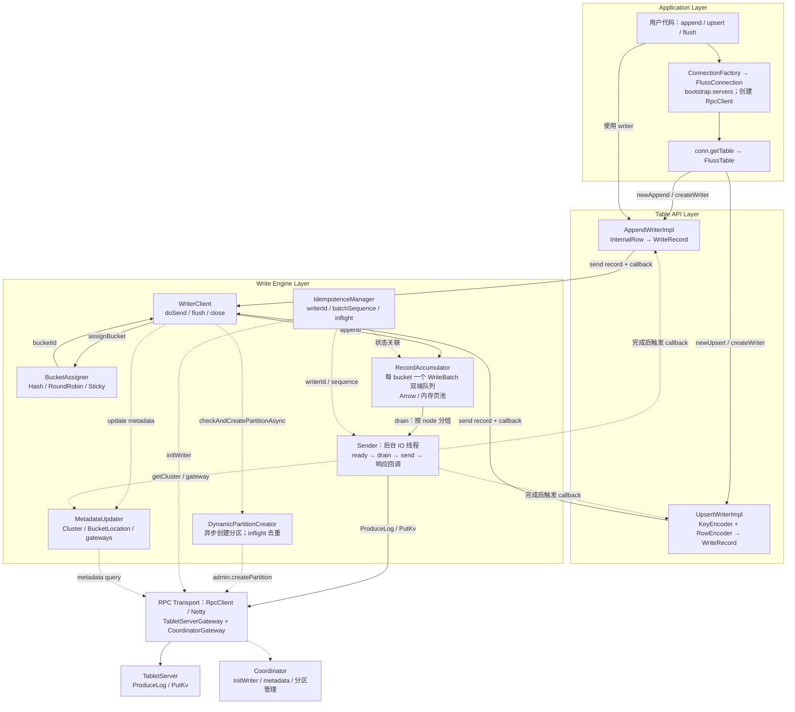
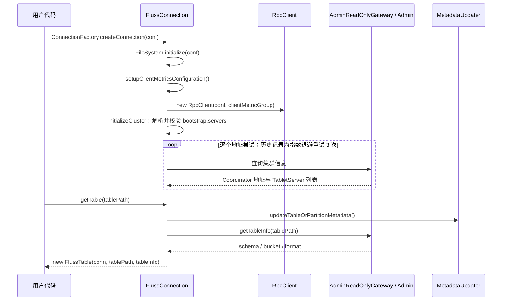
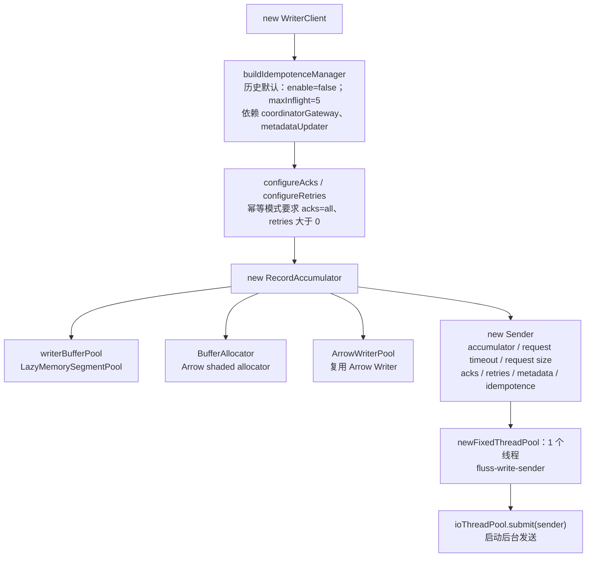
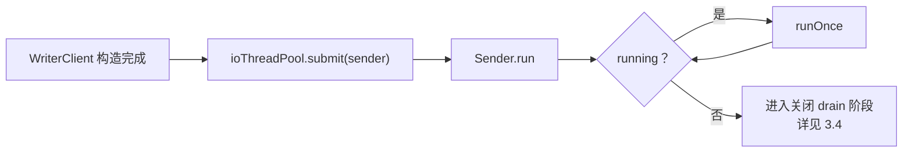
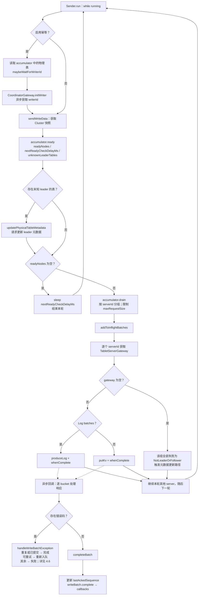
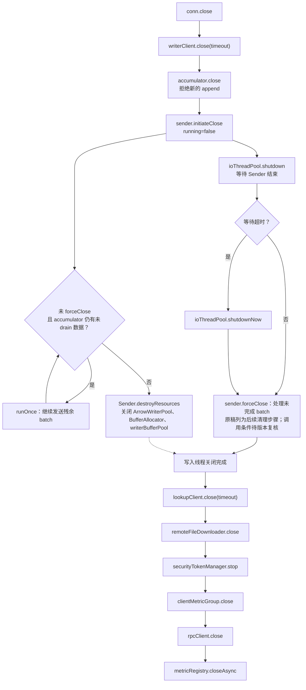
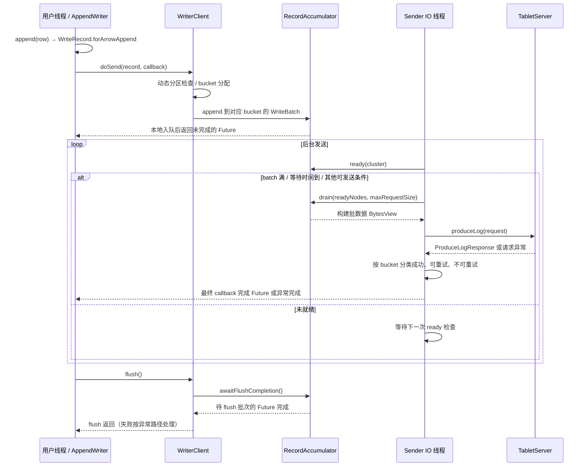
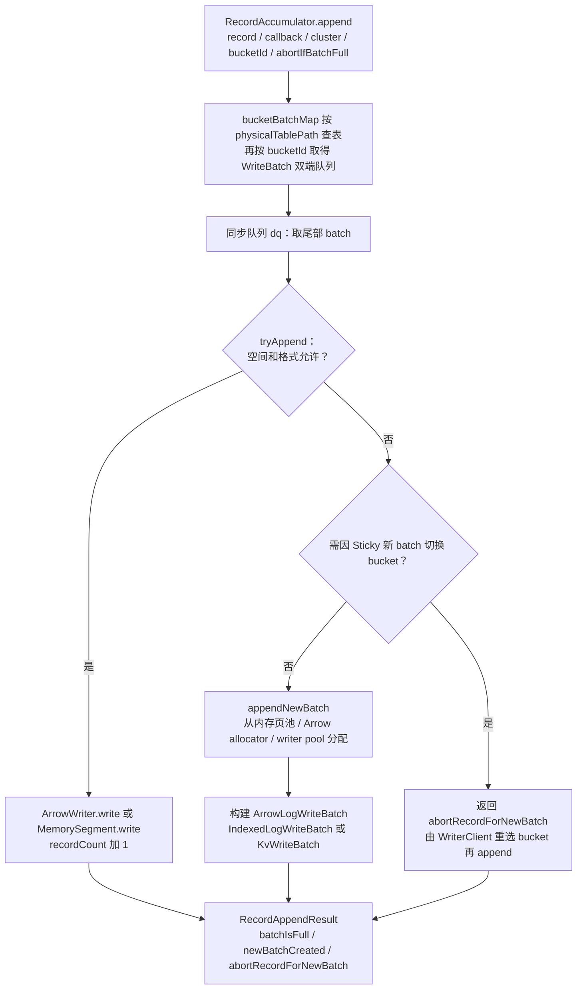
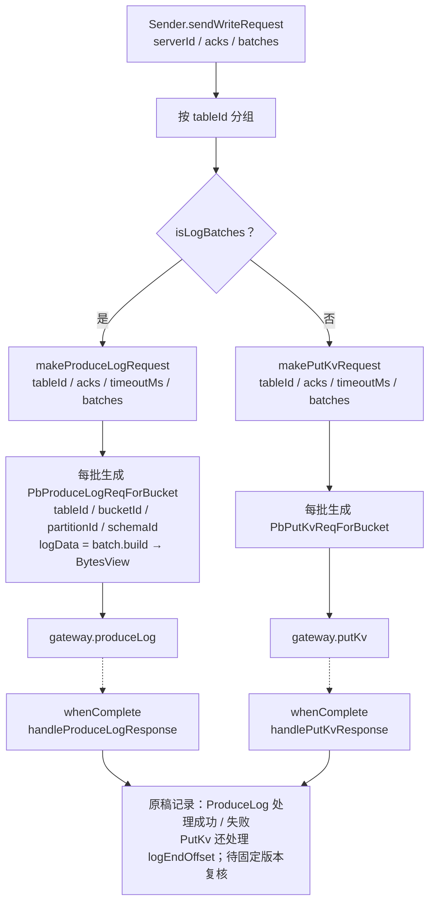
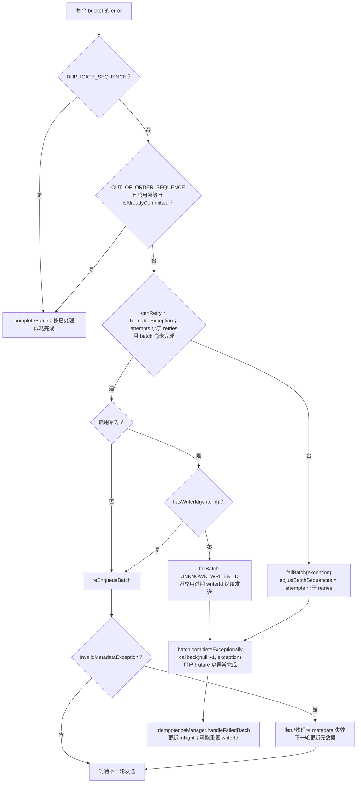

---
tags:
- fluss
- client
- write
- source-code
- lifecycle
created: 2026-06-30
updated: '2026-10-05'
reviewed: 2026-10-05
review_scope: 历史材料内部一致性与图示转换；未核验上游固定 commit
status: draft
title: 05b — 客户端写入流程深度分析
diagram_format: mermaid
---

# 05b — 客户端写入流程深度分析

> **定位**：聚焦 Fluss 纯客户端（Java Client）写入全链路，从 `ConnectionFactory` 创建到 Server Ack 收到。
> **与 05 的区别**：[[Fluss源码分析/05-客户端与计算集成|05]] 以架构概览和 Flink/Spark 计算集成视角为主；本文深入客户端内部的写入引擎管线。
> **源码版本边界**：本稿记录 2026-06-30 的 Fluss `trunk` 阅读，模块 `fluss-client`；没有保存可确认的上游固定 commit。归档摘要中的 `a3a59fd ~ 53b4f65` 未说明所属仓库，不能视作 Fluss 源码版本凭证。以下方法名、默认值、错误码和行为均是历史阅读记录，不能据此保证当前版本行为。
> **本轮整理（2026-10-05）**：依照原文转换 Mermaid 图并检查内部一致性，保留代码示例；未重新核验上游源码。后续复核应先补齐 Fluss 仓库 URL、完整 commit SHA，再为关键调用链附源码路径。

---

## 1. 写入 Demo

从单测 `FlussTableITCase.testAppendOnly()` 提取的最小写入示例：

```java
// 1. 创建连接（全局共享, 一个应用只创建一个）
Configuration conf = new Configuration();
conf.setString("bootstrap.servers", "localhost:9092");
try (Connection conn = ConnectionFactory.createConnection(conf)) {

    // 2. 获取 Table 句柄（轻量级，内部通过 MetadataUpdater 拉取 schema/bucket/format）
    Table table = conn.getTable(TablePath.of("db", "my_table"));

    // 3. 创建 AppendWriter + 写入多条数据
    AppendWriter writer = table.newAppend().createWriter();
    writer.append(GenericRow.of(1, BinaryString.fromString("hello")));
    writer.append(GenericRow.of(2, BinaryString.fromString("world")));
    writer.flush();  // 阻塞等待所有写入完成

    // 4. 关闭资源（try-with-resources: table → conn）
}
```

**三个关键约定**：
| 对象 | 生命周期 | 说明 |
|------|----------|------|
| `Connection` | 重量级、应用全局单例 | 内含 RpcClient、MetadataUpdater、WriterClient 等 |
| `Table` | 轻量级、per-thread | 通过 conn 获取，`AutoCloseable` |
| `AppendWriter` | 轻量级、per-thread | 通过 table 创建，异步写入、`flush()` 阻塞 |

---

## 2. 核心组件架构图


```mermaid
flowchart TB
  subgraph app[Application Layer]
    U["用户代码：append / upsert / flush"]
    C["ConnectionFactory → FlussConnection<br/>bootstrap.servers；创建 RpcClient"]
    T["conn.getTable → FlussTable"]
    U --> C --> T
  end
  subgraph api[Table API Layer]
    AW["AppendWriterImpl<br/>InternalRow → WriteRecord"]
    UW["UpsertWriterImpl<br/>KeyEncoder + RowEncoder → WriteRecord"]
  end
  subgraph engine[Write Engine Layer]
    WC["WriterClient<br/>doSend / flush / close"]
    BA["BucketAssigner<br/>Hash / RoundRobin / Sticky"]
    AC["RecordAccumulator<br/>每 bucket 一个 WriteBatch 双端队列<br/>Arrow / 内存页池"]
    SE["Sender：后台 IO 线程<br/>ready → drain → send → 响应回调"]
    IM["IdempotenceManager<br/>writerId / batchSequence / inflight"]
    MU["MetadataUpdater<br/>Cluster / BucketLocation / gateways"]
    DP["DynamicPartitionCreator<br/>异步创建分区；inflight 去重"]
  end
  RPC["RPC Transport：RpcClient / Netty<br/>TabletServerGateway + CoordinatorGateway"]
  TS["TabletServer<br/>ProduceLog / PutKv"]
  CO["Coordinator<br/>InitWriter / metadata / 分区管理"]
  T -->|newAppend / createWriter| AW
  T -->|newUpsert / createWriter| UW
  U -->|使用 writer| AW
  AW -->|send record + callback| WC
  UW -->|send record + callback| WC
  WC -->|assignBucket| BA
  BA -->|bucketId| WC
  WC -->|append| AC
  AC -->|drain：按 node 分组| SE
  SE -->|ProduceLog / PutKv| RPC
  RPC --> TS
  SE -.->|完成后触发 callback| AW
  SE -.->|完成后触发 callback| UW
  WC -.->|update metadata| MU
  SE -.->|getCluster / gateway| MU
  IM -.->|writerId / sequence| SE
  IM -.->|状态关联| AC
  WC -.->|checkAndCreatePartitionAsync| DP
  DP -.->|admin.createPartition| RPC
  IM -.->|initWriter| RPC
  MU -.->|metadata query| RPC
  RPC -.-> CO
```

实线表示主要调用或数据流，虚线表示元数据、幂等控制或异步完成通知；分组表示职责，不表示进程隔离。

**分层结构**：
- **Application Layer**：用户代码通过 `ConnectionFactory` 初始化连接，得到 `Table` 句柄
- **Table API Layer**：`AppendWriterImpl` / `UpsertWriterImpl` 将 `InternalRow` 编码为 `WriteRecord`
- **Write Engine Layer**：`WriterClient`（协调中枢）→ `BucketAssigner`（路由）→ `RecordAccumulator`（缓冲）→ `Sender`（IO 线程发送），辅以 `MetadataUpdater`（元数据）、`IdempotenceManager`（幂等）、`DynamicPartitionCreator`（分区创建）
- **RPC Transport**：`RpcClient (Netty)` 提供 `TabletServerGateway` 和 `CoordinatorGateway`
- **Server Side**：`TabletServer` 处理 `ProduceLog`/`PutKv`，`Coordinator` 处理 `InitWriter` 和 metadata

---

## 3. 生命周期流程

### 3.1 创建流程


```mermaid
sequenceDiagram
  participant U as 用户代码
  participant C as FlussConnection
  participant R as RpcClient
  participant A as AdminReadOnlyGateway / Admin
  participant M as MetadataUpdater
  U->>C: ConnectionFactory.createConnection(conf)
  C->>C: FileSystem.initialize(conf)
  C->>C: setupClientMetricsConfiguration()
  C->>R: new RpcClient(conf, clientMetricGroup)
  C->>C: initializeCluster：解析并校验 bootstrap.servers
  loop 逐个地址尝试；历史记录为指数退避重试 3 次
    C->>A: 查询集群信息
    A-->>C: Coordinator 地址与 TabletServer 列表
  end
  U->>C: getTable(tablePath)
  C->>M: updateTableOrPartitionMetadata()
  C->>A: getTableInfo(tablePath)
  A-->>C: schema / bucket / format
  C-->>U: new FlussTable(conn, tablePath, tableInfo)
```

**`table.newAppend().createWriter()`** → `new AppendWriterImpl(tablePath, tableInfo, writerClient)`，其中 `writerClient = conn.getOrCreateWriterClient()`：


```mermaid
flowchart TD
  W["new WriterClient"] --> I["buildIdempotenceManager<br/>历史默认：enable=false；maxInflight=5<br/>依赖 coordinatorGateway、metadataUpdater"]
  I --> C["configureAcks / configureRetries<br/>幂等模式要求 acks=all、retries 大于 0"]
  C --> A["new RecordAccumulator"]
  A --> P["writerBufferPool<br/>LazyMemorySegmentPool"]
  A --> B["BufferAllocator<br/>Arrow shaded allocator"]
  A --> R["ArrowWriterPool<br/>复用 Arrow Writer"]
  A --> S["new Sender<br/>accumulator / request timeout / request size<br/>acks / retries / metadata / idempotence"]
  S --> T["newFixedThreadPool：1 个线程<br/>fluss-write-sender"]
  T --> X["ioThreadPool.submit(sender)<br/>启动后台发送"]
```

### 3.2 启动流程

`WriterClient` 构造完成后即自动启动，无显式 `start()` 调用：


```mermaid
flowchart LR
  C["WriterClient 构造完成"] --> S["ioThreadPool.submit(sender)"]
  S --> R["Sender.run"]
  R --> Q{"running？"}
  Q -->|是| O["runOnce"]
  O --> Q
  Q -->|否| D["进入关闭 drain 阶段<br/>详见 3.4"]
```

Sender 启动前会检查幂等写入参数合法性，并对各组件进行依赖注入（`RecordAccumulator` ← `IdempotenceManager`；`Sender` ← `accumulator, idempotenceManager, metadataUpdater`）。

### 3.3 核心运行流程

`Sender.run()` 是唯一的后台线程，循环执行 `runOnce()`：


```mermaid
flowchart TD
  RUN["Sender.run：while running"] --> ID{"启用幂等？"}
  ID -->|是| TABLES["读取 accumulator 中的物理表<br/>maybeWaitForWriterId"]
  TABLES --> INIT["CoordinatorGateway.initWriter<br/>异步获取 writerId"]
  INIT --> SNAP
  ID -->|否| SNAP["sendWriteData：获取 Cluster 快照"]
  SNAP --> READY["accumulator.ready<br/>readyNodes / nextReadyCheckDelayMs / unknownLeaderTables"]
  READY --> UNKNOWN{"存在未知 leader 的表？"}
  UNKNOWN -->|是| META["updatePhysicalTableMetadata<br/>请求更新 leader 元数据"]
  META --> EMPTY
  UNKNOWN -->|否| EMPTY{"readyNodes 为空？"}
  EMPTY -->|是| SLEEP["sleep nextReadyCheckDelayMs<br/>结束本轮"]
  SLEEP --> RUN
  EMPTY -->|否| DRAIN["accumulator.drain<br/>按 serverId 分组；限制 maxRequestSize"]
  DRAIN --> TRACK["addToInflightBatches"]
  TRACK --> GW["逐个 serverId 获取 TabletServerGateway"]
  GW --> MISSING{"gateway 为空？"}
  MISSING -->|是| MISS["该组全部失败为 NotLeaderOrFollower<br/>触发元数据更新路径"]
  MISSING -->|否| LOG{"Log batches？"}
  LOG -->|是| PL["produceLog + whenComplete"]
  LOG -->|否| KV["putKv + whenComplete"]
  PL -.-> RESP["异步回调：逐 bucket 处理响应"]
  KV -.-> RESP
  RESP --> ERR{"存在错误码？"}
  ERR -->|是| HANDLE["handleWriteBatchException<br/>重复或已提交 → 完成<br/>可重试 → 重新入队<br/>其余 → 失败；详见 4.6"]
  ERR -->|否| OK["completeBatch"]
  OK --> ACK["更新 lastAckedSequence<br/>writeBatch.complete → callbacks"]
  PL --> NEXT["继续本轮其他 server，随后下一轮"]
  KV --> NEXT
  MISS --> NEXT
  NEXT --> RUN
```

响应处理由异步回调触发，不应读成必须等一组 RPC 全部完成后才执行下一轮。`running=false` 后的 drain 与资源释放见下面的关闭流程。

### 3.4 关闭流程


```mermaid
flowchart TD
  C["conn.close"] --> W["writerClient.close(timeout)"]
  W --> A["accumulator.close<br/>拒绝新的 append"]
  A --> I["sender.initiateClose<br/>running=false"]
  I --> D{"未 forceClose<br/>且 accumulator 仍有未 drain 数据？"}
  D -->|是| R["runOnce：继续发送残余 batch"]
  R --> D
  D -->|否| DEST["Sender.destroyResources<br/>关闭 ArrowWriterPool、BufferAllocator、writerBufferPool"]
  I --> SH["ioThreadPool.shutdown<br/>等待 Sender 结束"]
  SH --> TO{"等待超时？"}
  TO -->|是| NOW["ioThreadPool.shutdownNow"]
  TO -->|否| FORCE["sender.forceClose：处理未完成 batch<br/>原稿列为后续清理步骤；调用条件待版本复核"]
  NOW --> FORCE
  FORCE --> DONE["写入线程关闭完成"]
  DEST -.-> DONE
  DONE --> L["lookupClient.close(timeout)"]
  L --> F["remoteFileDownloader.close"]
  F --> S["securityTokenManager.stop"]
  S --> M["clientMetricGroup.close"]
  M --> RPC["rpcClient.close"]
  RPC --> MR["metricRegistry.closeAsync"]
```

---

## 4. 消息写入生命周期

一条 `InternalRow` 如何变成网络请求、发送到 Server、收到响应、如何处理异常。

### 4.1 总体流程概览


```mermaid
sequenceDiagram
  participant U as 用户线程 / AppendWriter
  participant W as WriterClient
  participant A as RecordAccumulator
  participant S as Sender IO 线程
  participant T as TabletServer
  U->>U: append(row) → WriteRecord.forArrowAppend
  U->>W: doSend(record, callback)
  W->>W: 动态分区检查 / bucket 分配
  W->>A: append 到对应 bucket 的 WriteBatch
  A-->>U: 本地入队后返回未完成的 Future
  loop 后台发送
    S->>A: ready(cluster)
    alt batch 满 / 等待时间到 / 其他可发送条件
      S->>A: drain(readyNodes, maxRequestSize)
      A-->>S: 构建批数据 BytesView
      S->>T: produceLog(request)
      T-->>S: ProduceLogResponse 或请求异常
      S->>S: 按 bucket 分类成功、可重试、不可重试
      S-->>U: 最终 callback 完成 Future 或异常完成
    else 未就绪
      S->>S: 等待下一次 ready 检查
    end
  end
  U->>W: flush()
  W->>A: awaitFlushCompletion()
  A-->>W: 待 flush 批次的 Future 完成
  W-->>U: flush 返回（失败按异常路径处理）
```

### 4.2 Append API → WriteRecord 编码

```java
// AppendWriterImpl.append(row):
public CompletableFuture<AppendResult> append(InternalRow row) {
    checkFieldCount(row);                                    // 字段数校验
    PhysicalTablePath physicalPath = getPhysicalPath(row);   // 分区路由
    byte[] bucketKey = bucketKeyEncoder.encodeKey(row);      // bucket key 编码

    WriteRecord record;
    if (logFormat == LogFormat.ARROW)
        record = WriteRecord.forArrowAppend(tableInfo, physicalPath, row, bucketKey);
    else if (logFormat == LogFormat.INDEXED)
        record = WriteRecord.forIndexedAppend(tableInfo, physicalPath, indexedRow, bucketKey);
    else // COMPACTED
        record = WriteRecord.forCompactedAppend(tableInfo, physicalPath, compactedRow, bucketKey);

    return send(record).thenApply(ignored -> APPEND_SUCCESS);  // Async, Future of Void → AppendResult
}
```

**5 种 WriteFormat → 2 种 RPC 类型**：

| WriteFormat | isLog? | 实际 RPC | 编码器 |
|-------------|--------|------------|--------|
| `ARROW_LOG` | ✅ | `ProduceLog` | `ArrowWriter` (Arrow columnar) |
| `INDEXED_LOG` | ✅ | `ProduceLog` | `IndexedRowEncoder` |
| `COMPACTED_LOG` | ✅ | `ProduceLog` | `CompactedRowEncoder` |
| `INDEXED_KV` | ❌ | `PutKv` | `KeyEncoder` + `IndexedRowEncoder` |
| `COMPACTED_KV` | ❌ | `PutKv` | `KeyEncoder` + `CompactedRowEncoder` |

### 4.3 WriterClient.doSend() — 协调中枢

```java
private void doSend(WriteRecord record, WriteCallback callback) {
    throwIfWriterClosed();

    // ① 动态分区检查（若表有分区且分区不存在，异步创建）
    dynamicPartitionCreator.checkAndCreatePartitionAsync(
        physicalTablePath, partitionKeys, autoPartitionStrategy);
    //    └─ 协调 inflight 集合去重
    //    └─ admin.createPartition(...).whenComplete(...)

    // ② Bucket 分配
    Cluster cluster = metadataUpdater.getCluster();
    BucketAssigner assigner = bucketAssignerMap.computeIfAbsent(
        physicalTablePath, k → createBucketAssigner(tableInfo, ...));
    int bucketId = assigner.assignBucket(record.getBucketKey(), cluster);
    // 有 key: HashBucketAssigner → hash(bucketKey) % bucketNumber
    // 无 key: StickyBucketAssigner → 固定 bucket 直到 batch 满
    //         RoundRobinBucketAssigner → AtomicInteger 轮询

    // ③ 追加到 RecordAccumulator
    RecordAppendResult result = accumulator.append(
        record, callback, cluster, bucketId, abortIfBatchFull);

    // ④ 若 batch 满触发了 Sticky→新 bucket 切换，重新分配 + 重试
    if (result.abortRecordForNewBatch) {
        assigner.onNewBatch(cluster, prevBucketId);
        bucketId = assigner.assignBucket(record.getBucketKey(), cluster);
        result = accumulator.append(record, callback, cluster, bucketId, false);
    }

    // ⑤ batch 满 / 新建 → 唤醒 Sender
    if (result.batchIsFull || result.newBatchCreated) {
        // wake up sender (via accumulator)
    }
}
```

### 4.4 RecordAccumulator — 批量缓冲


```mermaid
flowchart TD
  APP["RecordAccumulator.append<br/>record / callback / cluster / bucketId / abortIfBatchFull"] --> MAP["bucketBatchMap 按 physicalTablePath 查表<br/>再按 bucketId 取得 WriteBatch 双端队列"]
  MAP --> LOCK["同步队列 dq：取尾部 batch"]
  LOCK --> TRY{"tryAppend：<br/>空间和格式允许？"}
  TRY -->|是| WRITE["ArrowWriter.write 或 MemorySegment.write<br/>recordCount 加 1"]
  TRY -->|否| STICKY{"需因 Sticky 新 batch 切换 bucket？"}
  STICKY -->|是| ABORT["返回 abortRecordForNewBatch<br/>由 WriterClient 重选 bucket 再 append"]
  STICKY -->|否| NEW["appendNewBatch<br/>从内存页池 / Arrow allocator / writer pool 分配"]
  NEW --> TYPE["构建 ArrowLogWriteBatch<br/>IndexedLogWriteBatch 或 KvWriteBatch"]
  WRITE --> RET["RecordAppendResult<br/>batchIsFull / newBatchCreated / abortRecordForNewBatch"]
  TYPE --> RET
  ABORT --> RET
```

**Sender 的 `accumulator.ready(cluster)` 判定**：
| 条件 | 说明 |
|------|------|
| batch 记录数 ≥ `batch.size` / 估算单条大小 | batch 满了 |
| batch 存在时间 ≥ `linger.ms`（默认 10ms） | 超时可发送 |
| 缓冲池内存不足，无法创建新 batch | 必须 drain 释放空间 |
| accumulator 已关闭 | 优雅关闭 drain |

`accumulator.drain()` 将就绪的 `WriteBatch` 按目标 TabletServer 的 `nodeId` 分组，`WriteBatch.build()` 将内存中的记录序列化为 `BytesView`。

### 4.5 Sender 发送请求


```mermaid
flowchart TD
  S["Sender.sendWriteRequest<br/>serverId / acks / batches"] --> G["按 tableId 分组"]
  G --> L{"isLogBatches？"}
  L -->|是| P["makeProduceLogRequest<br/>tableId / acks / timeoutMs / batches"]
  P --> PB["每批生成 PbProduceLogReqForBucket<br/>tableId / bucketId / partitionId / schemaId<br/>logData = batch.build → BytesView"]
  PB --> PR["gateway.produceLog"]
  PR -.-> PC["whenComplete<br/>handleProduceLogResponse"]
  L -->|否| K["makePutKvRequest<br/>tableId / acks / timeoutMs / batches"]
  K --> KB["每批生成 PbPutKvReqForBucket"]
  KB --> KR["gateway.putKv"]
  KR -.-> KC["whenComplete<br/>handlePutKvResponse"]
  PC --> OUT["原稿记录：ProduceLog 处理成功 / 失败<br/>PutKv 还处理 logEndOffset；待固定版本复核"]
  KC --> OUT
```

### 4.6 响应处理 — 异常分类与处理策略

**原稿整理的写入路径错误码（未固定版本，不能视为当前全集）**：

| 错误码 | 可重试? | 处理方式 |
|--------|---------|----------|
| `NONE(0)` | — | 成功 → `completeBatch()`, 触发 `callback.onCompletion(bucket, offset, null)` |
| `NOT_LEADER_OR_FOLLOWER(12)` | ✅ 可重试 | `reEnqueueBatch()` + 标记该表 metadata 失效 → 触发元数据更新 |
| `UNKNOWN_TABLE_OR_BUCKET(20)` | ✅ 可重试 | `reEnqueueBatch()` + 标记 metadata 失效 |
| `LEADER_NOT_AVAILABLE(44)` | ✅ 可重试 | `reEnqueueBatch()` + 标记 metadata 失效 |
| `REQUEST_TIME_OUT(25)` | ✅ 可重试 | `reEnqueueBatch()` |
| `NETWORK_EXCEPTION(2)` | ✅ 可重试 | `reEnqueueBatch()` |
| `PARTITION_NOT_EXISTS(36)` | ❌ 不可重试 | `failBatch()` → callback 收到异常 |
| `RECORD_TOO_LARGE(13)` | ❌ 不可重试 | `failBatch()` |
| `DUPLICATE_SEQUENCE(33)` | — | **直接成功**（Server 已接收该 batch，只是响应丢失）→ `completeBatch()` |
| `OUT_OF_ORDER_SEQUENCE(32)` | ⚠️ 条件重试 | `isAlreadyCommitted()`? → `completeBatch()` : `failBatch()` |
| `UNKNOWN_WRITER_ID(34)` | ⚠️ 条件重试 | `hasWriterId()`? → `reEnqueueBatch()` : `failBatch()` |
| `FENCED_LEADER_EPOCH(23)` | ❌ 不可重试 | `failBatch()` |
| `INVALID_METADATA` 相关 | ✅ 可重试 | `reEnqueueBatch()` + 标记 metadata 失效 |

**原稿对应的异常处理决策树**（`Sender.handleWriteBatchException`）：


```mermaid
flowchart TD
  E["每个 bucket 的 error"] --> DUP{"DUPLICATE_SEQUENCE？"}
  DUP -->|是| OK["completeBatch：按已处理成功完成"]
  DUP -->|否| ORDER{"OUT_OF_ORDER_SEQUENCE<br/>且启用幂等且 isAlreadyCommitted？"}
  ORDER -->|是| OK
  ORDER -->|否| RET{"canRetry？<br/>RetriableException；attempts 小于 retries<br/>且 batch 尚未完成"}
  RET -->|否| FAIL["failBatch(exception)<br/>adjustBatchSequences = attempts 小于 retries"]
  RET -->|是| IDEM{"启用幂等？"}
  IDEM -->|否| RE["reEnqueueBatch"]
  IDEM -->|是| ID{"hasWriterId(writerId)？"}
  ID -->|是| RE
  ID -->|否| UNKNOWN["failBatch UNKNOWN_WRITER_ID<br/>避免用过期 writerId 继续发送"]
  RE --> META{"InvalidMetadataException？"}
  META -->|是| INVALID["标记物理表 metadata 失效<br/>下一轮更新元数据"]
  META -->|否| WAIT["等待下一轮发送"]
  INVALID --> WAIT
  UNKNOWN --> EX
  FAIL --> EX["batch.completeExceptionally<br/>callback(null, -1, exception)<br/>用户 Future 以异常完成"]
  EX --> HANDLE["IdempotenceManager.handleFailedBatch<br/>更新 inflight；可能重置 writerId"]
```

**关键机制**：

- **可重试条件**：`attempts < retries && !isDone() && error.exception() instanceof RetriableException`
- **幂等可重试**：额外要求 `hasWriterId(writerId)`，防止 writerId 变化后继续用旧 batch 发送
- **DUPLICATE_SEQUENCE** 是特殊处理：server 端已去重完成 → 直接返回成功，不走 retry 逻辑
- **OUT_OF_ORDER_SEQUENCE + isAlreadyCommitted**：响应丢失场景，`lastAckedBatchSequence ≥ batchSequence` 说明 server 已经处理过 → 按成功返回
- **Metadata 失效触发**：`NotLeaderOrFollower`、`UnknownTableOrBucket` 等错误会标记该物理表 metadata 失效，下一次 `sendWriteData()` 时自动重拉元数据

---

## 5. 历史配置项速查（默认值待固定版本复核）

| 配置项 | 默认值 | 说明 |
|--------|--------|------|
| `client.writer.acks` | `"1"` | 确认模式: 0 / 1 / all(-1) |
| `client.writer.enable.idempotence` | `false` | 幂等写入（强制 acks=all, retries>0, inflight≤5） |
| `client.writer.retries` | `3` | 最大重试次数 |
| `client.writer.batch.size` | `16384` (16KB) | 单个 batch 触发大小 |
| `client.writer.batch.timeout` | `10ms` | 即 linger.ms，batch 等待时间 |
| `client.writer.buffer.memory.size` | `33554432` (32MB) | 写缓冲总大小 |
| `client.writer.buffer.page.size` | `65536` (64KB) | 单页大小 |
| `client.writer.request.max.size` | `1048576` (1MB) | 单次请求上限 |
| `client.writer.max.inflight.requests.per.bucket` | `5` | 每 bucket max inflight |
| `client.writer.bucket.no.key.assigner` | `STICKY` | 无 key 桶分配策略: ROUND_ROBIN / STICKY |
| `client.writer.dynamic.create.partition.enabled` | `false` | 运行时动态创建分区 |

---

## 6. 历史阅读中的 Kafka Producer 对照

| 维度 | Fluss WriterClient | Kafka Producer |
|------|-------------------|----------------|
| 发送线程 | 1 个 Sender IO 线程 | 1 个 Sender + NetworkClient 轮询 |
| 网络模型 | Sender 直接调 RPC 代理 | Sender → NetworkClient → Selector (NIO) |
| 批格式 | 5 种 WriteFormat，2 种 RPC | 1 种 RecordBatch，1 种 Produce RPC |
| 记录编码 | Arrow / Indexed / Compacted × Log / KV | Serializer (用户自定义) |
| 桶分配 | BucketAssigner (Hash / Sticky / RoundRobin) | Partitioner |
| 内存管理 | Arrow BufferAllocator + lazy page pool | BufferPool |
| 幂等性 | IdempotenceManager + Server 去重 | Idempotent Producer (transactional.id) |
| 分区创建 | 内置 DynamicPartitionCreator 异步创建 | 需显式管理 |
| 响应信息 | Log: success/fail; KV: + logEndOffset (LEO) | offset + timestamp |

**核心设计差异**：
- **无 NetworkClient 轮询层**：Sender 直接通过 `TabletServerGateway` (Netty RPC) 发送，减少了中间层
- **多格式管线**：Arrow（列式日志默认格式）使用独立的内存管理和编码器
- **KV 表 LEO 返回**：写入 KV 表时 Server 返回 `logEndOffset`，用于 exactly-once 语义追踪

---

## 相关文件

- [[Fluss源码分析/05-客户端与计算集成|05 — 客户端与计算引擎集成]]
- [[Fluss源码分析/02-存储引擎模块|02 — 存储引擎模块]]
- [[Fluss源码分析/04-数据面-网络与RPC|04 — 数据面：网络与RPC]]

## 更新日志

- 2026-10-05：架构与生命周期图改为 Mermaid；保留 Java 示例和方法伪代码；明确未固定 Fluss 上游 commit，默认值、错误码和调用细节仍需版本核验。

- 2026-06-30 v1：初稿，覆盖 Demo、架构图（SVG）、创建/启动/运行/关闭生命周期、消息写入全链路 + 异常处理决策树
