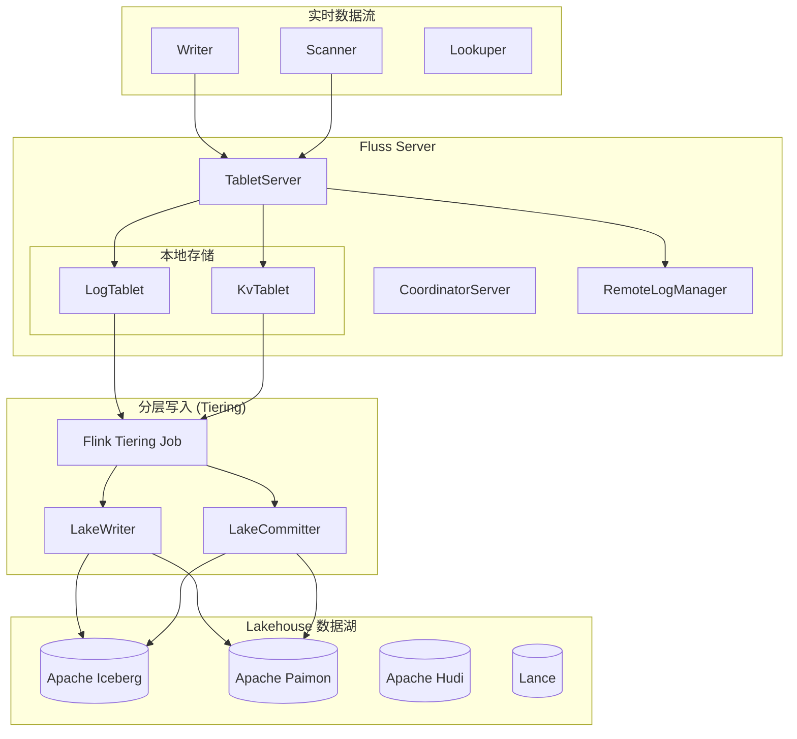
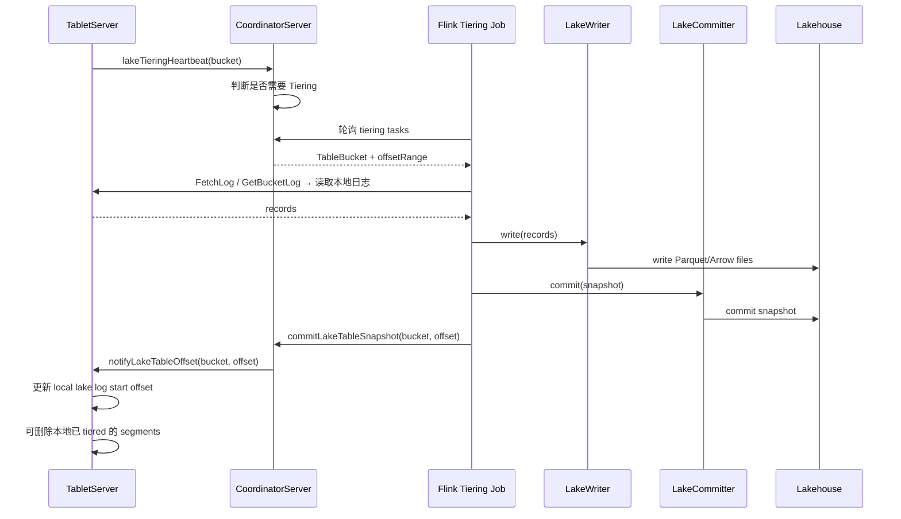

# 06 - Lake 层与湖仓融合

## 6.1 概述

Lake 层是 Fluss 最大的架构差异化能力——它原生支持将数据写入 Lakehouse（数据湖），实现 **"Streaming Table → Lakehouse Table"** 的一体化转换。Kafka 2.7.2 完全没有此能力。



---

## 6.2 Lake 存储插件架构

### 6.2.1 插件接口

```java
// 存储插件 — 工厂模式
interface LakeStoragePlugin {
    String name();                              // "iceberg" | "paimon" | "hudi" | "lance"
    LakeStorage createLakeStorage(Configuration conf);
}

// 存储抽象
interface LakeStorage {
    LakeCatalog getLakeCatalog();
    LakeTable getLakeTable(TablePath tablePath);
    LakeTableMetaInfo getLakeTableMetaInfo(TablePath tablePath);
}

// Catalog 抽象
interface LakeCatalog {
    void createTable(TableDescriptor desc);
    void dropTable(TablePath tablePath);
    List<String> listTables();
    Map<String, String> loadTableProperties(TablePath tablePath);
    void alterTable(TablePath, TableChange...);
}

// 表抽象
interface LakeTable {
    TablePath tablePath();
    LakeTableStats tableStats();    // 表统计信息
    LakeTableRead read();           // 读操作
    LakeTableAppend append();       // 追加写
    LakeTableDelta delta();         // Delta 写（Upsert/Delete）
}
```

### 6.2.2 四种后端实现

| 后端 | 模块 | 类 | 行数估计 | 完整度 |
|------|------|-----|----------|--------|
| **Iceberg** | `fluss-lake-iceberg` | `IcebergLakeStorage` / `IcebergLakeCatalog` | ~35 files | ★★★★★ 完整 |
| **Paimon** | `fluss-lake-paimon` | `PaimonLakeStorage` / `PaimonLakeCatalog` | ~30 files | ★★★★★ 完整 |
| **Hudi** | `fluss-lake-hudi` | `HudiLakeStorage` / `HudiLakeCatalog` | ~7 files | ★★☆☆☆ 基础 |
| **Lance** | `fluss-lake-lance` | `LanceLakeStorage` / `LanceLakeCatalog` | ~12 files | ★★★☆☆ 部分 |

---

## 6.3 Iceberg 集成（最完整）

### 6.3.1 IcebergLakeStorage 结构

```
IcebergLakeStorage (impl LakeStorage)
├── IcebergLakeCatalog
│   ├── 创建 Iceberg Table（复用 TableDescriptor → Iceberg Schema）
│   ├── 管理 Iceberg Namespace/TableProperties
│   └── 支持 HadoopCatalog / HiveCatalog
├── IcebergLakeSource (impl LakeTableRead)
│   ├── IcebergSplitPlanner（分区规划）
│   ├── IcebergSplit（单个 split）
│   ├── IcebergRecordReader → 读取 DataFile
│   ├── 谓词下推（File format filter + Row group filter）
│   └── FlussToIcebergPredicateConverter（谓词转换）
├── IcebergLakeWriter (impl LakeTableAppend / LakeTableDelta)
│   ├── AppendOnlyTaskWriter（普通表：无 PK）
│   │   └── 每 batch → DataFile (.parquet)
│   └── DeltaTaskWriter（PK 表：支持 delete/update）
│       └── 支持 Position Delete / Equality Delete
├── IcebergLakeCommitter (impl LakeTableCommit)
│   ├── 收集每个 task 的 WriteResult
│   ├── 提交 Iceberg Snapshot
│   └── 过期 Snapshot 清理
└── IcebergRewriteDataFiles（compaction）
    ├── 合并小 DataFile
    ├── 清理 Delete Files
    └── 支持 Z-ordering / Sorting
```

### 6.3.2 写入模式

| 表类型 | Writer | Iceberg 操作 | 说明 |
|--------|--------|-------------|------|
| 普通表 (Log Table) | `AppendOnlyTaskWriter` | `AppendFiles` | 纯追加，Parquet 写入 |
| PK 表 (KV Table) | `DeltaTaskWriter` + `GenericRecordDeltaWriter` | `RowDelta` | Upsert/Delete，支持 Position Delete |
| Merge-Engine 表 | `DeltaTaskWriter` (aggregate mode) | `RowDelta` + rewrite | 需要 compaction 来合并聚合结果 |

### 6.3.3 读取模式

```
IcebergLakeSource → Fluss Source:
  1. IcebergSplitPlanner: 根据 filter + snapshot 规划 split
  2. 每个 split → IcebergSplit (filePath, offset, length)
  3. IcebergRecordReader: 读取 Parquet → InternalRow
  4. 可选谓词下推：
     - Partition filter (目录级)
     - Row group filter (Parquet 统计信息级)
     - Arrow 统计信息 filter (列 min/max/null-count)
  5. InternalRow → Fluss Row (Arrow 格式)
```

---

## 6.4 Paimon 集成

### 6.4.1 PaimonLakeStorage 结构

```
PaimonLakeStorage (impl LakeStorage)
├── PaimonLakeCatalog
│   ├── 创建 Paimon Table
│   └── 管理 Paimon Schema / Options
├── PaimonLakeSource
│   ├── PaimonSplitPlanner
│   ├── PaimonRecordReader
│   └── PaimonSortedRecordReader（有序读取）
├── PaimonLakeWriter
│   ├── AppendOnlyWriter（普通表）
│   │   └── Arrow → Paimon Arrow Vector Column
│   ├── MergeTreeWriter（PK 表 + Merge Engine）
│   └── AppendOnlyArrowBatchHelper
├── PaimonLakeCommitter
├── DV Table 支持
│   ├── DvTableReadableSnapshotRetriever
│   └── PaimonDvTableUtils
```

### 6.4.2 Paimon 特有功能

1. **MergeTreeWriter**：直接写入 Paimon 的 MergeTree 格式（LSM），支持 PK 表
2. **AppendOnlyWriter**：纯追加写入，支持 Arrow 原生列式
3. **DV (Deletion Vector) 表**：Paimon 0.9+ 引入的 DV 机制，支持增量删除
4. **SortedRecordReader**：按 PK 排序读取，支持 Merge-on-Read
5. **PartitionBucket**：Paimon 的分区桶映射

---

## 6.5 Tiering 架构（Flink 独立作业）

### 6.5.1 Tiering 工作流



### 6.5.2 Tiering 组件

| 组件 | 类 | 功能 |
|------|-----|------|
| **入口** | `FlussLakeTiering` / `FlussLakeTieringEntrypoint` | Tiering 作业启动 |
| **Source** | `TieringSource` → `TieringSplitReader` | 从 TabletServer 读取数据 |
| **Writer** | `LakeWriter` 接口 | 写入 Lake Storage |
| **Committer** | `TieringCommitOperator` / `TieringCommitter` | 提交 Lake Snapshot |
| **Event** | `TieringReachMaxDurationEvent` / `FinishedTieringEvent` / `FailedTieringEvent` | 事件驱动 |
| **Metrics** | `TieringMetrics` | 指标收集 |
| **Split** | `TieringLogSplit` / `TieringSnapshotSplit` | 分层 Split 定义 |
| **Result** | `TableBucketWriteResult` / `TableBucketWriteResultEmitter` | 写入结果回传 |

### 6.5.3 CoordinatorServer 端 Lake 管理

| 类 | 功能 |
|----|------|
| `LakeTableTieringManager` | 管理 Lake 表的 Tiering 进度与调度 |
| `LakeCatalogDynamicLoader` | 动态加载 Lake Catalog（支持运行时切换） |
| `CommitLakeTableSnapshot` event | 处理 Tiering 提交的快照信息 |
| `NotifyLakeTableOffset` | 通知 TabletServer 更新本地 Lake offset |

---

## 6.6 Lance（Arrow Native Lake）

Lance 是新兴的 Arrow-native 列式存储格式，Fluss 支持作为 Lake 后端：

```
LanceLakeStorage
├── LanceLakeCatalog
├── LanceLakeWriter
│   └── ShadedArrowBatchWriter（直接写 Arrow IPC，零拷贝）
├── LanceLakeCommitter
└── LanceWriteResult

特点：
- Arrow-native：无需序列化/反序列化转换，直接操作 Arrow Vector
- 零拷贝路径：Fluss Arrow batch → Lance write（同一格式）
- 列裁剪 + 谓词下推完全复用 Arrow 能力
```

---

## 6.7 Fluss Lake 能力与 Kafka 对照

| 能力 | Fluss | Kafka 2.7.2 |
|------|-------|-------------|
| **数据湖集成** | ✅ 原生支持 Iceberg/Paimon/Hudi/Lance | ❌ 无（需外部 ETL 管道） |
| **Tiering** | ✅ 内建 Flink Tiering Job，自动将本地数据分层到 Lake | ❌ 无（KIP-405 仅分层到远程存储，非 Lakehouse） |
| **Lake 格式** | Parquet / Arrow / 原生格式 | ❌ Segment 文件 |
| **Lake 查询** | ✅ 可从 Lake 直接读取（BatchScanner） | ❌ 无 |
| **快照隔离** | ✅ Lake Snapshot 提供 MVCC 隔离 | ❌ 无 snapshot 概念 |
| **Schema Evolution** | ✅ 服务端内建 + Lake Catalog 管理 | ❌ 服务端不解析 schema |
| **Partition Evolution** | ✅ 通过 Iceberg/Paimon 的分区演进 | ❌ 无 |
| **文件管理** | ✅ Lake Catalog 管理 DataFile / DeleteFile | ❌ Segment 文件由 Broker 自主管理 |
| **Compaction** | ✅ RewriteDataFile（合并小文件 + 清理 Delete） | ❌ Log compaction（仅 key-based tombstone） |

---

## 6.8 关键差异总结

### Fluss Lake 层的设计哲学

```
Fluss = Streaming Storage + Lakehouse Integration

        实时写入 (ms 级)
              ↓
    ┌─────────────────────┐
    │   Fluss Tablet      │  ← 本地 Log + KV，毫秒级读写
    │  (oltp level)       │
    └────────┬────────────┘
             │ async tiering (minute-level)
             ↓
    ┌─────────────────────┐
    │   Lakehouse         │  ← Parquet/Arrow，分钟级物化
    │  (olap level)       │     支持批量查询 + 数据分析
    └─────────────────────┘
```

这不是简单的"存储分层"，而是 **"实时存储 + 数据湖"的融合架构**——与 Kafka 的"消息队列 + 外部 ETL" 是完全不同的范式。

### 与 Kafka KIP-405 的区别

| 维度 | Fluss Lake | Kafka KIP-405 (2.8+) |
|------|-----------|---------------------|
| **目标** | 写入数据湖（Iceberg/Paimon），支持分析查询 | 将日志卸载到 S3/HDFS，释放本地磁盘 |
| **存储格式** | Parquet / Arrow / Paimon format | 原始 `.log` segment（二进制相同） |
| **可查询性** | ✅ 可通过 Trino/Spark/Flink 查询 | ❌ 仅内部读取，不可外部访问 |
| **格式转换** | ✅ 实时 Arrow → Parquet 转换 | ❌ 不转换（保持 Kafka Message 格式） |
| **Schema 管理** | ✅ Lake Catalog 管理 schema evolution | ❌ 无 schema |
| **Delete/Update** | ✅ Delta/RowDelta（Iceberg）/ MergeTree（Paimon） | ❌ 不支持 |
| **Compaction** | ✅ RewriteDataFile（合并小文件 + 清理 delete） | ❌ 仅 log compaction（key-based） |

---

> **下一篇（最终）**：[[07-模块对应关系总表|07 - 模块对应关系总表]]
